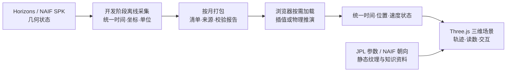

# 数据如何进入太阳系观测站

这份说明对应网页右上角的「数据与实现」。当前产品是 **2026—2027 年的预置历表观测工具**，不是直接连接望远镜或实时查询 NASA 的直播。页面选择时间后，从本站部署的数据包中读取对应月份，计算该时刻的天体状态，再把它绘成可交互的三维场景。

## 1. 数据来源

| 用途 | 来源 | 本项目的范围与记录 |
|---|---|---|
| 太阳、八大行星、月球的位置和速度 | [NASA/JPL Horizons](https://ssd.jpl.nasa.gov/horizons/manual.html) 几何状态向量 | 十个动态对象；[主历表清单](../public/data/manifest.json)保留目标 NAIF ID、原始查询、原始文件与 SHA-256、生成时间、版本、坐标及单位。 |
| 另外十九颗选定卫星的位置和速度 | [NASA/JPL NAIF 卫星 SPK](https://naif.jpl.nasa.gov/pub/naif/generic_kernels/spk/satellites/) | 相对所属**行星中心**的状态；[卫星清单](../public/data/satellites/manifest.json)记录卫星、SPK 内核和采样信息。 |
| 半径、质量、引力参数及自转参考值 | [JPL 行星物理参数](https://ssd.jpl.nasa.gov/planets/phys_par.html)、[NAIF 行星/卫星内核](https://naif.jpl.nasa.gov/pub/naif/generic_kernels/)及各天体资料页 | 整理在 `src/data/catalog.ts`、`src/data/satellites.ts`；每个对象提供来源链接。自转与朝向是参考模型，非逐时姿态观测。 |
| 画面外观 | [贴图来源清单](../public/textures/sources.json)、项目程序化效果 | 贴图和云图为静态素材；大气、日冕、恒星背景、带区粒子是说明性可视化，非实时影像或逐体观测。 |

主历表的太阳系质心（SSB）为原点，坐标为 **ECLIPJ2000**，数值单位为 **km、km/s**，时间为 **J2000 后的 TDB 秒**；请求使用未作光行时和恒星像差修正的几何状态（`NONE`）。2026-01-01 00:00 UTC 到 2028-01-01 00:00 UTC 的终端检查点覆盖 2026—2027 年。卫星采用同一时间、坐标和单位，先相对母星中心取样，全景时与母星中心状态相加。太阳与行星的**展示中心**和引力验证所需的部分**系统质心**分别保存、分别使用。

## 2. 离线准备与校验

`scripts/prepare-data.py` 整理 Horizons 数据；`scripts/prepare-satellites.py` 从 SPK 生成卫星状态。`scripts/prepare-data-assets.py` 整理浏览器所需的辅助资料。采集发生在开发阶段；部署后的网页不向 NASA 发起逐帧查询。

原十体主表每 **6 小时**保留位置与速度，月度分包。运行时用相邻采样点的位置和速度做三次 Hermite 插值，其速度是该插值曲线的导数。留出的 **3 小时中点**没有参与插值，在 49,657 个检查点上，相对原始 Horizons 状态的最大位置差为 **0.07837 km**，见[原十体插值报告](../public/data/interpolation-report.json)。卫星分别采用适合其轨道的采样间隔，在 237,575 个留出中点上相对原始 SPK 的最大位置差为 **0.93019 km**，见[卫星插值报告](../public/data/satellites/interpolation-report.json)。这两个数字是**插值相对来源的误差**，不能当作来源历表的绝对测量精度，也不能当作简化物理模型的误差。

日期界面显示北京时间 **UTC+8**。`src/data/time.ts` 负责 UTC、TAI、TT、TDB 的换算；应用数据和计算以 TDB 为准。未来闰秒的处理为当前资料下的假设，不用于航天导航。

## 3. 浏览器中的状态与两种运行模式

`src/ephemeris/ephemeris.ts` 和 `src/ephemeris/satellites.ts` 读取随网站发布的 JSON 清单及月度数据包。选择新日期时按需加载对应月份；主历表会尽力预取相邻月份，读取失败则显示错误。页面的“正在读取真实太阳系历表”指**读取本站预置历表包**。

两条路径最终都提供“时间、位置、速度”状态：

- **真实太阳系：** 从历表插值得到指定时间的几何状态。十九颗扩展卫星作为观测层围绕母星运动。
- **物理验证：** 从同一时刻的十体历表状态出发，`src/physics/core.ts` 在独立 Web Worker 中以牛顿点质量多体引力和 Velocity Verlet、默认 300 秒固定步长推进。它不包含扩展卫星，也不包含相对论、非球形引力和全部小天体。逐日误差图及十年数值稳定性结果见[验证报告](VALIDATION.md)。这部分与插值检验是两个不同问题。

## 4. 从状态到产品画面

`src/components/SolarSystem.tsx` 和 `src/components/SatelliteSystem.tsx` 将状态转换为球体位置、光照、轨迹和标签；右侧参数面板显示资料参数与当下相对距离、速度，并标出参照对象。底部统一时间轴控制两种模式。轨迹、参考平面、距离标尺与速度箭头是观测辅助层。

**真实比例**保留同一长度比例以观察大小、距离差异。默认的**空间观测**为了看清庞大的太阳系，会压缩距离、放大远处小天体并加入展示补光；它保留真实方位、倾角与运动方向，却不能用于直接量取距离和半径。背景星点、小行星带和柯伊伯带是结构示意，随机点不代表真实成员轨道或数量。球面贴图、地球静态云层与大气效果、太阳日冕等帮助辨认天体，不等于所选时刻的实时外观。

## 5. 如何追溯与复核

打开网页「数据与实现」，可以直接进入数据清单和来源站点；主历表清单中的查询与哈希可用于追溯开发期原始数据。运行 `npm test` 检查时间、插值、数据和物理核心；运行 `npm run validate:physics` 可重新生成物理验证报告。详细实验方法见[科学验证](VALIDATION.md)，扩展卫星的内核与边界见[卫星数据说明](SATELLITE-DATA.md)。
