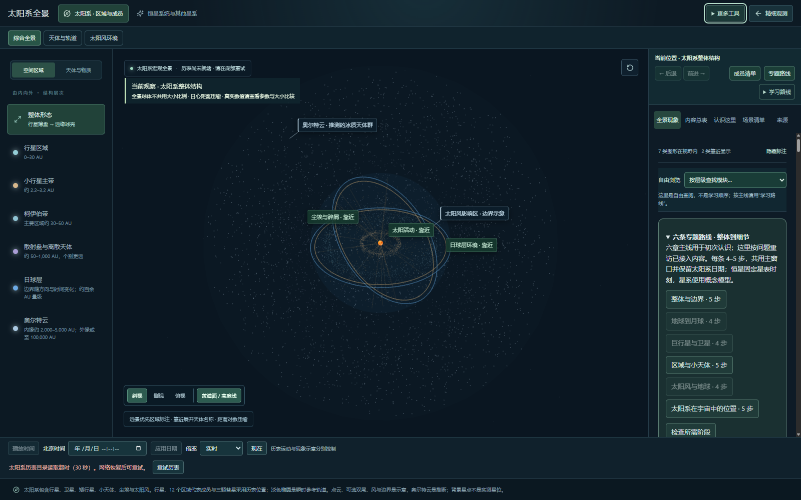
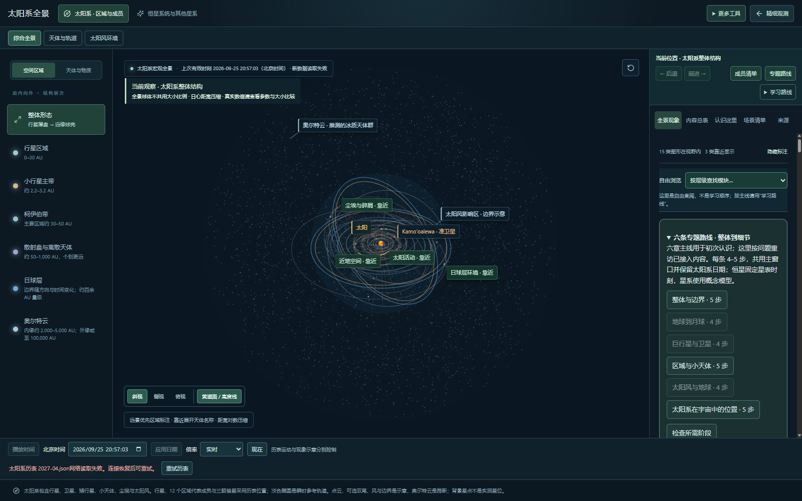

# 2026.09.25-r09.2 · 历表等待与原地恢复

基线 c3b8f1b。解决连接卡住时无限等待、主历表失败没有直接重试、重试跳回现在的问题。未修改历表数据、插值或物理模型，也未增加天体数量。R09 仍待用户总验收。

## 请求测量与结论

Windows 测试浏览器、关闭浏览器缓存、未模拟限速的一次线上旧版样本中，主历表目录请求耗时 9,743 ms，当月历表耗时 5,019 ms。目录在页面请求开始后约 3,051 ms 才发出，与形状资料、彗星轨迹及贴图请求相邻。相同文件本地请求为几十毫秒量级。这能证明该次等待包含网络请求阶段，不能据此确定 DNS、TLS、服务器或链路中的具体瓶颈，也不能代表所有用户。

本版在 HTML 解析时预加载主目录。新的本地请求记录中，目录与主脚本同时在约 41 ms 发出，主目录仅请求一次。提前发出请求有助于与脚本下载重叠，不宣称固定秒数或百分比的打开提速。

- [旧版线上请求样本](qa/ephemeris-loading-2026-09-25/initial-load-remote.json)
- [新版本地请求样本](qa/ephemeris-loading-2026-09-25/initial-load-local.json)

取样在主历表首次就绪后再等待约一秒结束；扩展资料尚未结束不等于失败。Worker 请求的结束事件不一定出现在页面会话中，不用它判定卡住。记录含 12 个 Image 条目，其中 11 个为贴图、1 个为浏览器日期控件图标；贴图独立于主历表加载。本轮没有降低贴图质量或把尚未完成的图像冒充已就绪。实际设备的完整画面加载时间仍须另测。

## 产品行为

- 底部时间栏区分“正在读取历表目录”和“正在读取所选日期的位置与速度”。首次没有有效数据时不编造观测日期。
- 主历表、行星卫星历表、通用扩展天体历表：每次文件请求在连接及响应体读取合计 30 秒后中止，提示对应目录或文件。这个时限不是整个页面所有资源的总时限；后台标签页的计时器调度也可能延后。
- 失败后可在时间栏或精细观测错误提示中点击“重试历表”；重新加载原来请求的日期，保持暂停、镜头与阶段选择。卫星和其他扩展资料沿用其原有重试入口。
- 选择新日期失败时仍显示上一份有效状态，并标明“上次有效时刻”；不把它改标为失败日期。旧请求晚返回不会覆盖后来选定的日期。
- 数据请求失败会从待处理缓存移除，重试发起新请求；成功数据仍可复用。与浏览器缓存失败的工具模块导入不同，历表重试无需刷新整页。
- 不自动无限重试、不自动切换日期。轨迹、星表、贴图等其他资源的等待策略并未全部统一到本次文件请求器。

## 验证与复验

77 个测试文件 / 321 项检查通过。新增 6 项覆盖：连接不响应、响应体不结束、成功后计时器清理、HTTP/网络/格式错误、共享月份请求失败后重试及迟到响应隔离、目录失败缓存释放。

浏览器故障注入检查：卡住主目录至真实 30 秒超时，原地重试成功；阻断 2027-04 月份包后保持原有效日期，再恢复到所选 2027-04-15 12:34:56（北京时间）；先请求慢月份再返回现在，迟到请求不回写；恢复后运动课仍可定位。卫星家族失败/重试与历史浏览检查通过。

复验：`npm test -- --maxWorkers=2`、`npm run build`；预览 4180 与测试浏览器 CDP 9223 可运行 `node scripts/qa/ephemeris-recovery.mjs`、`node scripts/qa/family-recovery.mjs`。请求抽样：`node scripts/qa/initial-loading.mjs [网址]`。浏览器脚本在结束时清除其网络拦截配置。

## 用户验收

刷新全景，观察底部加载提示；加载完成后选择一个其他月份，确认显示日期与场景一致。若出现网络失败，连接恢复后点“重试历表”，应回到刚才选择的日期，点击“播放时间”才继续运动。入口“更多工具 → 建设记录”可下载本说明。

主包体积警告仍存在，本轮优先修复等待和恢复。不能把本地与线上两个不同网络样本直接作速度对比结论，也不宣称太阳系整体任务已经全部完成。
