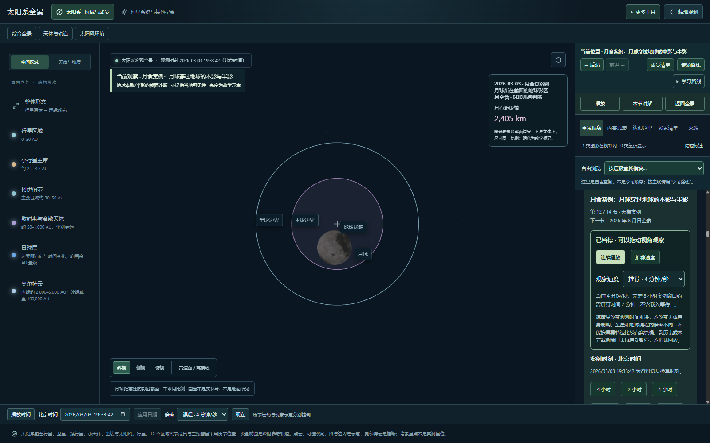
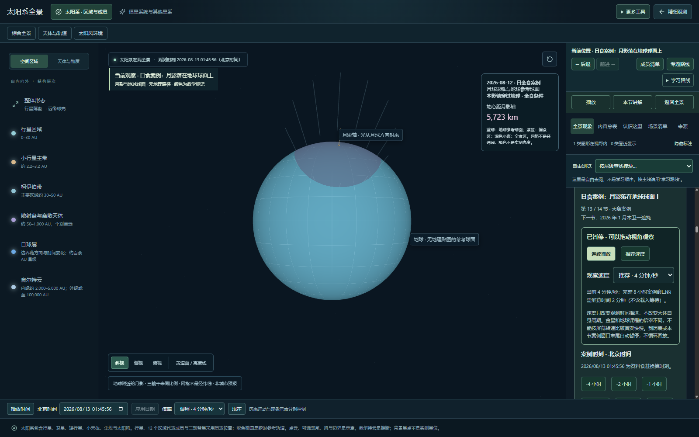
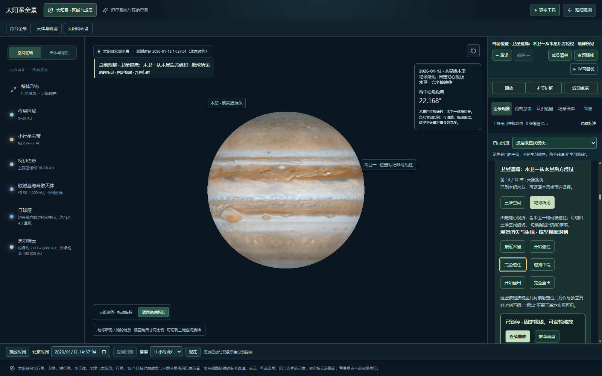
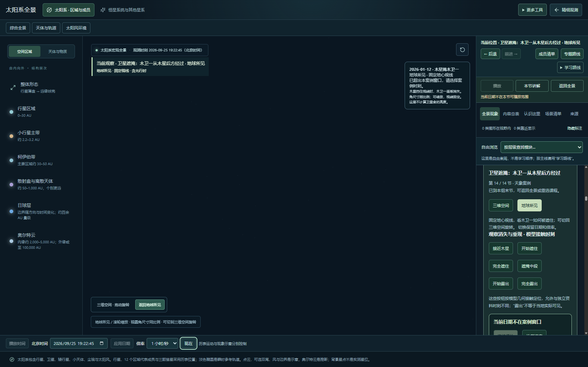

# 天象、日期与镜头历史验收

2026-09-25 · 本地待用户验收，未发布；R09 总验收未完成。

## 本轮修复

1. 全景日期框仅被点选后，失去焦点仍会停止跟随时钟。复现时输入框停在 2026-01-12 14:21:59，场景已到 16:07:14。现在没有编辑就恢复跟随；实际修改则显示“日期尚未应用”，保留草稿并提供取消。应用后同步场景，超范围日期拒绝且不改变观测状态。暂停按钮在加载或异常时仍可用，错误状态禁止开始播放。
2. 恢复镜头的路由标识漏掉遮掩视角字段，长度与当前路由不一致，导致已保存镜头被丢弃。统一当前画面、历史恢复和预设镜头的标识生成，普通课程与遮掩的三维/地心模式都用同一规则。

## 验收范围

- 14 节运动/天象课程：按顺序进入，核对课程标题、章节编号、共用主画布、暂停入场、连续播放及重置日期。定性锁定原理不声称进行物理演化回放。
- 阶段 01/03/04：运行时关闭相应依赖会退出课程并暂停；重开不会自动恢复隐藏课程。
- 日期：点选未编辑、未应用草稿、播放中的草稿、取消、正常应用、越界拒绝；底部时间和画面时刻对应。
- 月食：2026-03-03 案例进入后，主画面及详细读数对应月全食几何状态。
- 日食：NASA 命名日期 8 月 12 日的案例在北京时间进入 8 月 13 日凌晨，画面与时间栏一致。
- 木卫一遮掩：完全遮住与完全露出按钮改变主画面判定；三维与地心两种模式都有明确说明。
- 越出案例：返回现在后隐藏旧场景/读数，快捷和底部播放被禁用，重置后恢复；没有用历史数值冒充当前状态。
- 历史：拖动遮掩三维视角，离开到地球自转，再后退，保留观测日期并恢复三维模式与相近镜头。截图对比确认回到拖动后画面，而不是初始镜头。

## 视觉证据

镜头截图及差异记录位于同目录 `camera-*.png`、`camera-comparison.json`。本次拖动改变约 6.81% 像素，恢复后约 0.13% 像素仍有差异（像素任一 RGB 通道变化大于 8）；使用 0.2% 容差接受残余阻尼、抗锯齿与标注变化。这是显示回归检查，不是相机或天文角度精度。

## 复验与边界

- `node scripts/qa/event-acceptance.mjs`：专项日期、三事件和截图镜头回归。
- `node scripts/qa/motion-course-regression.mjs`：14 课及阶段 01/03/04；需已启动本地预览和项目测试浏览器。
- 76 个测试文件 / 315 项自动检查通过；生产构建通过。大包体提示仍存在。

课程标题、控件、主画面与时间状态对应的检查，不代表所有日期的科学精度认证。完整事件搜索、地理可见性和天气仍未实现。本轮桌面参考环境不替代用户实际设备验收；窄屏较拥挤的问题保留。

接下来：专题/家族跨月与加载失败路径、真实设备体验、用户验收，以及整理提交和部署；不再继续增加零散模块。
