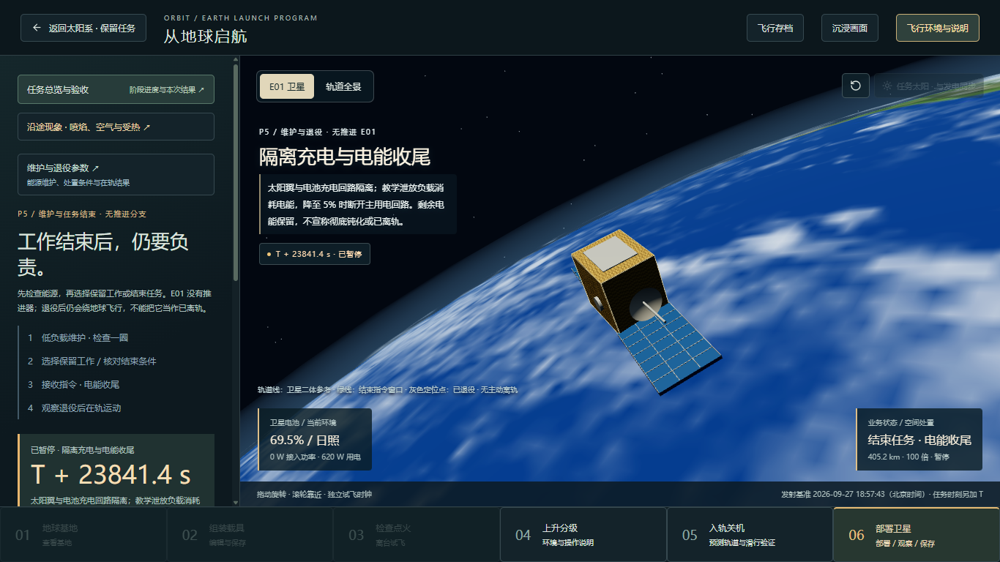
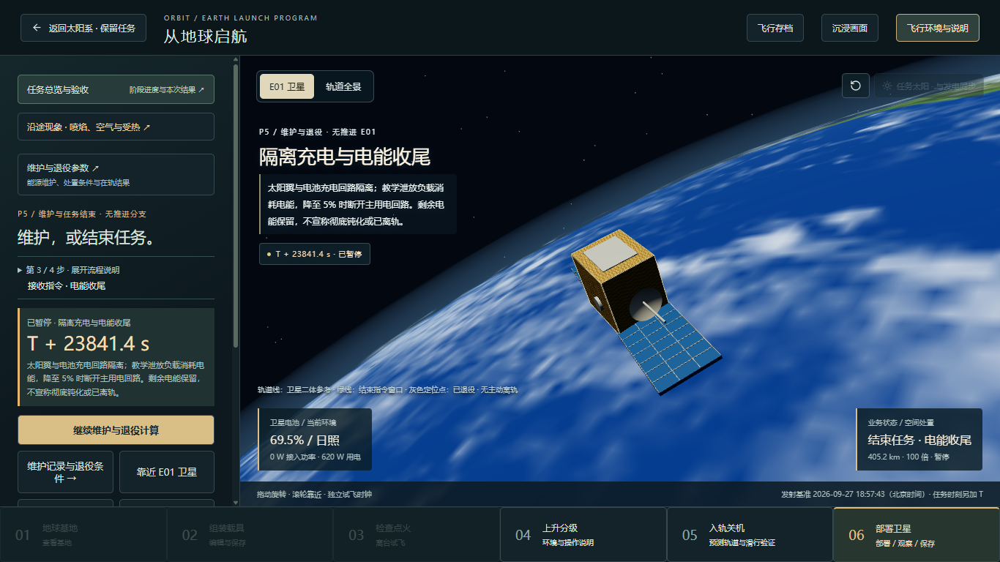
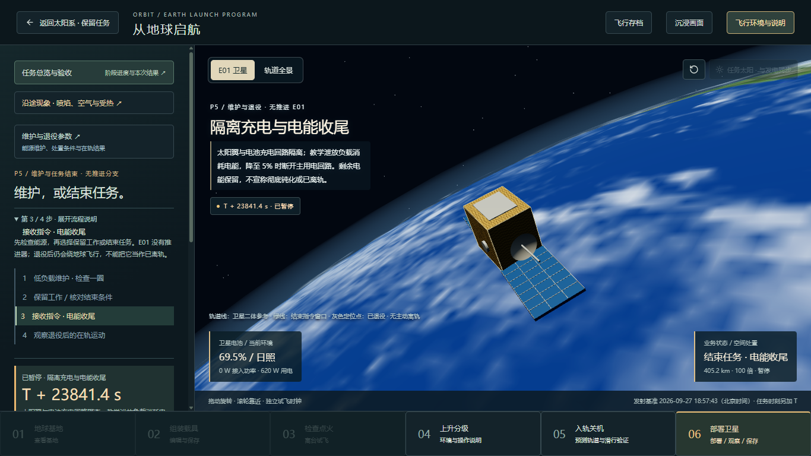
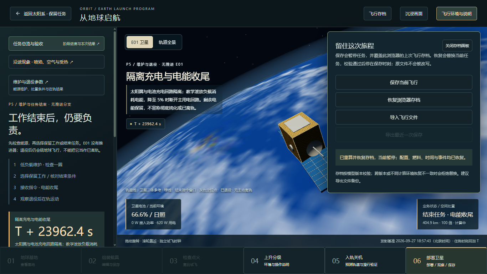
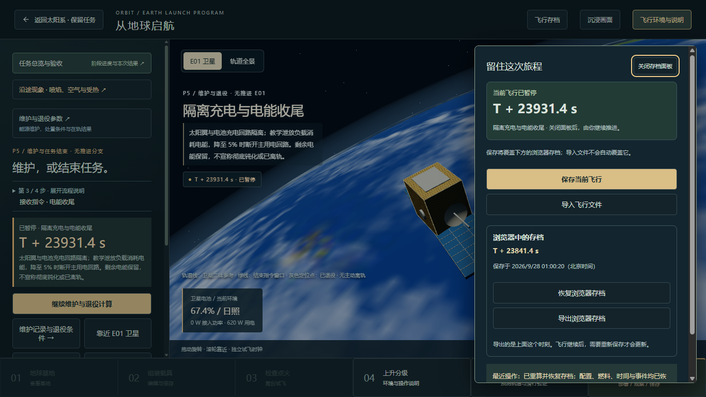
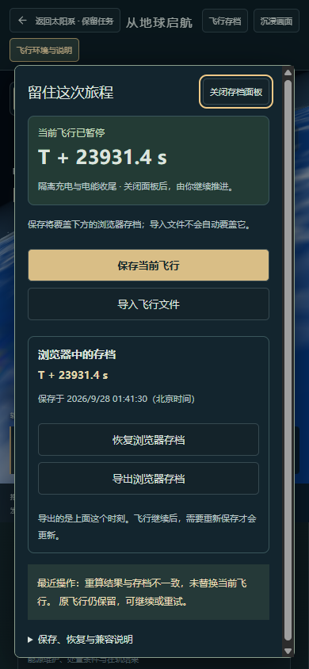

# 飞行任务：操作与存档体验修复

> 2026-09-28 已纳入 [地球出发教学版阶段归档](EARTH-LAUNCH-ARCHIVE.md)。下方各轮日期、检查结果和“未推送 / 待验收”描述保留当时状态；当前范围以归档记录为准。

2026-09-28，本地实现，待用户验收；本轮未提交或推送。范围是 P4/P5 任务侧栏与全阶段共用的飞行存档，不增加物理阶段、硬件或存档版本。

## 本轮检查方法

在本地 4180 页面、独立 Chrome 测试窗口，先实际点击并截图，再修改，再走相同操作。使用同一浏览器生成的既有 P4 日照、P5 电能收尾和 P5 完成存档。测试结束恢复原浏览器存档并关闭测试页。应用内浏览器工具无法连接，因此没有把这些结果称为应用内浏览器实测。

桌面 1366×768；另查 390×844 窄屏布局。所有下方截图均为本轮重新获取、打开检查过的页面，没有使用历史截图替代。

## 操作检查结果

| 操作 | 原问题与影响 | 本轮修复与证据 | 状态 |
|---|---|---|---|
| 继续 P5 电能收尾 | 继续按钮顶部 767 px，侧栏可视区底部仅 692 px；重复介绍和流程挤走主要操作 | 完整说明默认折叠；继续按钮现在占 566.8–607.8 px，可直接点击 | 已修复，待体验验收 |
| 理解当前步骤 | P5 四条流程没有当前步骤标识 | 简短摘要显示第 3 / 4 步；展开后同一条带当前步骤语义。完成时显示“本段完成”，失败时不冒充最终步骤 | 已修复 |
| 打开飞行存档 | 存档面板打开后 1.4 秒内，任务从 T+23971.4 推进至 T+24110.4；旧提示仍声称“当前暂停” | 各入口统一暂停；独立显示当前状态和最近操作。观察 1.5 秒时间不变，关闭仍暂停 | 已修复 |
| 导出已恢复的旧存档 | 没有在当前会话重新保存时，导出按钮不可用 | 直接读取浏览器原存档供导出，当前飞行与保存时刻分开。实际下载文件与原 JSON 逐字一致 | 已修复 |
| 写入失败 / 错误恢复 | 不能让“已保存”提示掩盖旧存档，也不能丢失会话中的新副本 | 模拟存储配额失败：原浏览器记录不变，提供单独副本导出；再保存成功后合并显示。重算不一致的文件拒绝替换原飞行 | 已复验 |
| 键盘与窄屏 | 存档打开后焦点留在背景；窄屏滚动后浮层可能离开视口 | 焦点进入面板，Tab/Shift+Tab 留在面板，Escape 关闭并返回入口；窄屏滚动后存档仍位于视口内 | 已复验 |

## 前后截图

原 P5 侧栏：继续操作在首屏之外。

修复后：保留主要说明，继续按钮在首屏；三维观察区尺寸不变。

完整流程按需展开，第三步明确高亮。

原存档面板：旧状态提示与继续运行的任务矛盾，旧存档不可导出。

修复后：当前飞行 T+23931.4 s，原浏览器存档 T+23841.4 s；两者各有明确标签。

390 px 窄屏：面板内部滚动，保存、恢复、导出均可到达；图中演示了错误文件恢复失败后原飞行保留的提示。

## 怎样验收

1. 进入“地球出发”，在现有 P4/P5 任务中看左侧当前步骤。默认先看继续操作；点击“展开流程说明”检查顺序与当前标识。P5 完成后应显示结果入口，仍说明卫星在轨、未完成空间处置。
2. 让任务继续一小段，再点击右上角“飞行存档”。当前时间应停止；关闭面板不会自动继续。当前时间和浏览器保存时间允许不同，这表示尚未重新保存。
3. 点击“导出浏览器存档”，导出的应为面板列出的旧时刻。要保存当前进度，先点“保存当前飞行”，确认时刻更新后再导出。
4. 用 Tab / Shift+Tab 和 Escape 操作面板；窄屏滚动页面后重新打开，面板仍应可见。

导入或恢复不会自动覆盖浏览器存档；显式保存才会覆盖。文件先做结构与校验码检查，恢复仍由原物理模型重算并核对，不把文件中的快照直接注入计算。不同运行环境重算不一致时仍拒绝恢复。

## 验证与边界

- 107 个测试文件、510 项检查通过；新增 8 项存档边界检查，包括空记录、读取受限、原文导出、损坏文件、校验码变化、写入失败与显式保存。
- 全量构建通过。已有主包体积告警仍在，未将此次操作修复称为加载性能优化。
- 浏览器检查覆盖 P4 进行中、P5 进行中与完成、暂停、焦点回返、实际下载、下载失败提示、存储写入失败、错误恢复及窄屏，无页面脚本异常。
- 本轮没有新增科学参数，也未改变物理求解或兼容规则。桌面首屏结论限定于已检查状态与尺寸；展开完整说明后可正常滚动。
- 不是全站无障碍认证、所有浏览器兼容报告或长时性能结论。用户视觉验收及远端发布均尚未完成。

查看本次任务的二级/卫星结果，另见[任务结果说明](TASK-RESULTS.md)；具体计算边界见[P4 卫星工作](SATELLITE-OPERATIONS.md)与[P5 维护退役](SATELLITE-LIFECYCLE.md)。
