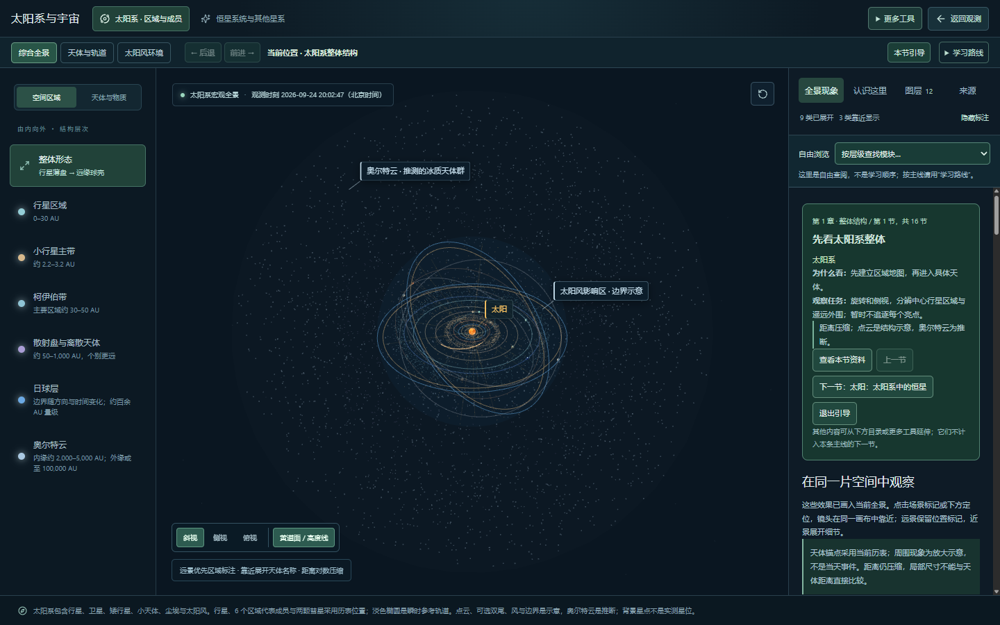
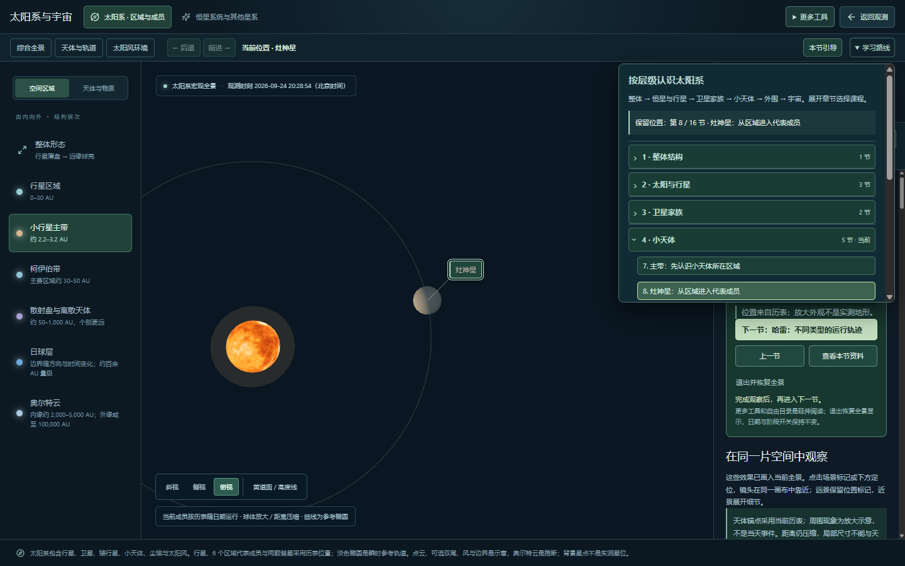
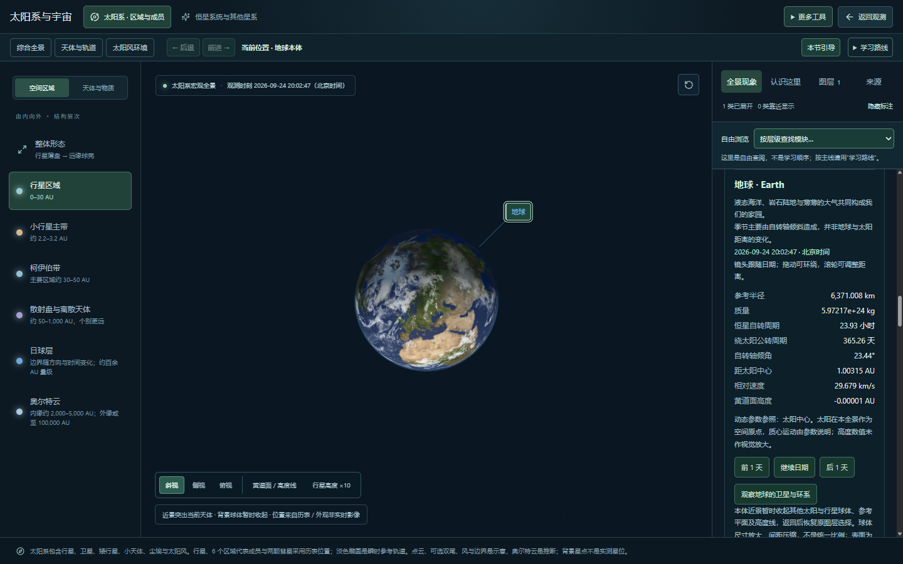
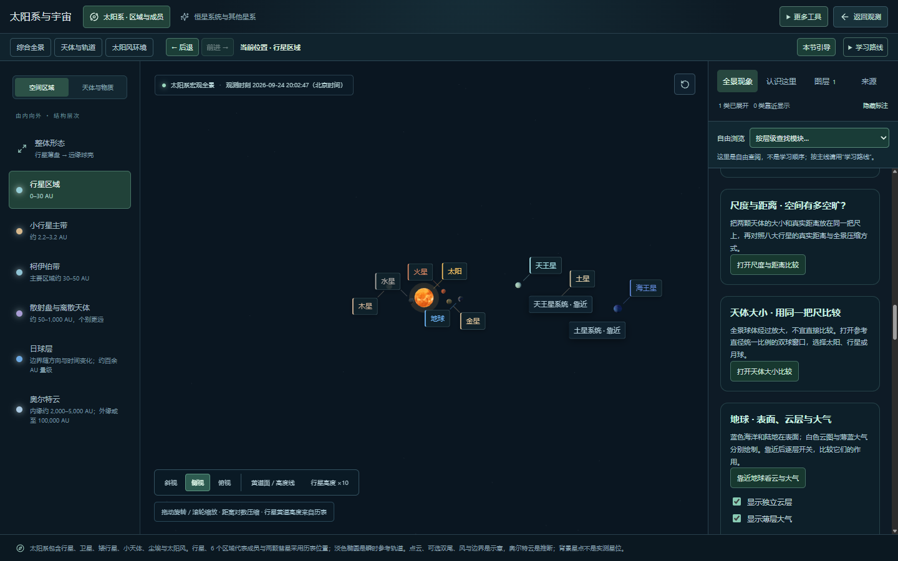
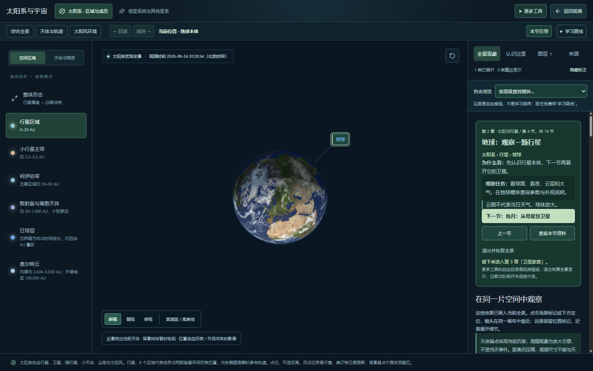
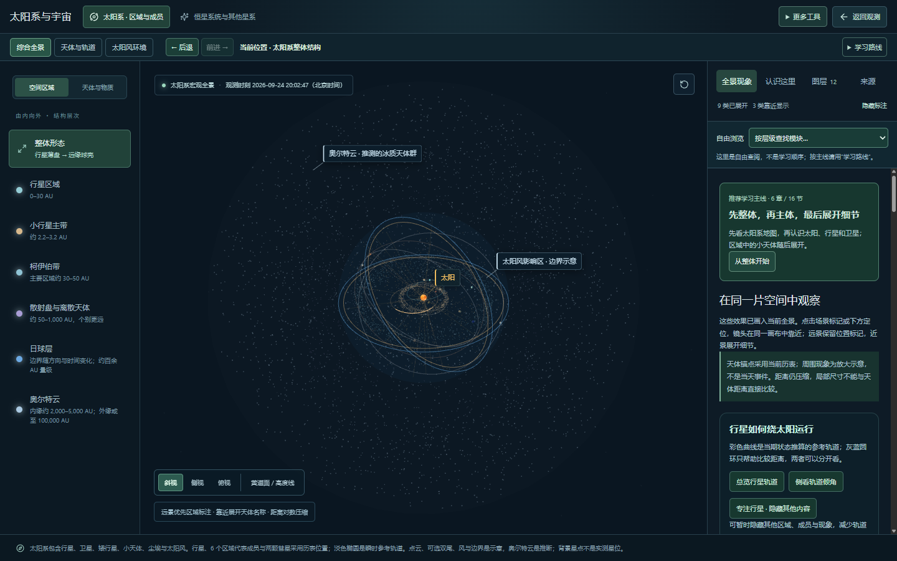
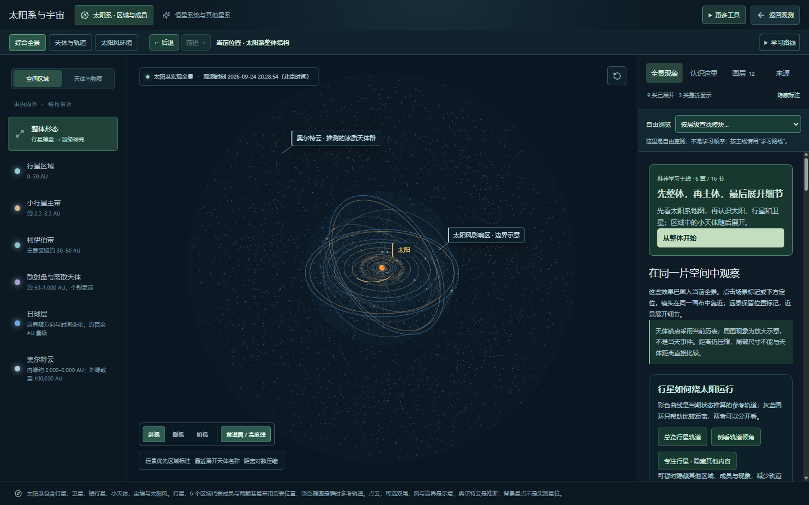

# 学习与观察流程检查报告

2026-09-24 · 本地待验收，未发布。范围：综合全景 → 学习主线 → 天体/家族近景 → 资料往返 → 退出全景。目标是从整体到细节连贯学习，同时保持三维观察和返回操作可靠。

本轮先在当前本地页面重现并截图，再修改实现。截图来自本轮实际页面，均已打开检查；没有使用此前截图代替证据。内置浏览器控制接口初始化失败，后续通过已有本地浏览器的调试连接完成相同页面的操作与截图。

## 1. 主线入口与课程目录 — 已优化

已有优点：主线具备六章十六节，浏览历史与课程顺序分开，工具栏紧凑。

发现：入口和卡片中的操作视觉权重相近；展开目录时十六节连续排列，当前章与下一步不够突出。

处理：按六章折叠，默认展开当前章，明确保留位置；下一节使用主按钮，上一节和资料为次要操作，显示跨章提示。正文与任务增加可读性。目录展开不挤压画布。

## 2. 进入具体天体与查阅资料 — 已修复

发现：从目录进入地球时，参数组件自动滚入视野，当前学习卡和下一节离开可见区域。图中已显示地球参数，但引导不在当前视口。

处理：学习模式关闭参数组件的自动滚动；进入章节后显示并聚焦课程卡。用户主动点“查看本节资料”才跳转参数，“本节引导”回到任务。自由浏览仍保留原来的参数定位行为。

## 3. 近景侧视、俯视与复位 — 已修复

发现：地球近景点击侧视，会清掉当前目标并把镜头移回行星区域，课程因此误判为自由浏览。

处理：角度预设围绕当前目标旋转，保持距目标的距离；复位恢复当前目标的近景。目标随日期移动的参照点保留，返回镜头也保留。地球、地月家族、灶神星分别复验通过。近景不再显示不适用的行星高度放大按钮。

## 4. 退出引导与恢复全景 — 已修复

发现：退出课程后点综合全景，只恢复基础图层；课程临时关闭的五类空间现象仍为关闭。DOM 检查确认五个对应开关均为 false；远景截图本身不足以证明这一开关状态。

处理：“退出并恢复全景”和综合全景预设统一恢复基础图层、现象选择与默认轨道显示。尊重阶段开关，不改变观测时间和播放倍率。最后一节的“结束主线 · 自由探索”可保留当前宇宙位置。

## 验证和限制

- 构建通过，现有 JS 大包提醒仍在；本轮不宣称解决包体或性能预算。
- 全部 39 个测试文件、166 项测试通过。新增角度变化保持目标、距离、跟随参照和原历史不变的回归测试。
- 浏览器检查课程卡可见和焦点、地球/家族/成员切换角度、镜头复位、资料往返、目录默认当前章、Esc 关闭和焦点恢复、退出与预设恢复开关，均通过，无运行异常。
- 1024、700、390 px 工具栏无横向溢出；桌面仍为两行。
- 已检查键盘焦点和操作顺序，但未用屏幕阅读器逐项验证，未做完整 WCAG 合规或全站审计。截图不能独立验证科学精度、长期资源稳定性或所有设备性能。
- 没有新增天体、改变历表或物理模型。此轮不等于总规划 M0/M2/M5 整体验收完成。
