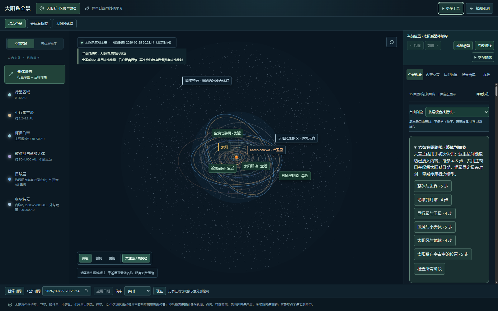
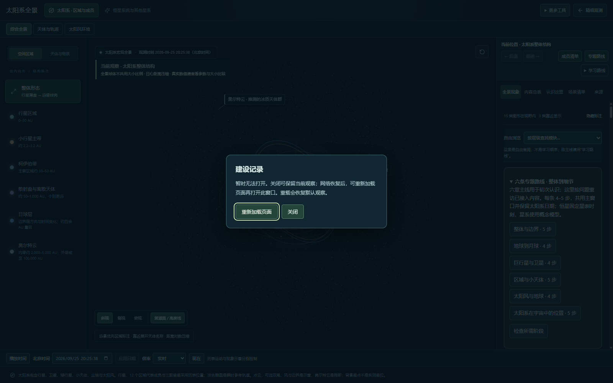

# 2026.09.25-r09.1 · 首次加载优化

基线：3480358。将按需打开的 12 个窗口改为延迟加载：整体规划、建设记录、数据与实现、太阳系图鉴、物理验证报告、运行知识、阶段导览、星点与环、近地空间、太阳活动、尘埃与流星、日球层详解。主全景、现有天体和供数逻辑保持原有入口。

## 测量结果

生产构建的首页主脚本由 1,894,951 字节降至约 1,635,000 字节，减少约 13.7%；相同 gzip level 9 下由 590,178 降至约 494,900 字节，减少约 16.1%。首页样式由 193,686 降至 123,928 字节。末位会随版本说明与文件名变化，精确测量快照见 [sizes.json](qa/loading-2026-09-25/sizes.json)。

浏览器首次请求记录确认，仅请求首页脚本、首页样式及既有物理 Worker，没有提前请求上述窗口的代码或样式。见 [请求记录](qa/loading-2026-09-25/lazy-initial-resources.json)。这是首次传输范围的缩减，不是删除能力；打开全部工具后总下载量可能增加少量分包开销。不将文件体积变化解释为固定的加载秒数提升。

## 交互与故障恢复

- 打开窗口时显示“正在准备内容”，可以关闭或按 Escape 返回。
- 已关闭窗口不会在加载完成后自行弹出；再次打开复用已加载模块。
- 代码或样式加载失败时显示明确说明。关闭保留当前观测；网络恢复后可以主动重载页面再打开窗口，重载会恢复默认观察。
- 浏览器会缓存失败的模块导入，因此没有提供实际无效的“再次尝试”按钮，也不会自动重载丢失观察状态。
- 失败/等待层保留键盘焦点，关闭后返回可用入口。

## 已执行检查

12 个窗口的正常入口、四个独立三维教学画布、精细观测中的运行知识与验证报告、主全景运动课定位通过。独立阻断建设记录的 JS 和 CSS 请求，关闭保持暂停日期、键盘焦点、主动重载恢复样式通过；人为延迟代码请求，加载中按 Escape 关闭后不再自行弹出通过。全量 76 个文件 / 315 项测试及生产构建通过。

复验命令：`node scripts/qa/lazy-loading.mjs`，需要本地预览 4180 与测试浏览器 CDP 9223。故障模拟只在测试浏览器拦截请求，结束会清除阻断和缓存覆盖。

## 验收与剩余工作

首次刷新后观察全景，再逐一打开“更多工具”中的建设记录、整体规划、数据与实现和图鉴，检查首次打开与再次打开。可以用慢网络检查等待层的关闭。

本批仍保留主包体积提示；三维引擎、宏观场景和公共代码仍是主要开销，没有把它们拆成多个首屏必需请求来宣称首屏减少。贴图/历表带宽、实际设备的下载与执行时间仍需单独测量。R09 用户总验收尚未完成，功能和科学模型边界沿用 [上次交付](RELEASE-2026-09-25.md)。
