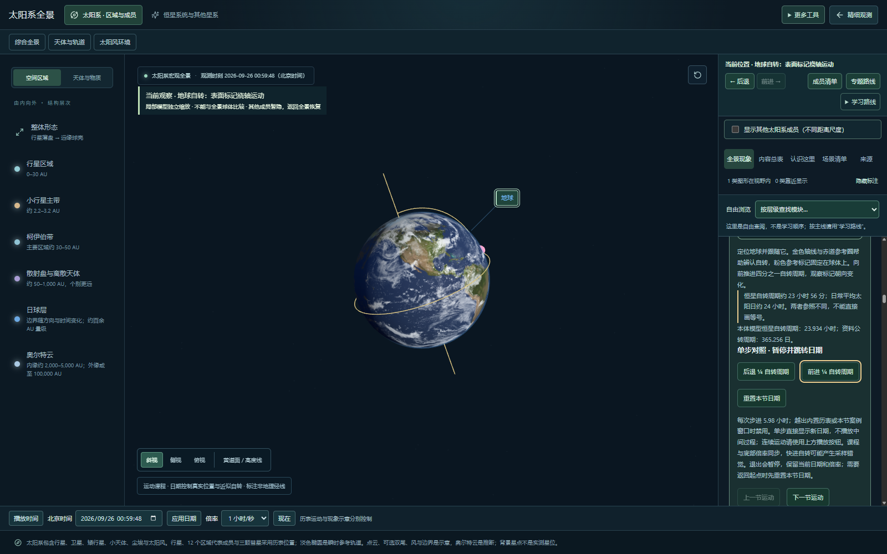
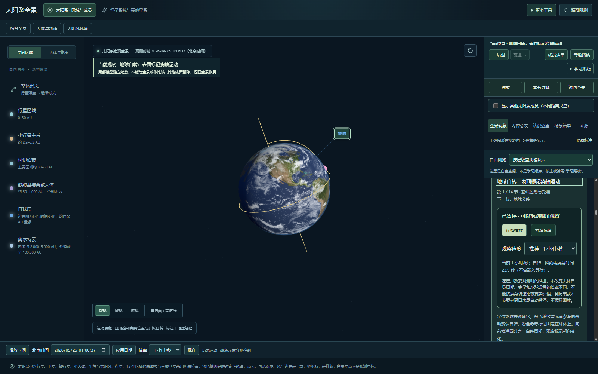
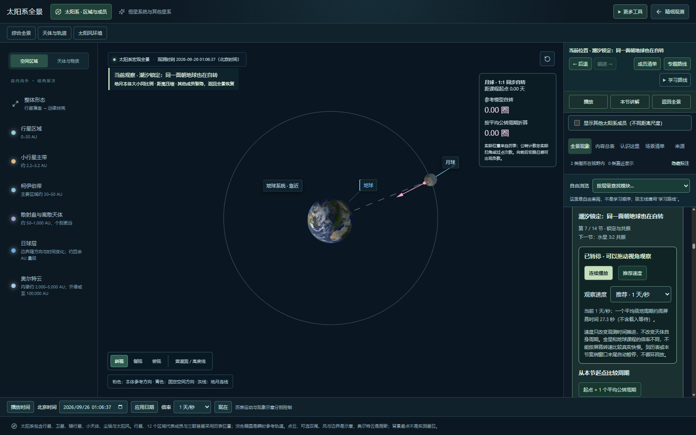
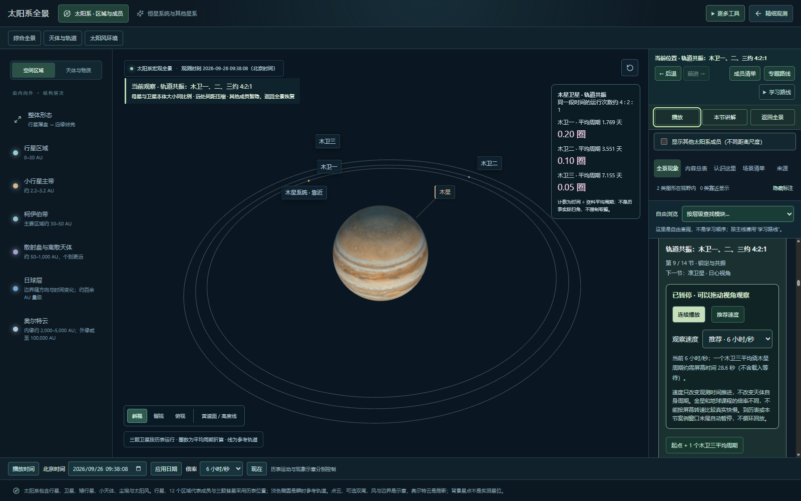
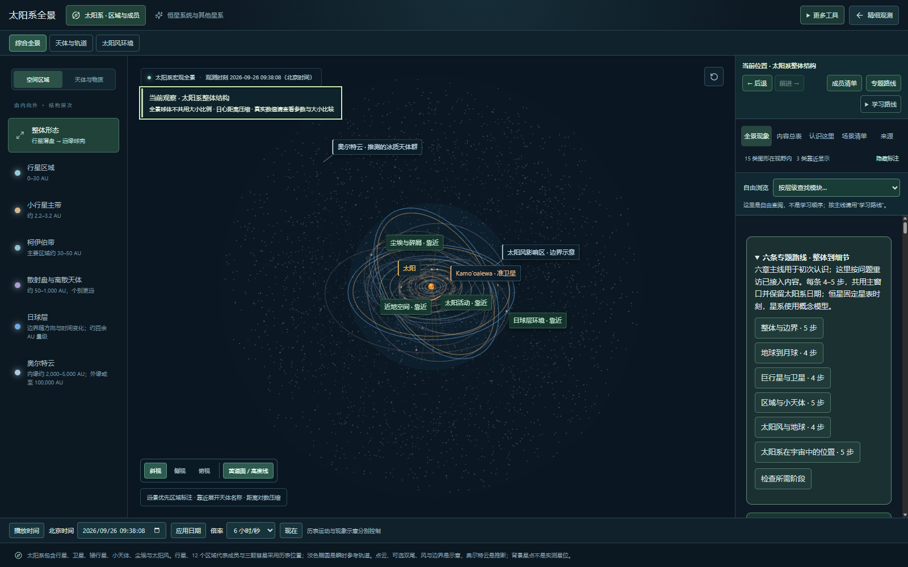
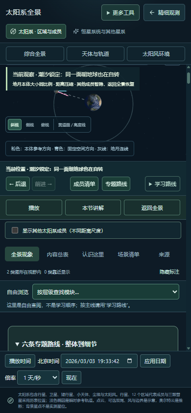

# 主画面与运动课操作验收

2026-09-25 · 本地待验收，未发布；R09 整体与用户验收仍未完成。

## 范围与发现

本次重新操作并截图检查桌面 1600×1000 的四步路径：地球自转 → 月球同步自转 → 木星卫星共振 → 返回全景。截图来自本轮本地构建，未使用历史截图作为证据。

确认的操作问题：单步和说明文字较长，播放和退出按钮随右侧内容滚走；进入来源标签后也难以快速返回当前讲解。修复为右侧固定的“播放/暂停、本节讲解、返回全景”一行，桌面主画布高度保持不变。快捷与详细播放器共用范围/加载判定，定性锁定原理不出现物理回放按钮。

修复前：

## 四步结果

1. 地球自转：正常。前进四分之一模型周期后日期和地表朝向改变；粉色本体标记及固定极轴与文字说明相符。“本节讲解”跳到当前标题并移入键盘焦点。

2. 地月关系：正常。局部仅显示地球、月球及教学参考线，未混入金星；实际拖动后镜头发生变化而观测日期不变。图示本体方向与空间固定方向分别标注，不宣称完整天平动精度。

3. 木星卫星：正常。画面为木星与三颗共振卫星；连续播放实际推进日期与卫星位置，快捷按钮与详细播放器状态一致，暂停后日期停止。切到“来源”仍可控制，再用“本节讲解”返回对应内容。

4. 返回全景：正常。清除课程和课程快捷栏，暂停时钟，保留所观察到的日期；焦点移到主画面当前位置说明。后退可以恢复上一课程及快捷栏。

## 补充检查与限制

- 月食案例末尾：快捷及详细播放器都禁止从已完成时刻重新开始；重置日期后恢复可播放。
- 390px 窄屏：没有页面横向溢出，快捷按钮可操作，说明区域仍可滚动。小屏同时容纳场景、多个导航与说明比较拥挤，尚需专门移动端布局优化；此次不标为手机完整体验合格。
- 新增按钮有可见焦点和明确无障碍名称；跳转讲解和退出后的焦点去向已检查。未进行屏幕阅读器全面验证、触屏设备实测或完整 WCAG 认证。
- 场景视觉抽查与日期操作不能独立验证天体绝对物理精度；数据证据仍见科学核验及现象核验报告。
- 此次只验收上述代表路径和播放器边界，不代表 14 课、全部天体、所有日期及设备组合重新完整验收。

自动检查：76 个文件 / 313 项测试通过。浏览器脚本 `scripts/qa/motion-acceptance.mjs` 验证定位、单步日期、拖动不改日期、播放/暂停同步、跨标签控制、返回、焦点、后退恢复、原理课、事件末尾与窄屏。生产构建通过，现有大包体提示保留。

下一步：其余专题/事件路径按同样标准分批验收，并完成用户设备和视觉验收；不以持续增加入口代替验证已有能力。
