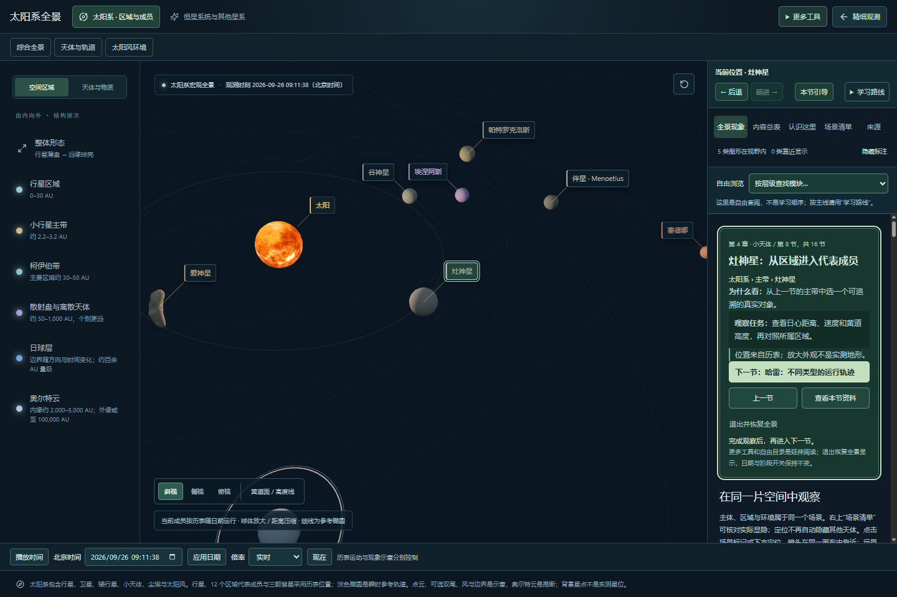
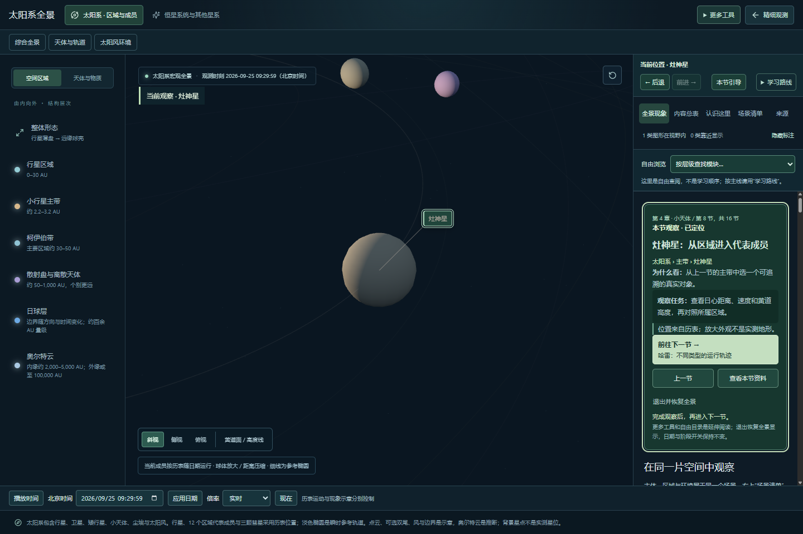
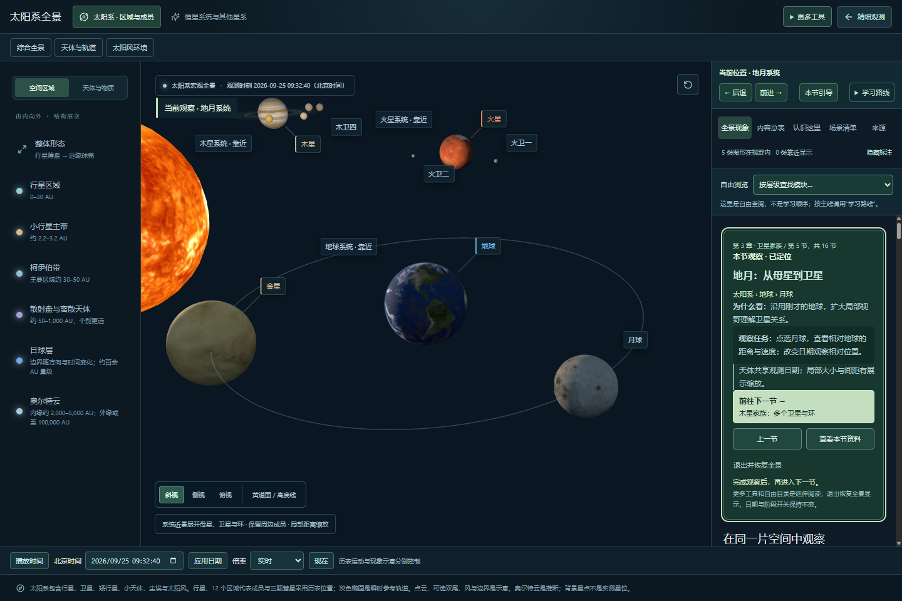

# 按钮与主画面对照检查 · 2026-09-25

本地完成，未提交推送、未部署。针对用户提供的主带课程截图排查，不新增天体或改变科学数据。

## 结论与修复

1. 主带 → 灶神星的状态切换有效，但普通成员默认镜头距目标 8 个显示单位，目标明显小于附近太阳，视觉反馈不足。改为 2.8，调整最小缩放限制；保留双体与不规则形状的专用距离。卫星家族按实际显示边界和画布宽高比取景，不删除周边天体。
2. “下一节”展示下一对象名称，容易被当成当前对象。画布增加“当前观察”，课程明确“本节观察”，下一节使用单独的动作和目的地两行。
3. “查看本节资料”的成员选择器不存在；卫星资料选择器过宽，先匹配行星资料。改为实际成员区和精确卫星区；右侧区域成员目录同步修正。跳转将键盘焦点落在对应资料区。
4. 地月家族与近地现象共享空间锚点，但不能共用观察目的。新增观察目的记录，磁层、辐射带和流星示例的标题、相关开关与历史恢复各自对应；点地月家族不再自动开启近地环境。离开月球课程查看磁层会明确提示自由浏览，返回本节恢复课程。
5. 家族标签原先可能在卫星/环已隐藏时显示。现要求对应家族实际有开启的卫星或环。
6. 环境历史恢复原先可能被卫星阶段关闭误拦截；现在区分家族和环境意图。关闭卫星阶段仍阻止月球课程，重新开启后可回到本节。

## 主线逐节检查

使用本轮本地运行页面，逐节点击并保存状态与截图；下表核对章节、画面目标标题和跟随状态。对灶神星、地球、地月家族、环境和窄屏另做截图目视检查。并不把标题检查当作每个像素/每个天体的科学精度验收。

| 步骤 | 课程 | 画面目标 | 状态 |
| --- | --- | --- | --- |
| 1 | 先看太阳系整体 | 太阳系整体结构 | 对应通过 |
| 2 | 太阳：太阳系中的恒星 | 太阳本体 | 对应通过 |
| 3 | 行星：从轨道看整体关系 | 行星区域 | 对应通过 |
| 4 | 地球：观察一颗行星 | 地球本体 | 对应通过 |
| 5 | 地月：从母星到卫星 | 地月系统 | 对应通过 |
| 6 | 木星家族：多个卫星与环 | 木星卫星系统 | 对应通过 |
| 7 | 主带：先认识小天体所在区域 | 小行星主带 | 对应通过 |
| 8 | 灶神星：从区域进入代表成员 | 灶神星 | 对应通过 |
| 9 | 哈雷：不同类型的运行轨迹 | 哈雷彗星 | 对应通过 |
| 10 | 柯伊伯带：再进入远缘区域 | 柯伊伯带 | 对应通过 |
| 11 | 冥王星—卡戎：远缘双体 | 冥王星卫星家族 | 对应通过 |
| 12 | 日球层：太阳风的环境边界 | 日球层 | 对应通过 |
| 13 | 奥尔特云：认识推断的外围 | 奥尔特云 | 对应通过 |
| 14 | 邻近恒星：离开太阳系尺度 | 邻近恒星系统 | 对应通过 |
| 15 | 银河系：太阳系所属的星系 | 银河系中的太阳 | 对应通过 |
| 16 | 邻近星系：更大的宇宙背景 | 银河系之外 | 对应通过 |

## 往返与异常状态

- 上一节：地月 → 地球本体，课程和镜头目标同步；侧视仍围绕本体。
- 查看本节资料：灶神星 → 区域真实成员；地月 → 卫星与环系；自由目录 → 区域成员。对应资料区获得焦点。
- 磁层 → 辐射带 → 后退 → 前进：观察目的、标题、开关恢复正确。
- 地球旁流星示例：只开启对应尘埃/流星组，不误启磁层和辐射带。
- 月球课中转入磁层：提示自由浏览；“回到本节”恢复地月。
- 卫星阶段关闭：月球课程禁用并显示原因；近地环境历史不受无关阶段阻塞。重开后正常返回。
- 390px 窄屏无新增横向溢出，操作按钮和当前/下一节说明可见。桌面 1440×960 检查通过。
- 浏览器捕获运行异常为零；56 个测试文件、225 项测试通过，生产构建通过。大包提醒仍待性能阶段处理。

## 本轮截图证据

内置浏览器连接工具启动失败后，使用现有本地调试浏览器。没有在远端页面修改或验证。

## 验证边界

检查的是 16 节主线及上述主要定位/资料/历史/阶段入口，不声称遍历每个日期、全部按钮排列、所有设备和每种缺包组合。截图能支持视觉反馈和窄屏布局结论，不能据此宣称完整无障碍合规、完整科学精度或性能总验收。浏览历史不恢复观测日期；学习路线与浏览后退/前进仍独立。

## 地月显示跟进 · 同日第二轮

用户再次指出金星看似位于月球轨道内。此前导航核对没有解决不同层级距离缩放混用的科学表达问题，本轮单独修正：

- 家族局部取景默认暂隐其他成员及其独立现象、轨迹；同画布开关可恢复，并明确警告不同尺度不可比较。返回区域全景自动恢复，底层对象、历表与已有图层选择未删除。
- 月球相对地球使用 `1737.4 / 6371.0084` 约 27.27% 的共同本体半径比例；不再使用小卫星统一增强公式。默认镜头将两球中心放在相同景深便于比较，自由旋转仍有透视。
- 地月相对距离继续压缩，月球参考轨道不代表金星轨道。金星绕太阳运行；实际金星/地球直径比例为 `6051.8 / 6371.0084` 约 95%。
- 家族近景使用历表中的太阳方向作平行光照；隐藏太阳球体不影响照明。仍有辅助补光，不宣称真实曝光或食影。
- 物理参数来源：[JPL 行星参数](https://ssd.jpl.nasa.gov/planets/phys_par.html)、[NASA 月球资料](https://nssdc.gsfc.nasa.gov/planetary/factsheet/moonfact.html)。
- 57 文件 / 227 测试通过；浏览器检查默认地月仅有对应标签、其他成员开关、日期推进、转入磁层不沿用隔离、历史恢复开关、退出近景及 390px 布局通过。当前仍未提交部署。

## 跨模块比例排查 · 同日第三轮

已扩展至八大行星入口、六个家族、其他双体及小天体环；统一比例转换、近景显隐、标注与历史开关，详细发现和截图见 [跨模块比例与近景排查](SCALE-AND-CONTEXT-AUDIT.md)。233 项测试通过，本地待验收，未推送。
