# 跨模块比例与近景上下文排查

日期：2026-09-25。状态：本地修复并复验，未提交、未推送，等待用户验收。

## 结论

地月截图反映的是跨模块的尺度与显隐问题，而非单颗金星的位置数据错误。本轮检查太阳系主全景、八大行星本体入口、六个行星家族、冥王星五卫星、阋神星双体、特洛伊双小行星、小天体双环及土卫二近景；同时核查精细观测使用的比例转换函数。历表、实际参数和物理积分输入没有修改。

## 按操作顺序验收

| 步骤 | 路径与健康状态 | 发现与处理 |
|---|---|---|
| 1 | 全景 → 八大行星本体：已修复并复验 | 仅修复“地月系统”入口不足以覆盖“地球本体”入口。八大行星本体近景统一支持暂隐周边，避免再次混入不同尺度成员。全景持续显示“球体不共用大小比例、日心距离压缩”。 |
| 2 | 六个行星家族：已修复并复验 | 地月以外的卫星仍采用幂函数放大。现在所有六个宏观家族内，母星和卫星本体共用半径比例；小卫星仍有可点击名称和参数列表。土星近景遗留的日球层按钮随其图形一起隐藏。 |
| 3 | 冥王星 → 阋神星 → 双小行星 → 女凯龙星：已修复并复验 | 这些局部模型的距离尺度原先与背景全景交错。现在默认仅显示当前模型与背景星点；右侧可重新开启其他成员，返回全景恢复，不删除任何全景对象。 |
| 4 | 行星环、参考轨道与土卫二：已修复并复验 | 原来三个视图的卫星距离函数不同，且与线性的环半径不一致。现在共享局部距离映射，已绘制的主环范围保持线性，外侧压缩。土卫二恢复真实相对半径后同步调整近裁剪，近景与喷流仍可见。 |
| 5 | 背景开关 → 后退前进 → 全景 → 窄屏：已修复并复验 | 历史补存环、环宽增强、卫星轨道以及冥王星质心/轨道开关。背景开关放入右侧操作区，避免覆盖画布提示；390px 检查无横向溢出。 |

## 本轮截图

以下为本轮本地浏览器实际截图，未使用旧轮次画面替代。内置浏览器连接因运行环境错误不可用，使用已有本地 Chrome 调试浏览器检查同一 localhost:4180 构建。

### 1. 行星本体

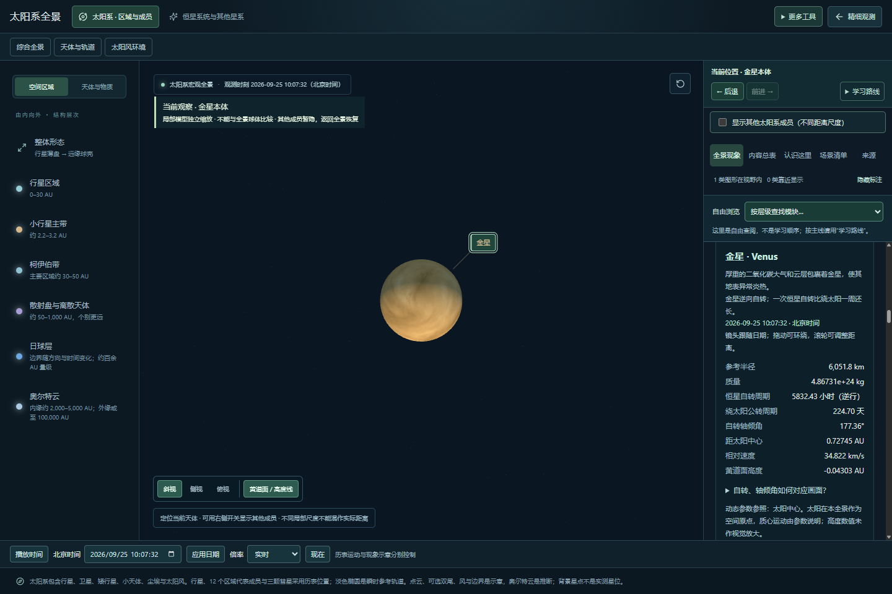

### 2. 六个行星家族

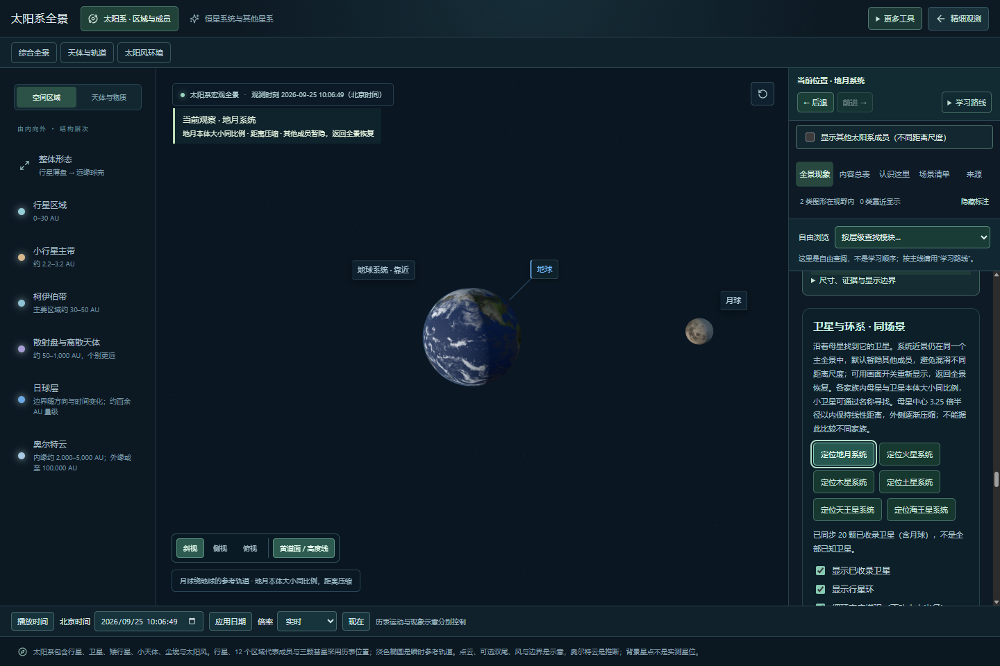
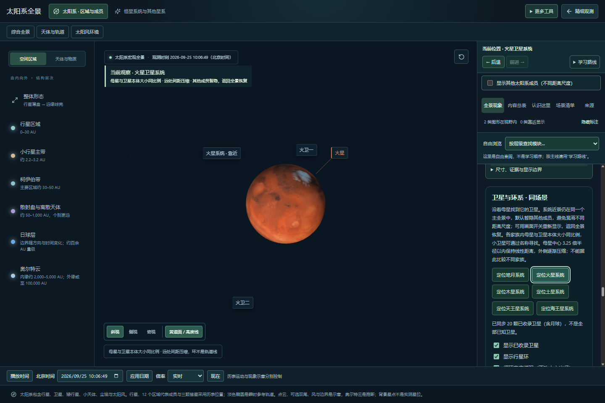
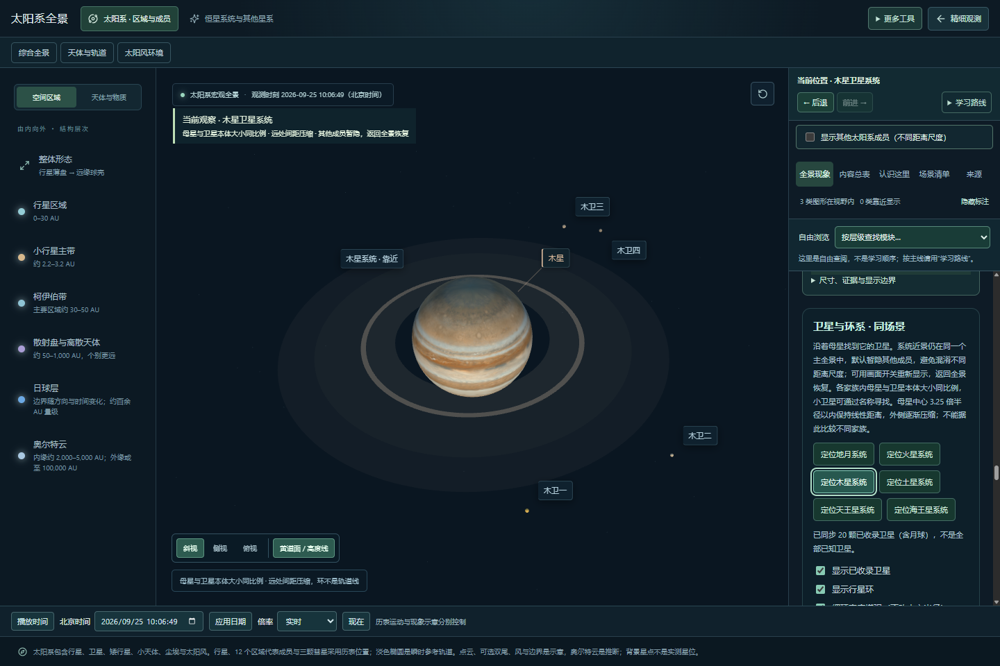
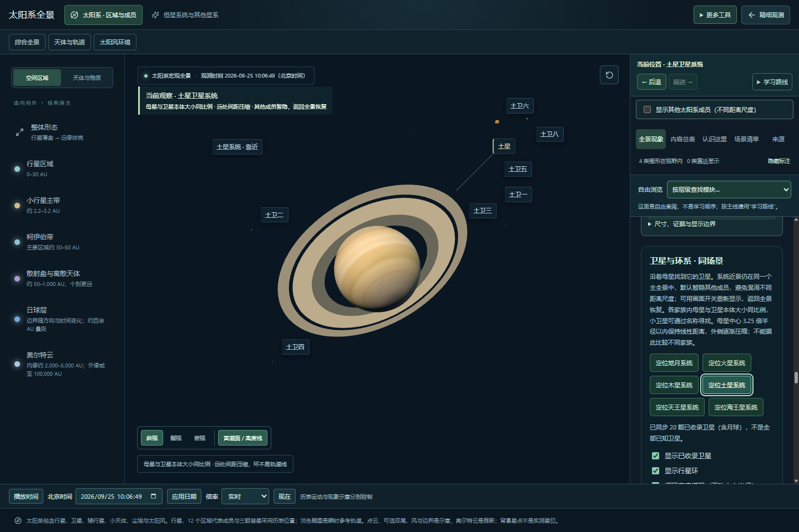
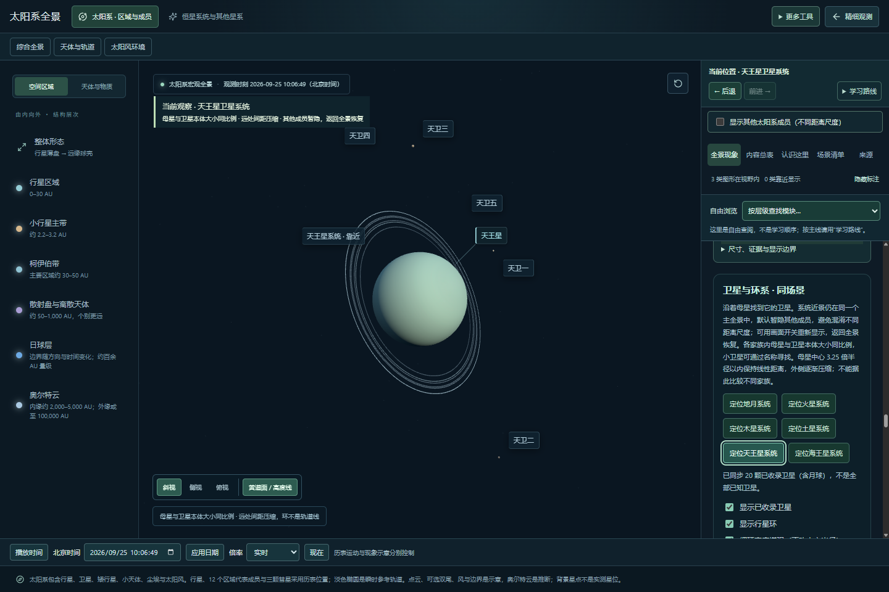
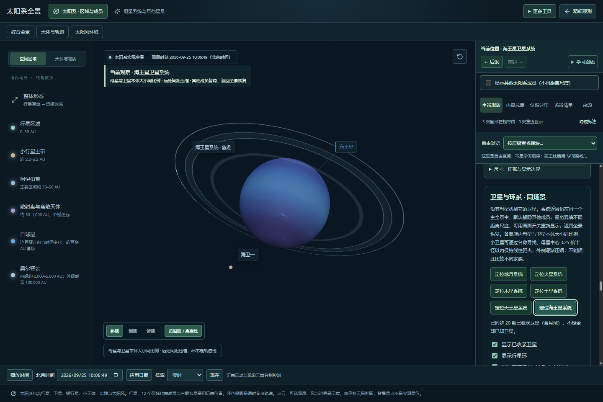

### 3. 其他局部系统

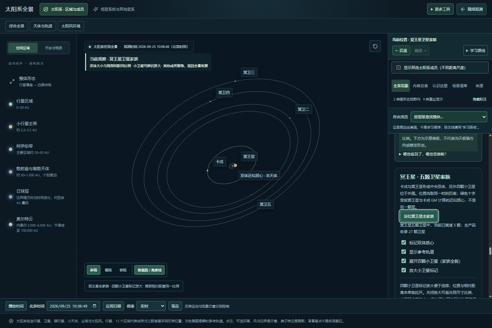
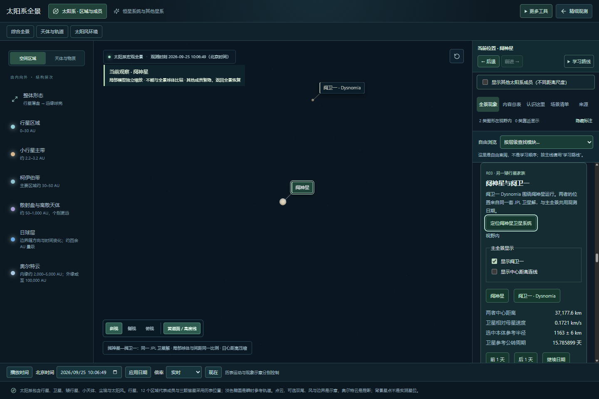
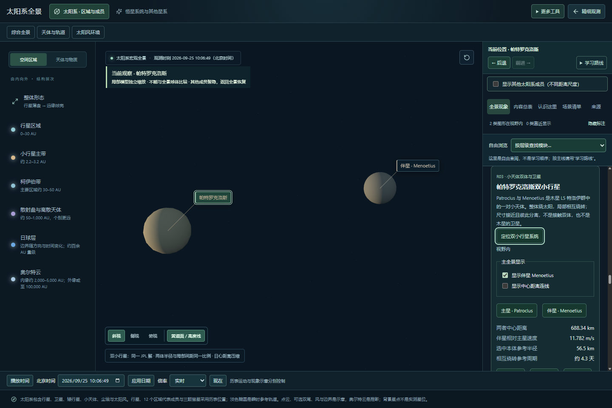
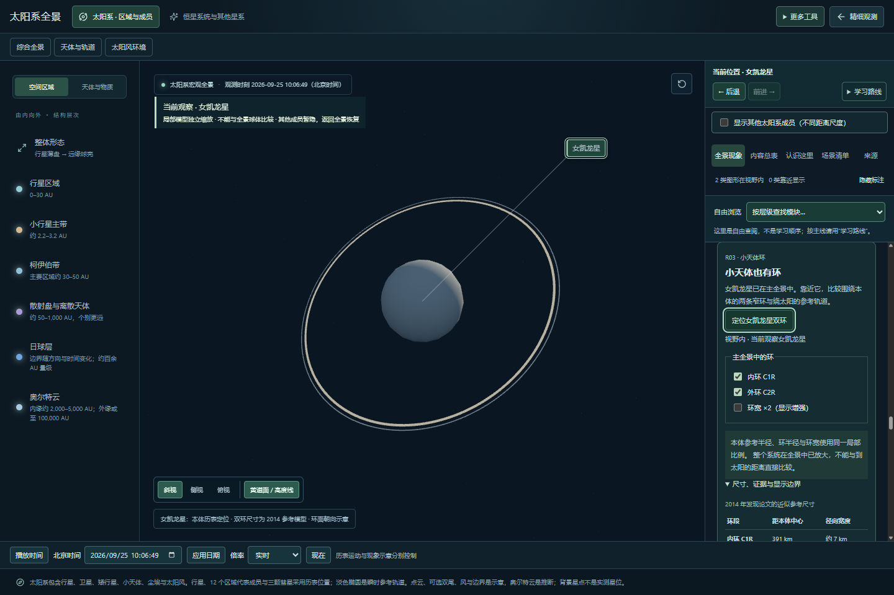

### 4. 土卫二近景

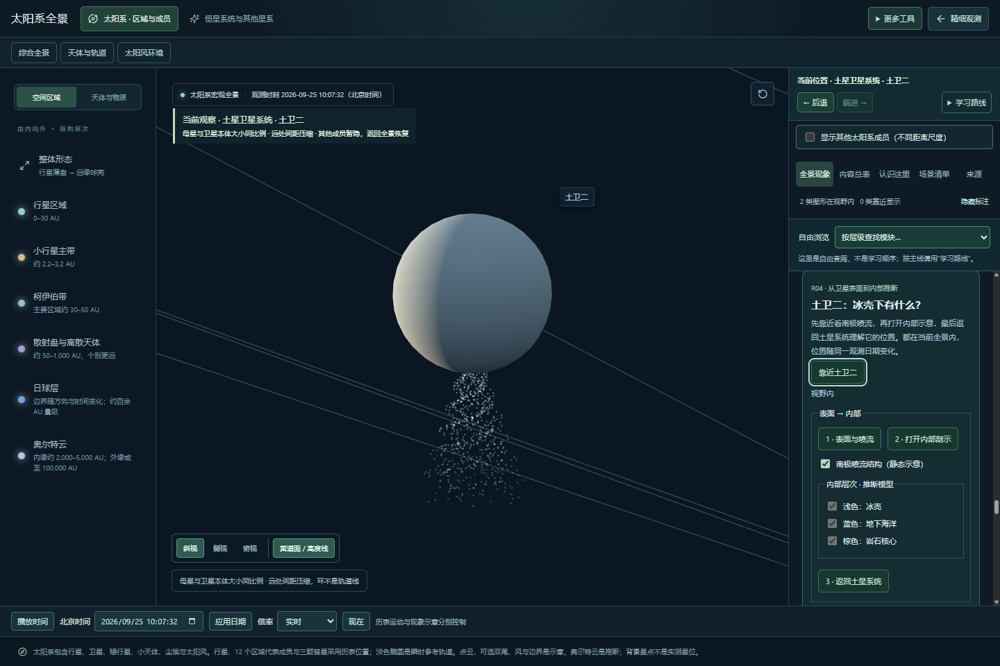

### 5. 返回与窄屏

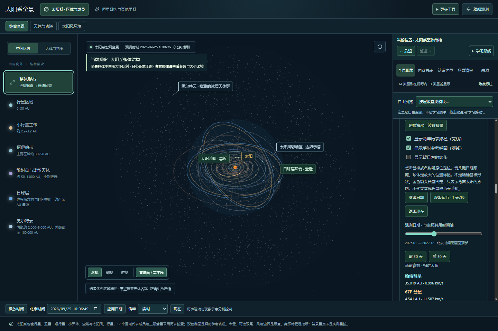
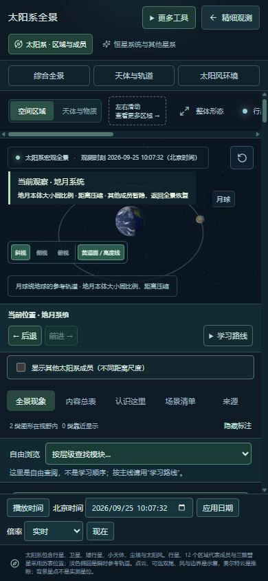

对照发现：

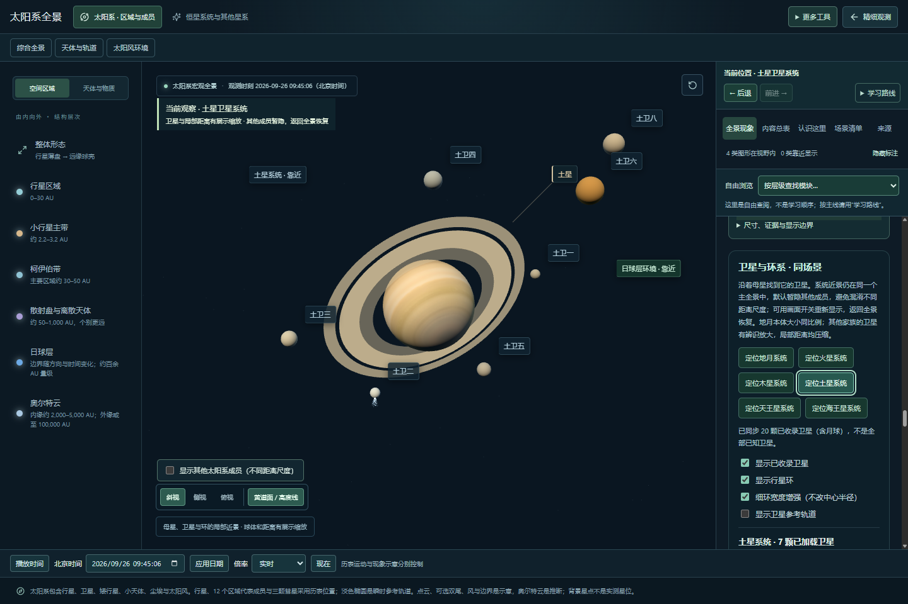
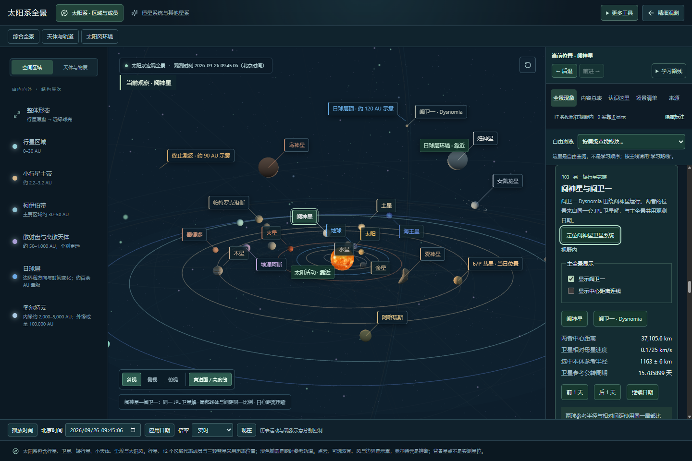

## 规则与证据

- 本体半径：使用已有 catalog / satellites 资料值。宏观六家族内为 `母星显示半径 × 卫星参考半径 / 母星参考半径`。这不意味着不同家族或太阳系全景使用共同大小比例。
- 局部距离：以母星半径为单位，r ≤ 3.25 时为 r；外侧使用 `3.25 + 0.48 ln(r / 3.25)`。分界与系数是绘图选择，不是天文学常数。覆盖目前已绘制的参考环边界；新增更远的环时必须重新核查，不可直接沿用保证。
- 方向及运动：只沿同一母星相对向量缩放，保留坐标轴转换和径向先后。天体位置与参考轨道调用同一映射；不修改历表数组。
- 自动检查遍历已有 2026—2027 月包中四大巨行星的已收录卫星样本，确认显示球体仍位于本版参考主环外；不等于对所有已知内卫星、稀薄外环或未来日期的证明。
- 自动测试：58 个文件、233 项通过；构建通过。既有大型包体积提示仍存在。
- 浏览器操作：六个家族、四个其他局部模型、八个行星本体入口、土卫二、背景开关、浏览历史、全景恢复、同画布与日期保持、390px 布局检查通过，无捕获到的运行异常。

## 仍应明确的边界与风险

1. 全景是跨尺度结构图，不是全太阳系统一物理比例画面。比较金星与地球等大小应使用已有“打开天体大小比较”；实际距离用参数或尺度比较入口。
2. 精细观测中的“距离压缩 / 卫星放大”模式仍是明示的增强模式，真实比例模式保留；此次没有将两者混称为统一真实比例。
3. 冥王星四颗小卫星仍可启用辨识放大，开关与提示保留。阋神星和特洛伊双体本体及局部距离原本共同比例，保留该规则。
4. 光照为教学渲染；静态贴图、示意色球、环亮度、细环宽度增强、日冕、喷流和地球天气均不代表当日实拍。此次未重建天体形状、自转精度或全部表面。
5. 平面投影中，月球/卫星和环发生视觉重叠可能是真实的前后遮挡；不能只凭二维截图判断相交。轨道线穿过卫星当前位置本属参考轨道语义，不是实体物质环。
6. 恢复相对大小后，火卫一、火卫二等可能小于一个像素。名称与侧栏列表提供鼠标和键盘入口，但仍建议后续增加专门的单卫星放大观察。不能为可见性暗中改变科学比例。
7. 已检查基本标签、键盘焦点样式与窄屏几何，没有进行完整读屏器测试、全设备兼容或 WCAG 合规认证。浏览器截图只能证明所测日期、角度和布局状态。

## 数据追溯

沿用项目已有带版本的资料与数据包，本次不新增天文学数值：

- `src/data/catalog.ts`、`src/data/satellites.ts`：物理半径及来源链接。
- `public/data/satellites/manifest.json`：母星中心、ECLIPJ2000、km / km/s、TDB、NAIF 版本。
- `src/data/rings.ts`：NASA 环半径资料、参考宽度、显示边界。
- `public/data/eris-system`、`public/data/patroclus-system`、`public/data/pluto-moons`：同解局部系统数据与清单。

此审查没有重做历表插值精度和十年物理验证；这些沿用各数据准备与物理验证报告，不能把显示测试当作轨道精度验证。
