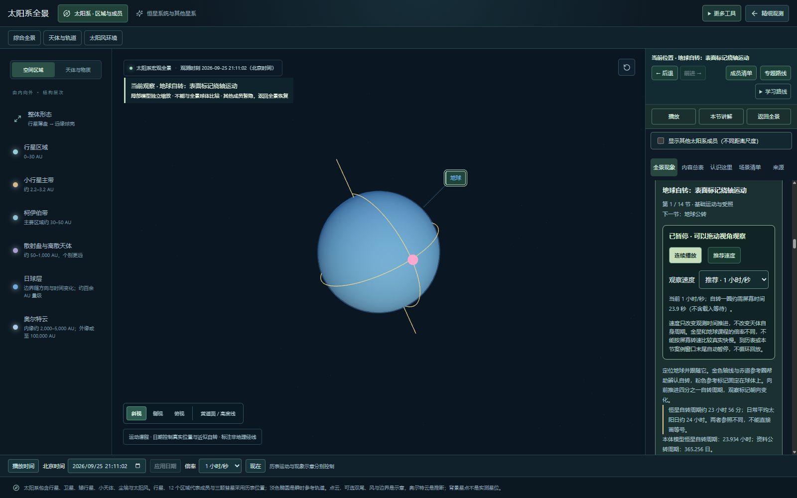
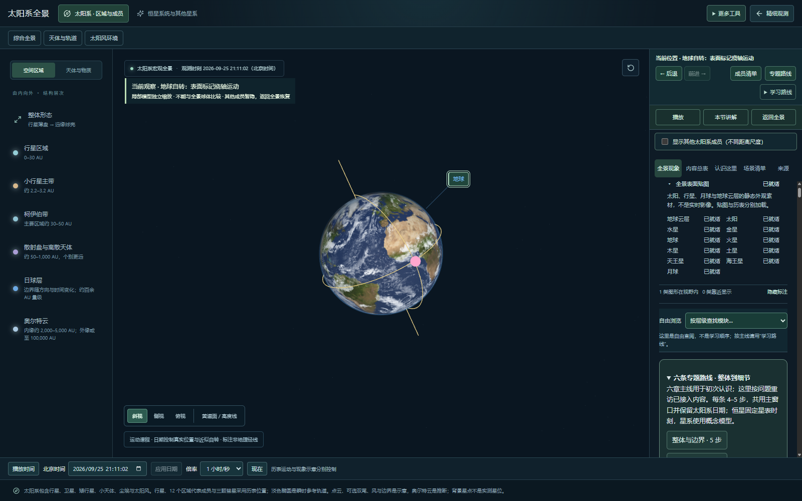

# 2026.09.25-r09.3 · 全景外观素材加载与恢复

基线 bf8cd40。太阳与行星表面原本在贴图失败时保留纯色材质，但没有统一提示和重试入口；云层有单独错误提示，却没有等待时限。本轮把主全景的太阳、八大行星、月球和地球云层接入可查询、可恢复的状态清单。

## 使用方式

全景右侧说明区顶部新增“全景表面贴图”，默认折叠。展开可看具体素材是否就绪；失败时点“重试未就绪贴图”。该操作只请求失败素材，不重设时间、镜头、课程或图层，也不重建主画布。此入口位于原有滚动区中，没有增加顶部工具栏或减少主窗口高度。

素材未加载时保留基础颜色球体；没有云图则不显示云层。静态表面贴图不等于实时遥感或天气，真实位置仍由独立历表供数。

## 等待与生命周期

- 每次贴图等待 30 秒后转为未就绪，允许手动重试；暂停或后台标签页的浏览器计时器调度可能延后。
- 沿用 Three.js 图像加载和原始贴图文件，不更改图像方向、色彩空间或清晰度。底层 ImageLoader 没有公开取消此传输的接口：超时结束界面等待，并阻止迟到结果写入场景，不声称此时已中断浏览器网络传输。
- 重试只处理失败项，成功项和仍在读取的项目保持原样。成功贴图由所属场景回收；迟到、失败和已退出场景的回调不能写回画面。
- 地球云层原有单项重试继续可用，重建云壳会替代旧请求的回调，不增加重复清单行。

## 验证

78 个文件 / 326 项自动检查通过，新增 5 项覆盖超时和迟到结果回收、只重试失败项、新旧请求隔离、场景退出后不更新、云壳重建替换回调。

浏览器分别阻断地球表面、地球云层和火星：清单准确显示三项失败，历表与课程仍可用；解除阻断后只重新请求这三张图，原日期和同一个画布保持不变。截图确认地球海陆与云层恢复。另将地球图片请求延迟超过真实 30 秒，确认迟到结果不自行更改失败状态，手动重试可恢复；加载中切换到恒星页面再返回，全景正常重建。

1280×720、1024×768、390×844 检查：页面无横向溢出，右侧/下方说明区内部滚动，章节讲解可定位，拖动与播放控制可用。测试浏览器结果不代替用户真实设备的长期性能验收。

复验：`npm test -- --maxWorkers=2`、`npm run build`；本地预览 4180、测试浏览器 CDP 9223 下运行 `node scripts/qa/texture-recovery.mjs` 和 `node scripts/qa/viewport-acceptance.mjs`。

## 边界与后续

清单针对主全景当前已使用的上述外观素材，不代表所有教学窗口、模型文件、历表或 GPU 绘制都已经完成。月球载入后加入清单；独立教学与精细观测仍有自己的加载过程。本轮没有宣称减少首次贴图总下载量或修复所有网络瓶颈。后续可测量按观察尺度加载不同清晰度的收益，并评估其他画面的外观恢复；科学模型和用户总验收保持原有边界。

上次请求测量中的“12 个 Image 条目”包含浏览器日期控件图标，实际为 11 个贴图文件；已更正上批说明，不能把浏览器图标计入天体素材。
