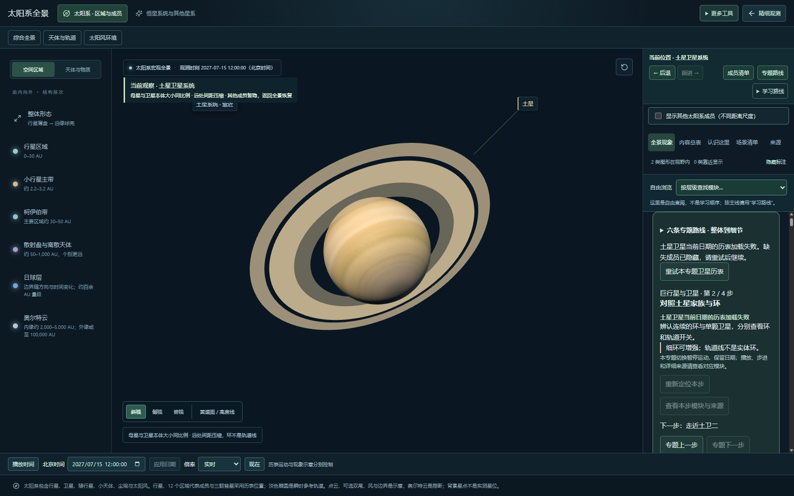
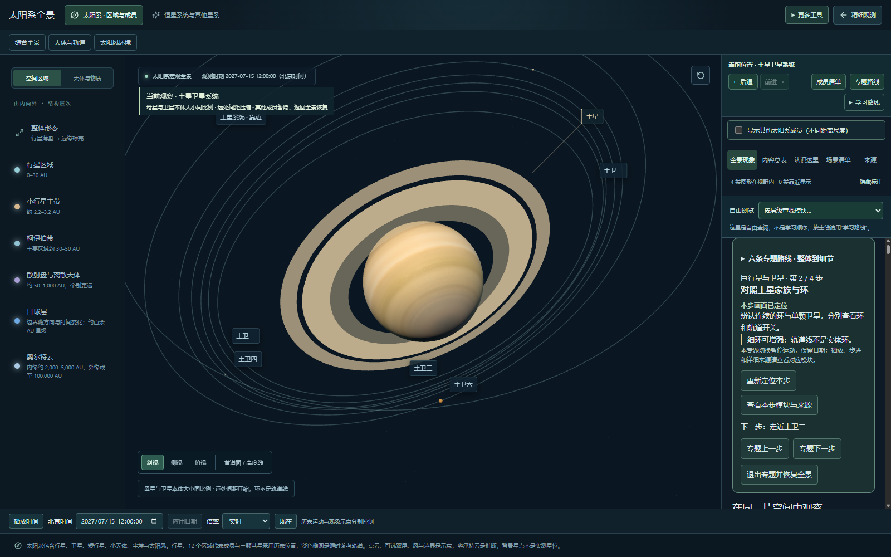

# 专题与卫星异常恢复验收

日期：2026-09-25。范围：本地预览，不代表线上发布或所有设备验收。

## 本轮修复

专题依赖的卫星月度资料失败时，原界面只提示等待，且查看模块按钮不可用。现在显示对应家族的失败原因，并在专题面板提供“重试本专题卫星历表”。检查当前步及下一步的依赖；没有开始路线时检查各路线起点。不把其他家族的失败当作当前专题失败。

缺失成员继续隐藏，母星和行星环仍可观察；恢复数据后重新检查当前步骤与场景是否匹配。未改变时间、历表数值、模型或尺寸比例。

## 实际执行结果

- 五条太阳系专题 22 步：逐步核对定位状态、进度、日期保留、同一画布和模块/来源跳转；课程偏离后重定位、步骤切换暂停、历史返回、阶段关闭限制通过。
- 宇宙专题 5 步：空间距离与天空方向切换、跨太阳系/宇宙范围前进后退、手动偏离后重定位、退出返回全景通过。
- 阻断恒星目录请求：下一步不可用；清除阻断并重试后可进入邻星空间。
- 阻断木星卫星 2027-06 数据：旧的木卫一参数与可见标签消失，目录入口禁用；土卫六仍可用。重试后恢复木卫一，前进后退保留当前日期与所选卫星。
- 阻断土星卫星 2027-07 数据：专题不再显示“本步画面已定位”，显示失败和直接重试入口；恢复后重新匹配画面，下一步可进入土卫二。
- 390 px 宽度检查未发现页面横向溢出，不代表移动端整体体验验收。
- 全量自动检查：76 个文件、315 项通过；生产构建通过，保留既有大体积脚本提示。

## 可复验入口

预览 http://127.0.0.1:4180/ ，使用测试浏览器 CDP 9223。按顺序运行，不能同时操作同一标签页：

- `node scripts/qa/topic-routes.mjs`
- `node scripts/qa/cosmic-route.mjs`
- `node scripts/qa/family-recovery.mjs`

异常由测试浏览器拦截具体资源请求产生；脚本结束清除网络阻断和缓存覆盖。没有删改产品数据包。

## 画面证据

## 边界与剩余工作

这些检查证明所列界面与恢复路径在本地测试环境通过，不证明所有网络故障组合、全部卫星家族或真实设备均通过，也不认证天文模型绝对精度。仍需用户在实际设备检查拖动、可读性、播放和页面流畅性，再整理提交、发布及远端验收。
