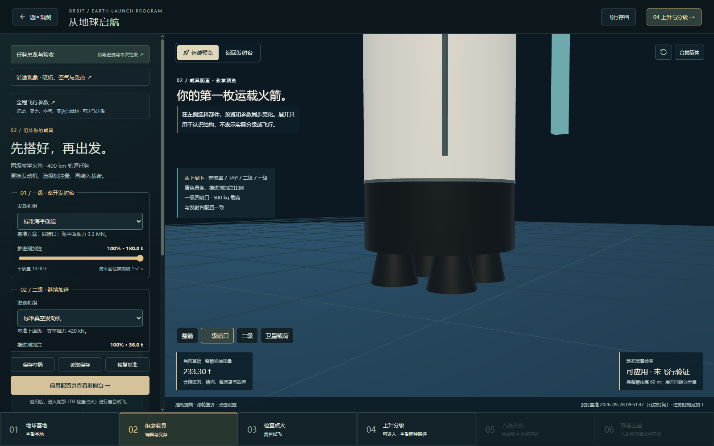
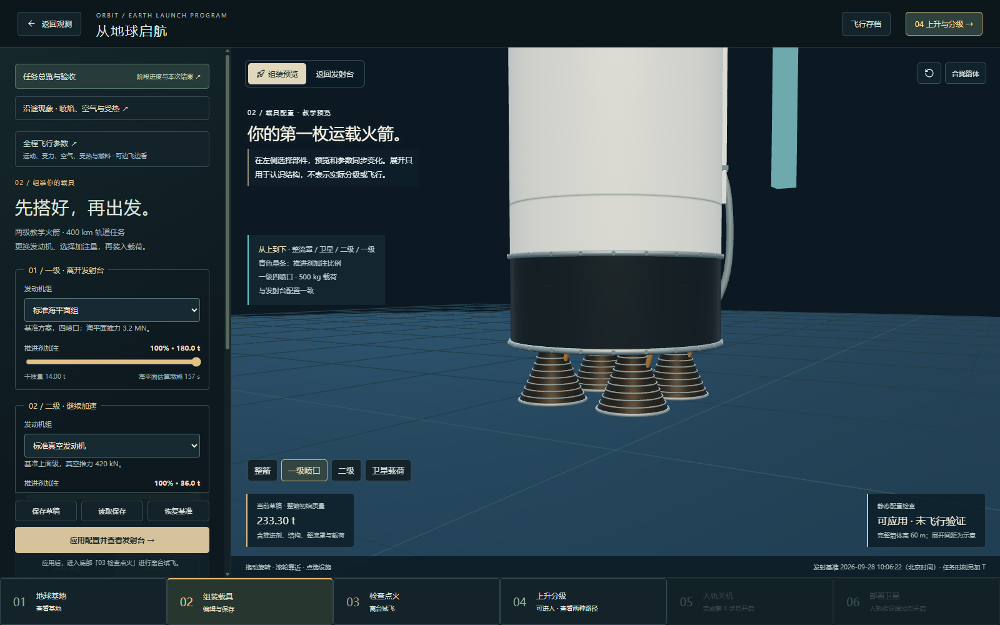
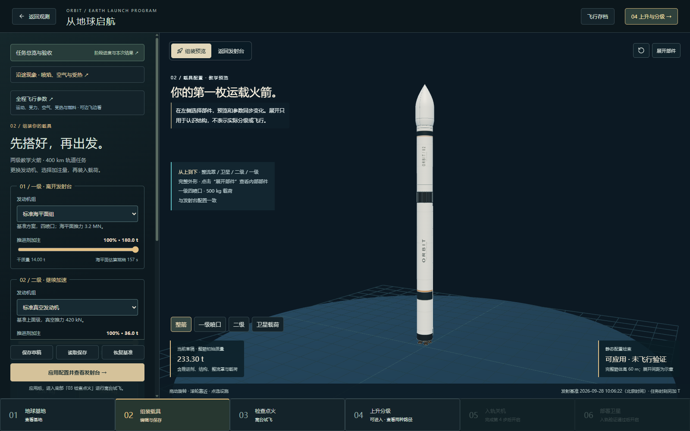
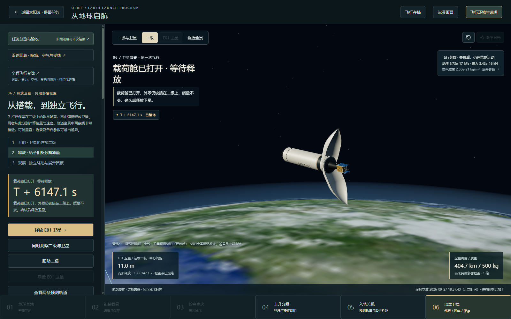
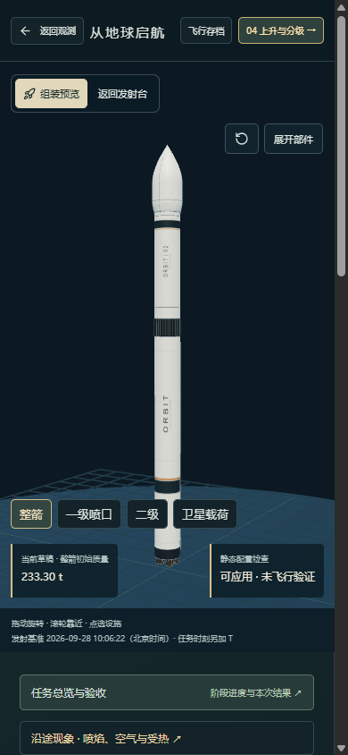

# 火箭外形细化与查看方法

> 2026-09-28 已纳入 [地球出发教学版阶段归档](EARTH-LAUNCH-ARCHIVE.md)。下方各轮日期、检查结果和“未推送 / 待验收”描述保留当时状态；当前范围以归档记录为准。

2026-09-28，本地更新，待体验验收，未提交或推送。

## 本轮改动

- 组装页默认显示完整火箭；点击“展开部件”再观察内部关系。合拢、拆解和部件定位重新取景，避免镜头保留在之前的高度。
- 保留名义高度 60 m、主体直径 3.7 m、整流罩最大直径约 4.3 m；采用白色主体、石墨色结构段、少量暖色标识及环绕箭体的 ORBIT 涂装。
- 一级新增开口发动机舱、级间加强筋、紧固件与管线罩。二级新增顶部结构和载荷适配器，整流罩肩部平顺连接主体，半罩共用完整外壳轮廓。
- 海平面及真空喷管采用旋转曲面，补充喉部、连接段、环带和供给管路；一级四喷口/双喷口随配置切换，二级高比冲选项保留较宽喷管。
- 发射台、组装预览、上升和在轨部署共用同一模型，分级和开舱接口保持一致。外观不修改质量、推力、阻力、飞行时序、载荷位置或存档版本。

## 怎样看

1. 在本地页面打开“地球出发”，进入底部“02 组装载具”。先看完整外形，拖动旋转、滚轮缩放。
2. 点击“一级喷口”“二级”“卫星载荷”，近看各自结构；再点击“合拢箭体”回到整箭。
3. 改变左侧发动机选项，可比较双喷口、四喷口与两种二级喷管。静态推重比检查仍决定配置能否应用。
4. 应用配置后，发射台和随后飞行使用同一外形；部署阶段仍保留原教学开舱与释放方式。

## 截图对照

修改前：喷口是简单截锥，发动机舱与箭体缺少连接细节。

修改后：弯曲喷管、喉部、连接环及底舱细节。

完整火箭默认展示，涂装贴合圆柱表面。

二级开舱后，载荷适配器、卫星与保留的罩体在同一模型中展示。

## 真实依据与教学边界

本模型为原创教学造型，未复刻现实型号。发动机结构的分区与受保护安装方式可参考 [NASA 的 SLS 发动机段介绍](https://www.nasa.gov/image-article/sls-engine-section-approaches-finish-line-first-flight/)。该参考只帮助理解结构分区；SLS 的尺寸、发动机参数和工作方式没有作为本载具的真实规格。

涂装、管线、接缝和紧固件为视觉表达，没有进行结构应力、管路流动或制造公差求解。环带不表示已模拟真实冷却回路。教学整流罩仍留在二级上、未抛弃，其质量沿用原模型；现实载具的抛罩方案依任务设计而异。本轮未增加侧助推器、栅格舵、着陆腿或回收能力。

## 关于“退役”的补充解释

退役指正式结束原定业务。短期没有观测、进入地影或暂时低负载，并不自动等于退役。任务结束后的能源处理与轨道处置需要另外判断：[ESA 对剩余能量管理的说明](https://www.esa.int/Space_Safety/Clean_Space/Sending_a_satellite_safely_to_sleep)、[ESA 对空间碎片缓解与处置的说明](https://www.esa.int/Space_Safety/Space_Debris/Mitigating_space_debris_generation)。

本项目 E01 的退役分支停止业务、隔离充电并进行教学放电，保留 5% 残余后观察 10 分钟。它仍沿轨道运动，没有推进器、未主动离轨，不能据此认定完成处置或完全钝化。选择“保留工作状态”则尚未退役。

## 技术核对

重复的筋条、环带与紧固件按材质合并；基准整箭可见模型为 31 个网格，未给每个紧固件增加独立动画。涂装为本地生成的两张 512×1024 纹理，不访问外部贴图服务器。喷焰原点保留在一级 y=0、二级 y=33.7 m。

本轮实际检查整箭、拆解、四/双喷口、不同二级喷管、载荷、桌面及 390 px 窄屏；检查分级可见性与开舱/释放接口，基准整箭质量仍为 233.30 t。近看细节与远景的清晰度不同，不以放大结构图替代整体尺寸比例。

验证结果：107 个测试文件 / 510 项检查通过；首次并行构建时一个历表读取检查超出 5 秒，降低并发后全套复查通过，未改该检查的超时阈值。类型检查和生产构建通过。独立浏览器恢复既有入轨存档，开舱、释放 E01 并运行至“部署检查通过”，过程无页面脚本错误；结束后恢复原测试窗口存档。主包体积告警仍为已知项，本次未宣称加载性能达标。
