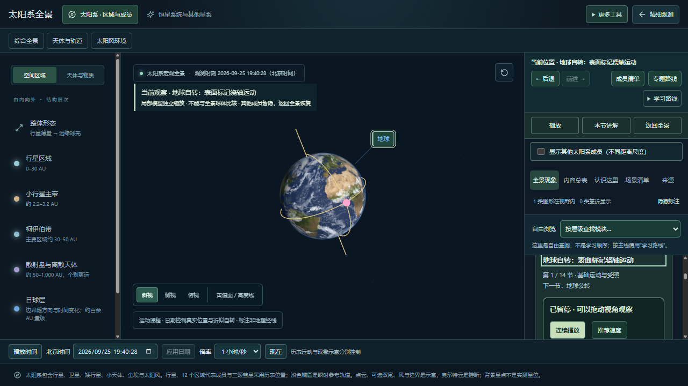
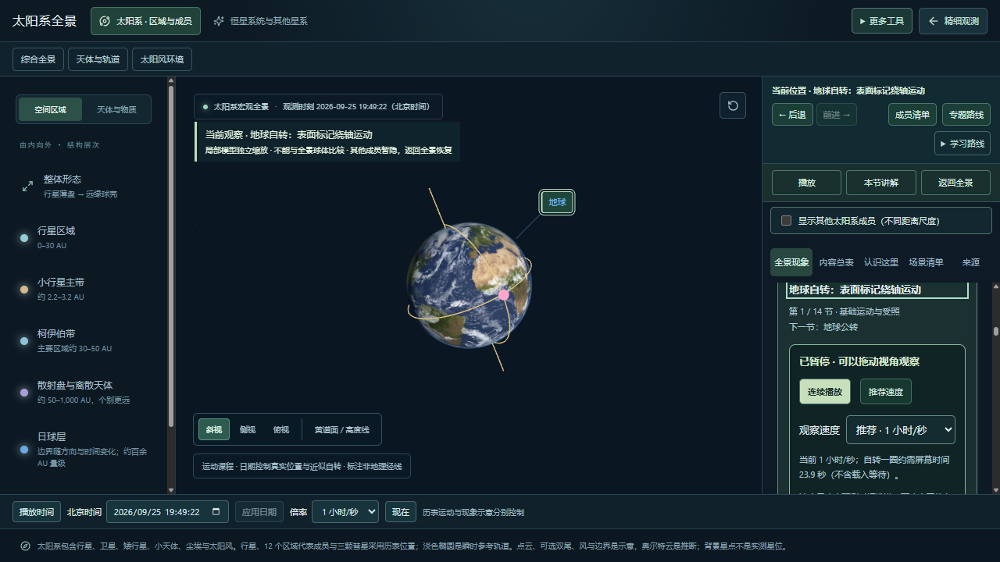

# 操作与窗口布局验收

日期：2026-09-25。本机测试浏览器的本地预览；不是用户设备或触屏真机的验收结论。

## 问题与修复

1. 进入地球自转课，在 1280×720 窗口，图层统计和目录一直占据右侧固定空间，正文只剩 157.5 px。现将统计及目录移入正文滚动区域，保留右侧前进/后退、播放、讲解和返回全景。正文增加至 271.5 px，主画布仍为 750×535 px。
2. 390×844 窗口中，学习路线外层已经收起，内部章节的 open 状态仍误触发整栏自动增高，导致正文高度约 13,326 px。选择器现在只检测路线最外层；侧栏固定为 380 px，正文约 167 px，并可内部滚动。
3. 自由浏览目录遗留“五条专题”的文字，已统一为六条。

## 操作步骤与结果

1. 打开地球自转课，在 1280×720、1024×768、390×844 点击“本节讲解”：焦点与标题进入实际可见正文范围，页面无横向溢出。1024×768 的正文从 189.5 px 增至 319.5 px。
2. 窄窗口滚动正文，展开再收起学习路线：路线展开区域有高度上限，收起后侧栏恢复 380 px，不再被隐藏的章节撑开。
3. 在 1280×720 使用真实鼠标事件拖动 3D 画布：截图确认地球视角改变，观测日期保持不变。
4. 播放后暂停：日期推进，暂停后稳定；从来源页按“本节讲解”恢复正确内容与键盘焦点。
5. 太阳系、邻星距离、天空方向、银河系、邻近星系两轮共 10 次切换，检查单一活跃场景、重复场景节点/监听与绘制提交情况；六项检查均通过；原始结果见 [performance.json](qa/viewport-2026-09-25/performance.json)。此测量不是屏幕呈现帧率，也不与此前不同运行条件的数字直接作速度比较。

复验：`node scripts/qa/viewport-acceptance.mjs`；性能：`node scripts/measure-performance.mjs .cache/viewport-performance.json 2`。两者依赖本地预览 4180 和测试浏览器 9223，按顺序执行。

## 本轮截图

修复前的电脑窗口：

修复后的同尺寸窗口：

窄窗口中讲解已可读（页面会按讲解定位滚动）：

## 验收边界

通过可见范围和焦点检查不等于完整无障碍认证。窄屏仍采用纵向排列，查看正文时需要滚动，未改造成移动端专用界面。触屏手势、真实屏幕流畅性、高刷新率功耗及用户设备长时间使用仍需人工验收。本批未提交发布；不据此宣布第一阶段全部目标完成。
