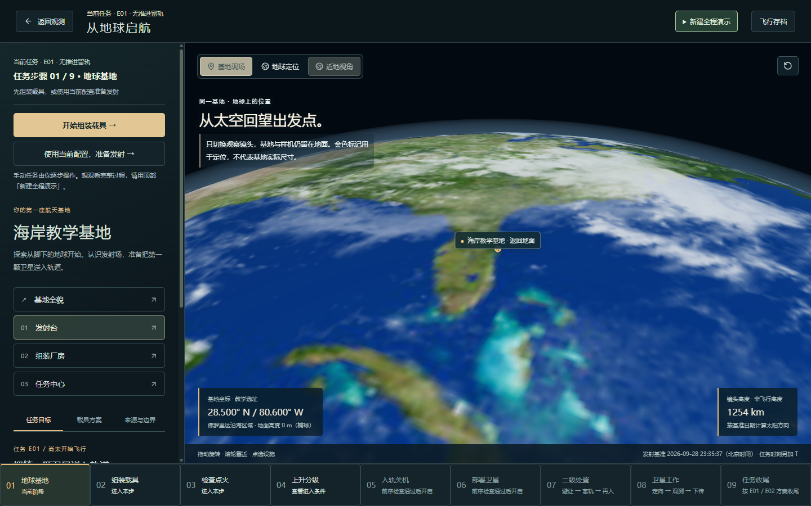
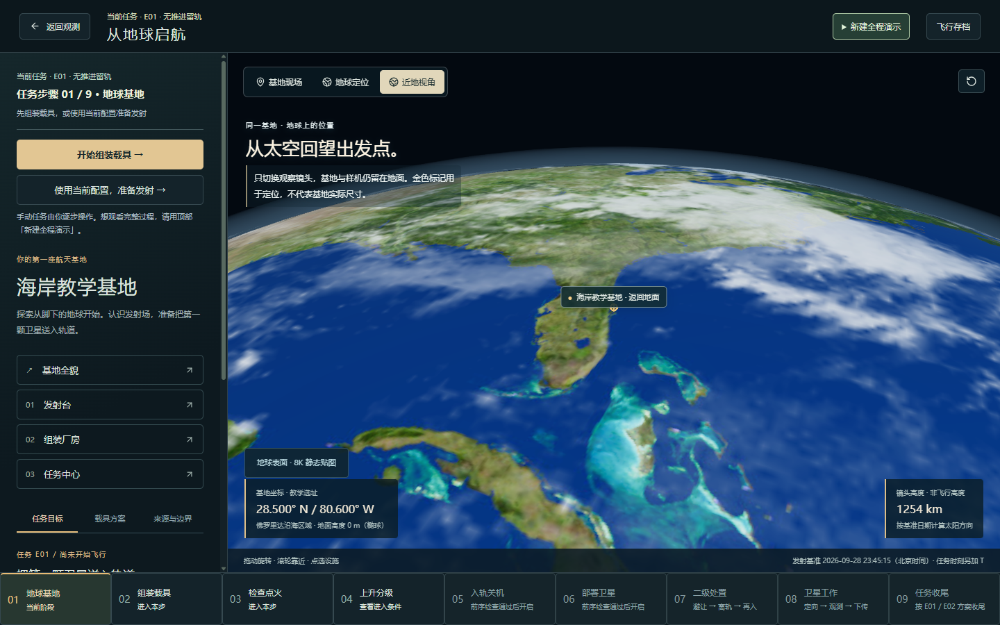
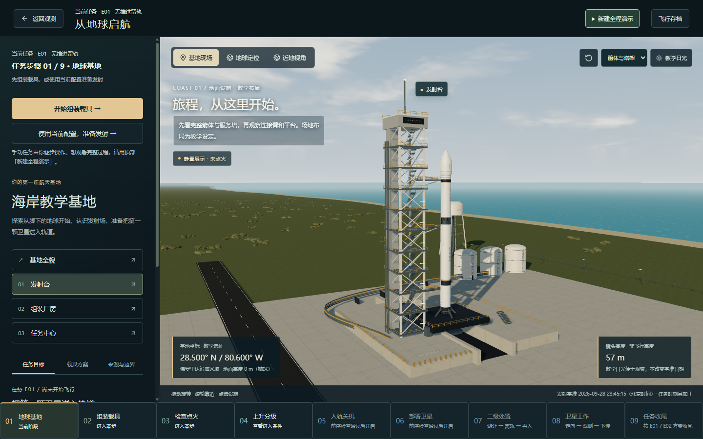
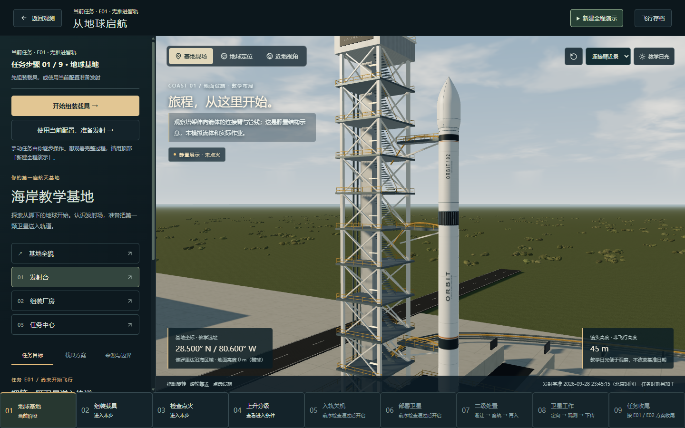
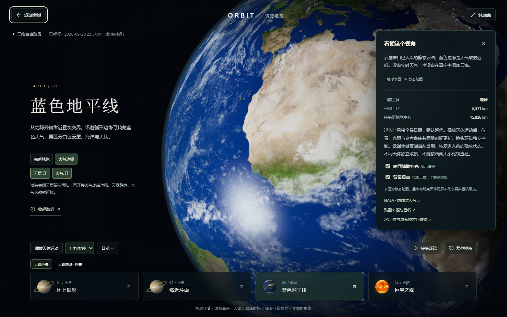

# 第二批体验优化：地球近景与基地视角

日期：2026-09-28。状态：本地实现与验证完成，等待用户验收；未提交、未推送本轮产品改动。

本项承接[观察空间与层级导航](OBSERVATION-SPACE-IMPLEMENTATION.md)。第二批约定的面板占位、层级靠近／返回、地球近景清晰度、基地关键视角已完成本地首轮实现；这不代表后续解释与性能专项也已完成。

## 地球近景

- 保留现有 2K 基础贴图，进入全景时不额外请求高清资源。地球实际绘制直径达到约 360 个画布像素后，才按需读取本地 8K 表面贴图。高像素密度屏幕按画布像素判断；仅进入“地球本体”不保证立即触发，继续靠近后才可能需要高清。
- 全景采用的标准材质、沉浸观景和发射基地采用的自定义材质均已接入；上升场景复用同一地球材质入口。保留各自的光照方式和坐标规则。
- 新图读取成功后再替换基础表面，并释放旧表面纹理；显示读取中、就绪或保留基础图状态。读取失败、等待超时、设备不支持该尺寸时不移除基础画面。
- 失败后可点“重试近景贴图”，不会重启飞行或重置镜头。关闭场景时取消尚未完成的请求；超时后迟到的回调不能覆盖重试结果。
- 全景地球球面网格从 48×32 提高到 128×80，减少放大时的轮廓折线；物理半径不变。

素材来自 [Solar System Scope / INOVE 的公开贴图集](https://www.solarsystemscope.com/textures/)，沿用其 CC BY 4.0 署名；原始文件尺寸 8192×4096，4,565,076 字节，未经图像修改。下载地址、时间、尺寸和 SHA-256 已加入 `public/textures/sources.json`。运行时只读取项目中的 `/textures/earth-day-8k.jpg`，不访问原始素材服务器。

本次只增加地表分辨率。云图、夜光图仍为现有静态素材，大气为视觉近似；不是实时天气、卫星实拍直播或可降落地形。8K 纹理会增加近景显存使用；按需触发和硬件尺寸检查不等于已经完成低配设备性能专项。

## 基地观察

在“地球出发 → 基地现场 → 发射台”右上角选择：

| 视角 | 看什么 | 行为 |
| --- | --- | --- |
| 箭体与塔架 | 完整箭体、塔架、平台与周边关系 | 按窗口长宽比适配距离，留出上下余量 |
| 地面仰望 | 从地面看箭体、塔架和连接臂 | 镜头高度约 2.2 米；改变画面，不启动飞行 |
| 连接臂近景 | 塔架伸向箭体的连接臂和管线 | 局部取景，顶部塔架和底部平台可能在画外 |

每个视角有相应说明，仍可拖动、缩放及复位。全程演示开始／退出的临时界面恢复也保存所选基地视角；真实试飞仍使用原有跟随和地面机位。教学日光、任务时间与物理过程不变。

## 验证记录

- 构建、类型检查与规划文档同步检查通过。
- 相关回归：5 个测试文件、23 项通过，覆盖两种材质、按需加载、硬件限制、失败／超时／取消／重试、旧回调隔离、相同比例不同物理半径，以及基地取景边界。
- 最终全量回归：121 个测试文件、592 项通过，约 125 秒。之后仅将全景贴图状态移到说明滚动区域之外，避免说明自动定位后遮住状态，并重新构建和检查页面。
- 独立本地 Chrome 页面检查 1440×900 和 1100×800：三个基地视角可切换，仰望读数为 2 米；较窄桌面窗口无横向溢出。
- 首页全景未请求 8K；近地视角成功从 `127.0.0.1:4180/textures/earth-day-8k.jpg` 读取。全景地球继续缩放后、沉浸地球近景均显示 8K 就绪。
- 人为阻断高清图片请求后，页面保留 2K 地球及失败说明；解除阻断后点重试，在同一场景恢复 8K。
- 科学位置、半径、日期与模拟推进模型没有改动。本轮没有再次全程运行 E01 / E02 的所有飞行分支；全量自动测试通过也不等于所有硬件上均无卡顿。

检查使用单独浏览器配置与页面，结束时恢复该检查页初始存储并关闭，未修改用户正在使用的页面。截图中的地球表面与云层均按原有日期、自转和光照显示。

## 对比与验收

同一基地近地视角的原有 2K 表面：

按需加载 8K 后，海岸、岛屿与地表轮廓更清晰：

完整箭体与塔架：

连接臂局部观察：

沉浸式地球与静态素材说明：

验收入口：刷新本地页面 → 地球出发 → 近地视角；再返回基地现场，在右上角选择三个发射台视角。全景可通过“靠近行星区域 → 靠近地球”并继续滚轮靠近，或进入“沉浸观景 → 地球蓝色地平线”查看。

第二批进入待验收状态。下一批沿用原有规划：统一数据类型与来源标识、让事件对应参数变化，并解释任务成果与最终去向；第四批再做首开、资源、持续运行、存档恢复与键盘路径专项。此处不增加新天体或新玩法。
