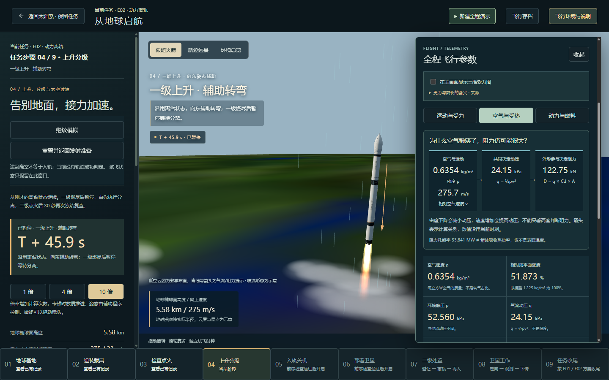
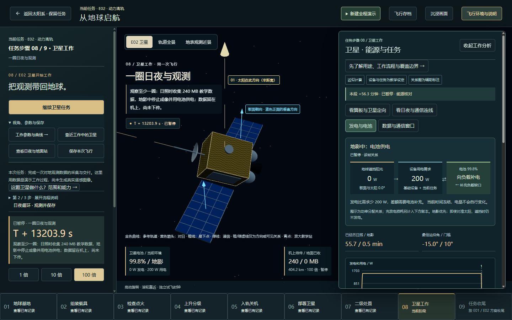

# 第三批：事件、参数与任务结果的对应关系

日期：2026-09-29。对应原审查清单第三批「完成解释闭环」。本轮沿用既有计算精度，不增加物理模型、卫星设备或玩法。改动在本地，尚未提交或发布。

## 这次可以看到什么

| 入口 | 新呈现 | 要回答的问题 |
| --- | --- | --- |
| 从地球启航 → 全程飞行参数 → 空气与受热 | 密度与相对空气速度 → 动压 → 阻力；同帧数值 | 为什么不能只凭高度判断阻力？为什么阻力耗能不等于箭体温度？ |
| 卫星工作 → 工作参数与曲线 → 发电与电池 | 太阳翼发电 → 设备用电 → 电池补充、充电或满电拒收 | 对准太阳为什么可能不发电？负载差额由谁承担？ |
| 卫星工作 → 工作参数与曲线 → 数据与通信窗口 | 累计采集 → 机上待传 → 地面已收 | 拍到、保存与送到地面，是不是同一件事？ |
| 观测任务完成或停止；E01 / E02 最终结果 | 共享任务回执：工作区间、数据成果、卫星去向 | 业务交付完成，是否等于物体已处置？ |

供电和数据关系图位于参数页前部，移除了重复的发电和夹角读数，保留后续曲线、站点表、账本和来源详情。没有新增占据主画面的常驻面板。

### 空气、运动与阻力

直接读取 `flightTelemetry` 的同一快照。速度使用相对空气速度；动压、阻力和阻力耗能率都沿用现有计算。关系图不计算新的温度，不将尚未计算的热状态填为零。暂停保留当前帧。

### 供电与任务条件

供电判断复用 `solarPointingReading`。地影、太阳翼背向太阳、发电不足、收支平衡、充电、满电和电池耗尽分别解释。图中电力差额是发电减负载需求，不将其冒充扣除充放电损耗后的储能变化率。

修正了辅助线说明中的一处边界：不能在电池已经耗尽时仍一律写「电池供电」。辅助线与参数页现共用供电判断。

运行中的采集和下传会突出对应数据节点；暂停后取消活动高亮，并明确数量冻结。没有可用窗口、低电量保护和任务停止各自说明原因，不把机上缓存计作地面成果。

「近似计算」「设备与任务为教学设定」「关系图为辅助标注」在这两个参数入口统一标明。下方既有 NASA、USNO 参考及适用边界继续保留。并未把发射模型改称 JPL 历表或实际遥测。

### 曲线与事件

发电曲线使用本次事件记录标注「进入地影」「恢复日照」；数据曲线标注「开始观测」「申请下传」。编号可在曲线下展开查看。

竖线使用日志时刻，曲线仍按原来的 10 秒采样。两者可能不重合，不从采样图线推造精确事件时刻。维护和离轨阶段的后续事件不会混入工作段曲线。

### 业务成果与物体去向

回执从已有数据账本读取采集量、机上余量和地面接收量，分别判断交付和处置。E01 退役仍在轨不算完成处置；E02 的 20 km 检查点不算最终下降完成；地表参考终点不代表真实烧毁、安全落地或残骸预测。

维护和离轨仍会更新共享的 `operations.elapsedS`。回执使用交接时刻截断观测工作区间，防止把后续时间算进观测任务。它没有改变原来的时钟、积分或存档格式。

回执不声明真实影像、累计拍摄面积或实际地面站业务已经发生。瞬时假设视场与已经交付的数据量分别说明。

## 验证

- 新增 6 项解释逻辑与展示测试，使用模型实际运行的 E01 / E02 路线，核对暂停、供电边界、数据保存和交付、20 km 与地表终点、历史时长、事件时间及快照只读性。
- 针对性检查：4 文件 / 23 项通过。
- 完整回归：122 文件 / 598 项通过。布局调整后再次完成生产构建；文档同步检查和 TypeScript 检查通过。
- 本地 Chrome 页面：1440×900 与 1100×800，关系图无横向溢出、数值无裁切；供电、下传、交付及两种结束结果通过正常存档恢复入口检查。浏览器用样例由同一浏览器运行模型生成，未绕过恢复重算或直接注入求解器状态。
- 页面验证还检查暂停时数据不变、继续后下传状态和读数更新、再次暂停后冻结；事件列表与图中编号关联。
- 这是抽样页面验证，加上完整模型回归；不等同于在浏览器里从发射开始连续观看两条全程，也不代表所有设备性能已经达标。

构建仍有既有大脚本体积提示。首开、弱网、长时帧耗时、存档环境兼容和键盘路径，留在第四批专项测量。

### 验证环境注意

最初由 Node 生成的样例在 Chrome 恢复时触发既有的「重算结果与存档不一致」保护，原任务未被替换。本轮改用浏览器内实际生成的样例验证页面，并保留严格校验，没有把这个跨运行时问题误报为已修复。下一批应专项核对不同运行环境的存档重算边界；它不是本轮解释组件改变物理精度的结果。

后续记录（2026-09-29）：[第四批专项检查](SPECIALIST-CHECKS-AND-CLOSEOUT.md)已复现并修复这一兼容问题，六个阶段的跨环境恢复、异常存档拒绝及继续运行验证通过。保留本段作为第三批当时的验证边界。

## 截图索引

- [供电关系，1440×900](explanation-results/02-power-eclipse-final.png)
- [供电关系，1100×800](explanation-results/03-power-1100.png)
- [数据流向，暂停帧](explanation-results/04-data-flow.png)
- [业务交付回执](explanation-results/05-receipt-complete.png)
- [E01：退役仍在轨](explanation-results/06-receipt-e01.png)
- [E02：参考下降结束](explanation-results/07-receipt-e02.png)
- [空气与阻力](explanation-results/08-air-load.png)
- [正在下传](explanation-results/09-live-transfer.png)
- [曲线事件对照](explanation-results/10-chart-events.png)

## 剩余范围

本轮解释功能可在本地验收。后续进入原计划第四批「专项测量与收尾」；不因仍可增加科学模型而继续抬高本版精度目标，也不把航天器操控、真实业务星座或多存档自动加入本轮。
