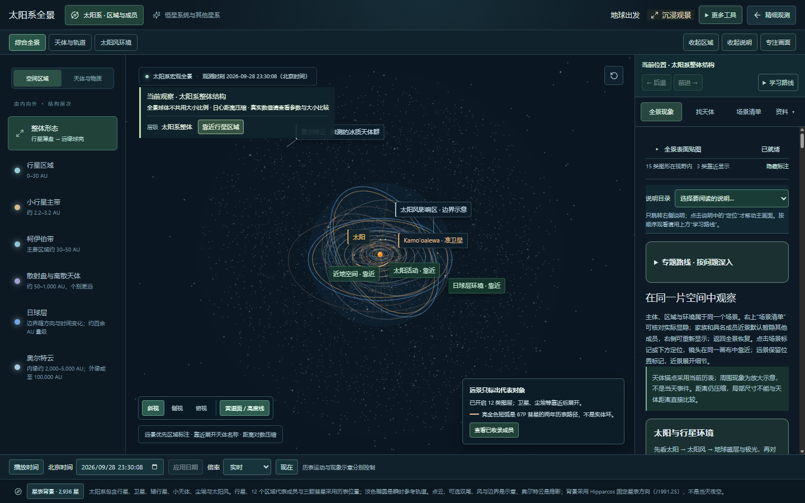
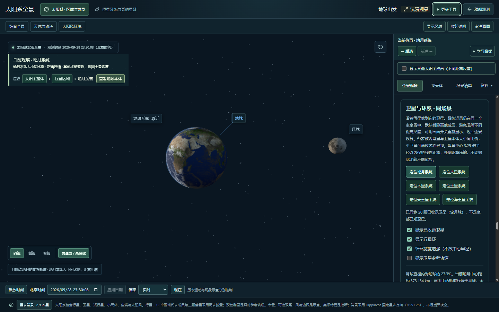
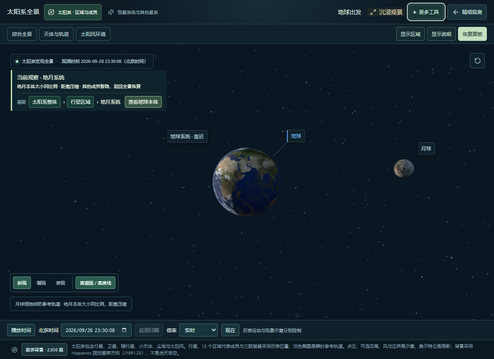

# 第二批体验优化：观察空间与层级导航

日期：2026-09-28。状态：本地实现与验证完成，待用户验收；本批产品改动尚未提交或发布。

本记录承接[全景入口整理](PANORAMA-NAVIGATION-IMPLEMENTATION.md)，对应[四批安排](README.md)中第二批的第一部分。地球近景纹理与发射基地关键镜头仍待处理，本记录不代表第二批全部完成。

## 用户可见的变化

- 顶部右侧增加“收起区域”“收起说明”“专注画面”。分别收起两侧面板，或将整个可用宽度留给 3D 场景；控制沿用现有工具栏，不新增一整行。
- “恢复面板”回到进入专注模式前的布局，支持只恢复先前打开的一侧。专注状态下可按 Esc 恢复；打开单侧说明时不会额外展开区域目录。
- 当前观察提示中增加层级入口：太阳系整体 → 行星区域 → 地球 → 地月系统。点上层名称返回对应范围；地月系统也能单独查看地球本体。
- 小天体回到自身所属区域，例如灶神星对应主带、阋神星对应散射盘、冥王星对应柯伊伯带，并可展开冥王星卫星家族。磁层、事件和介质等专题不会误标成卫星家族。
- 通过层级按钮靠近目标后，说明面板滚动到相应内容。说明栏关闭时先保留阅读目标，重新展开后再定位。
- 数据或阶段条件未满足时，近景按钮禁用并显示原因。场景内的“查看已收录成员”在专注状态下也能直接打开右侧搜索。

这些操作复用当前镜头和数据入口。面板显示状态不改变观测日期，也不卸载 3D 画布；靠近与返回保留既有示意比例说明，没有修改历表、引力、自转、公转或任务存档格式。

## 验证

| 检查 | 结果 |
| --- | --- |
| 构建、类型检查与规划文档同步检查 | 通过 |
| 布局、层级与既有导航定向测试 | 5 个文件、27 项通过 |
| 最终全量回归 | 119 个文件、582 项通过，约 84 秒 |
| 1440×900 布局 | 双侧面板时画面宽 910；专注后宽 1440，高度保持；控制位于右侧 |
| 单侧恢复与 Esc | “显示说明”只打开右侧；Esc 恢复先前部分展开的布局 |
| 整体 → 区域 → 地球 → 地月 | 同一画布、同一观测日期；右侧“卫星与环系”说明顶部定位到滚动容器内 12 像素 |
| 分类与返回 | 灶神星、阋神星、冥王星归属及家族入口检查通过；可返回所属区域和整体 |
| 1100×800 | 专注画面宽 1100，无横向溢出，“恢复面板”可见 |
| 差异格式检查 | 通过 |

最终浏览器检查在独立本地 Chrome 页面完成，暂停观测时间后比较状态；结束时恢复该页面检查前的浏览器存储并关闭页面，未操作用户正在查看的页面。检查前本地预览服务已停止，重新启动后完成复查。

最初的全量测试运行被对话输入中断，不计为通过；上述全量结果来自后续完整运行。桌面取样不等于完整移动端适配，也不代替性能与无障碍专项。现有主脚本仍约 1.68 MB（未压缩），体积提醒留待第四批测量处理。

## 页面证据

全景保留两侧面板，上方可选择专注画面，画面内可逐层靠近：

地月近景中收起区域目录，保留与画面对应的说明：

1100 像素桌面窗口的专注画面，镜头和时间操作仍可使用：

## 本地验收方法与后续

1. 刷新本地页面，依次点“靠近行星区域”“靠近地球”“展开地月系统”。检查对象、日期、比例说明与右侧介绍是否对应。
2. 点层级中的“行星区域”或“太阳系整体”，检查能否回到合适范围。
3. 点“专注画面”，尝试拖动和缩放；点“显示说明”应只显示右侧。再次进入专注模式，再按 Esc，应恢复刚才的单侧布局。

第二批下一部分：处理地球近景画质及发射基地关键镜头，并保留来源和显示边界。随后按既有计划完成第三批解释与任务成果、第四批实测与收尾；本轮不追加新的科学模块或玩法。

后续进展：[地球近景与基地视角](CLOSEUP-AND-BASE-VIEWS.md)已完成本地实现、画面对比和失败恢复验证。第二批约定内容现已具备本地验收条件，完整验证范围及限制见该记录。
