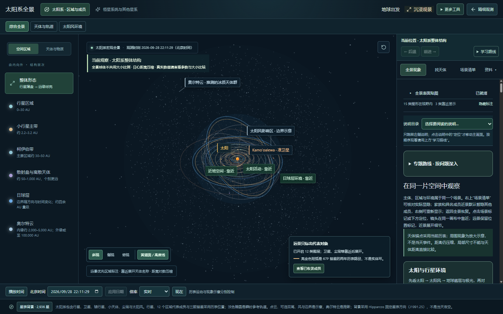
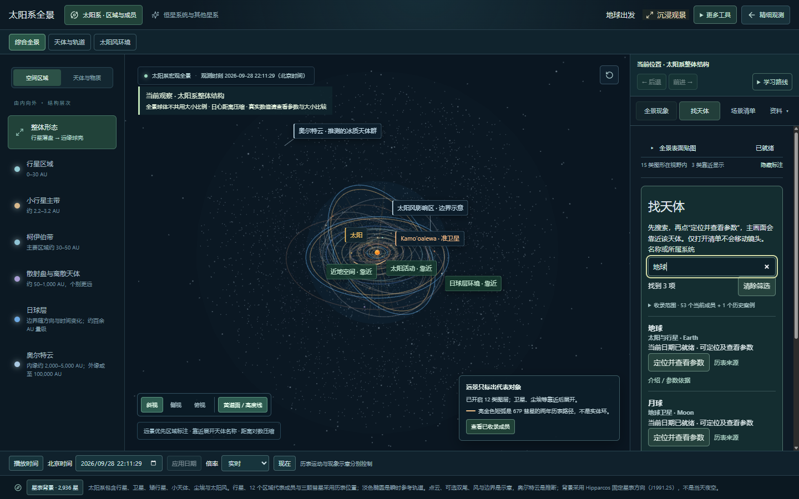
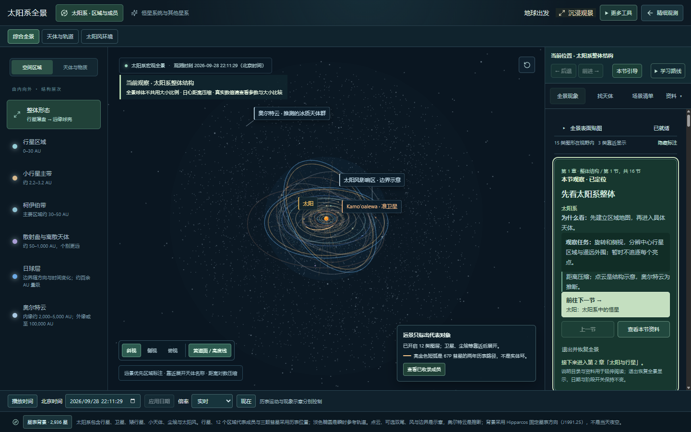
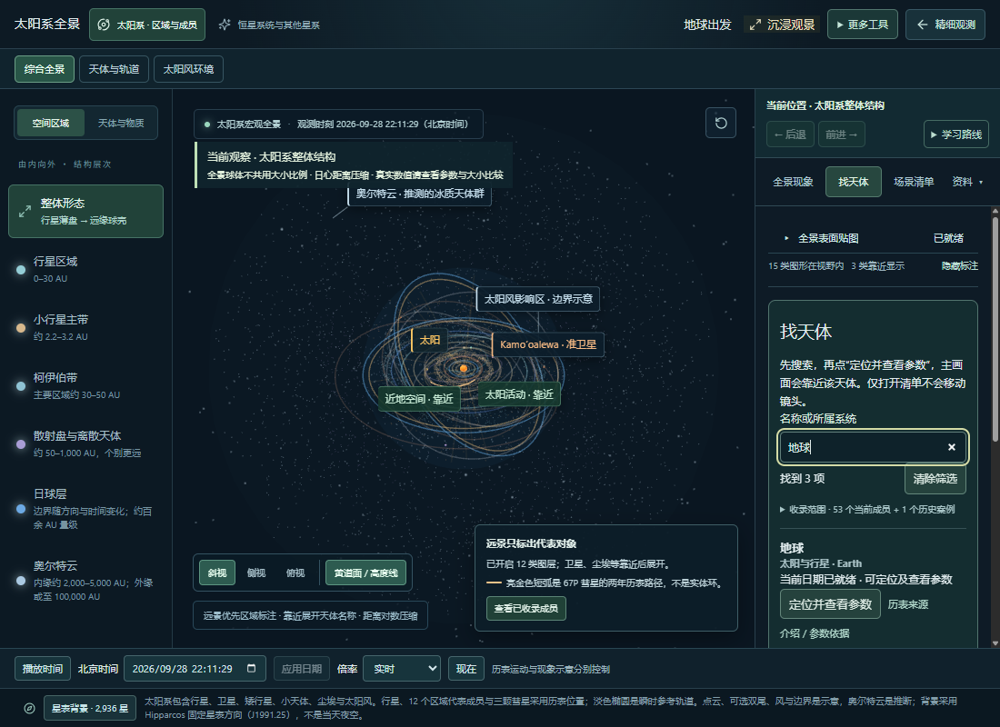

# 第一批体验优化：太阳系全景导航

日期：2026-09-28。状态：本地实现与验证完成，等待用户验收；尚未提交或发布本批产品改动。

本项承接[全局审查的四批安排](README.md)，补齐第一批的全景入口整理。发射与卫星部分见[任务流程改动记录](TASK-FLOW-IMPLEMENTATION.md)。

## 用户现在怎样操作

| 目的 | 入口 | 对画面的影响 |
| --- | --- | --- |
| 自由观察区域或类别 | 左侧“空间区域 / 天体与物质” | 切换观察对象或区域 |
| 按整体到细节认识太阳系 | 右侧“学习路线” | 选择课程后应用本节取景与图层；保留观测日期 |
| 找到某颗天体 | 右侧“找天体” | 打开和搜索保持画面；点“定位并查看参数”后才靠近目标 |
| 查看某种现象及控制 | 右侧“全景现象” | “说明目录”只滚动说明；模块内定位与开关才改变场景 |
| 围绕一个问题深入 | 全景现象中的“专题路线” | 选择路线后按专题逐步取景；默认收起六条路线 |
| 核对实际显示状态 | 右侧“场景清单” | 查阅保持画面；定位和图层操作按原有功能生效 |
| 查来源、区域概念和接入范围 | 右侧“资料” | 阅读不移动镜头、不修改日期 |
| 回到上一个观察位置 | 右侧“后退 / 前进” | 恢复浏览镜头；与课程的上一节 / 下一节区分 |

## 已修改

- 将“找天体”提到右侧一级入口，搜索框直接可见，保留输入内容。原来的“查看已收录成员”也直接进入同一清单。
- “内容总表”保留接入情况与待补充内容，不再内嵌一套需要再次展开的成员目录；提供同一搜索入口。
- “认识这里”“内容总表”“数据来源”收进“资料”菜单，当前资料类型有选中标记；菜单支持 Esc 和点击外部关闭。
- 学习路线保留六章、十六节及原来的阶段 / 数据条件；开始学习后，本节卡片显示在说明目录之前。初始全景不再同时展开一张主线介绍和六条专题路线。
- 修复“本节引导”在内容总表或场景清单中找不到课程卡片的问题：先恢复说明面板，再聚焦保留的本节卡片。阅读引导不会重新执行课程取景。
- 目录明确命名为“说明目录”，解释阅读和定位的区别。所需阶段关闭时禁用对应条目并提供阶段开关入口；目标缺失时显示原因，避免静默返回。
- 专题入口按“问题深入”标注；进入专题后收起路线选择，突出本步、下一步和退出操作。

## 验证记录

- 构建、类型检查、规划文档同步检查通过。
- 定向回归：4 个测试文件、20 项通过，覆盖面板选中、阶段门控、不可用成员定位、空搜索以及既有学习和镜头历史规则。
- 全量回归：118 个测试文件、575 项通过；直接运行 `node node_modules/vitest/vitest.mjs run --maxWorkers=2`，约 103 秒。随后只补充说明目录提示随阶段变化清除、术语统一，并重新构建及检查相关测试。
- 浏览器使用独立本地页面。1440×900 检查了搜索地球、定位及参数、后退恢复全景、学习第一节和下一节、退出、资料菜单、专题入口。
- 打开搜索保持观测对象、日期和同一画布，不新增浏览历史。定位地球后可后退到原全景及成员清单。
- 从本节切到内容总表，再点“本节引导”，本节卡片可见并获得焦点；对象和日期保持不变。
- 29 个已开启的说明目录入口逐项跳转，均找到目标并获得焦点，观测对象和日期保持不变。
- 关闭阶段 03 与 04 后，相应目录项不可选，有阶段开关入口；恢复阶段后条目重新可用。
- 在 1100×800 桌面窗口检查搜索框和四个侧栏入口，无横向溢出。此项不等同于完整手机端适配。

检查暂停了独立页面的观测时间，便于比较跳转前后；未操作用户正在使用的页面。原浏览器存储在结束时恢复，审查页面关闭。

## 页面证据

默认全景：

直接搜索天体：

从资料返回本节引导：

较窄桌面窗口：

## 本批的完成边界

第一批“使用逻辑与导航”的发射 / 卫星流程、全景入口整理均已具备本地验收条件。验收重点是能否分清当前对象、当前任务、阅读入口与下一步动作；不能据此宣布全产品已经归档。

后续仍按既有三批推进：第二批观察空间、尺度路径与近景画面；第三批参数 / 事件 / 成果解释与来源；第四批资源、性能和恢复操作专项。当前没有新增天体或改动物理公式、历表、真实尺寸、自转 / 公转与任务存档格式。

已知构建提醒：主脚本约 1.68 MB（未压缩），仍有体积提示，应在性能专项中测量后处理；本批不把构建通过等同于所有设备无卡顿。

后续进展：[第二批第一部分——观察空间与层级导航](OBSERVATION-SPACE-IMPLEMENTATION.md)已完成本地实现与验证，地球近景画质和基地镜头仍待处理。
