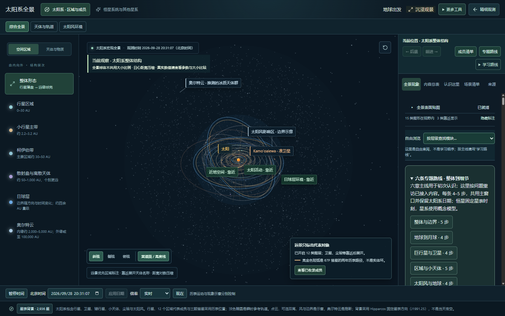
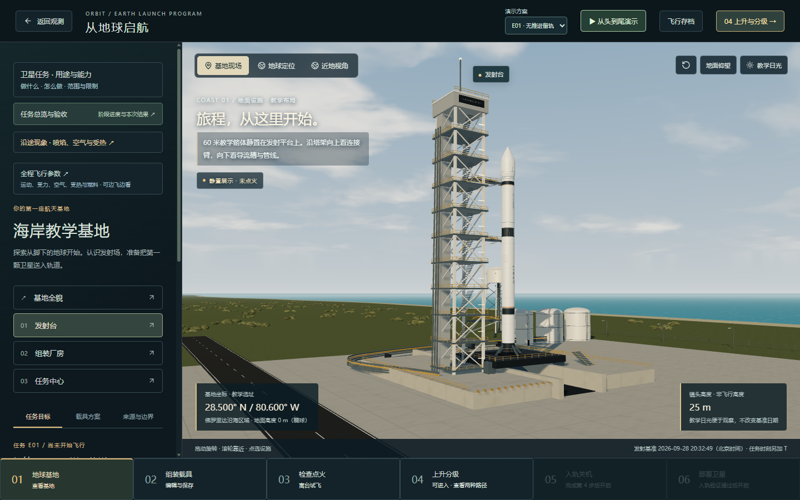
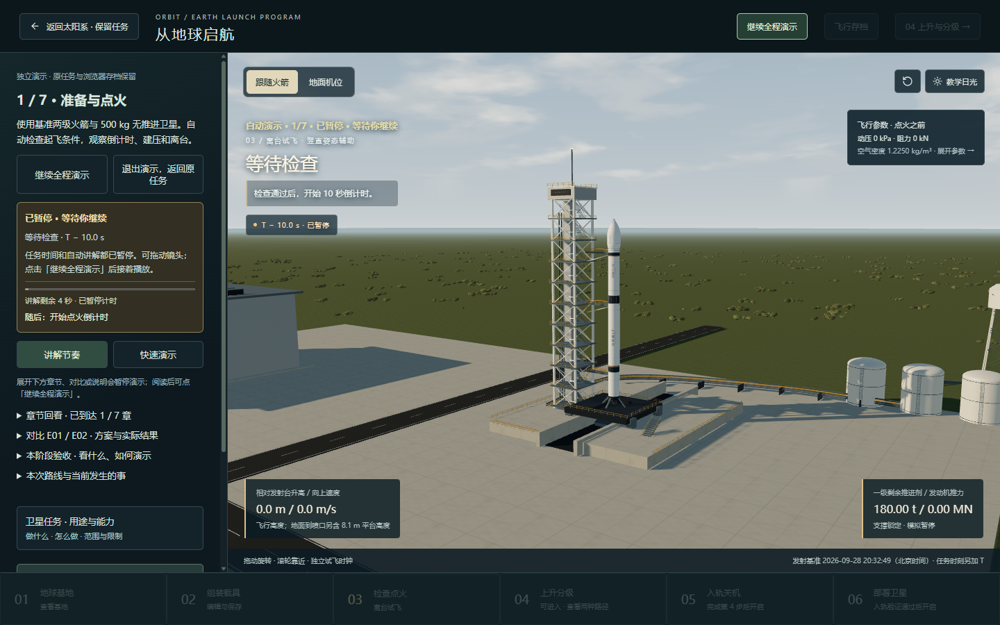
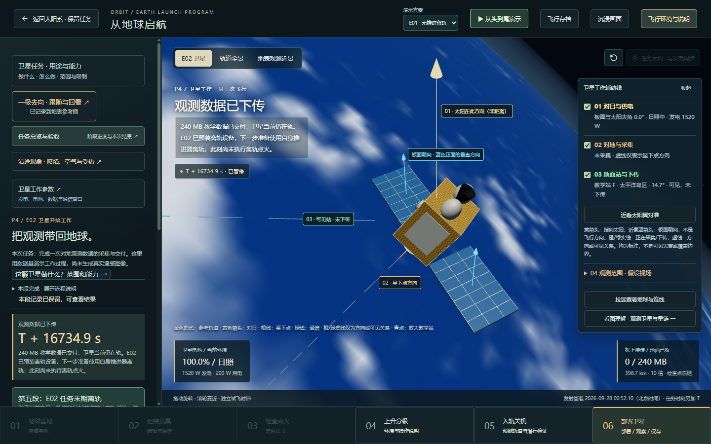
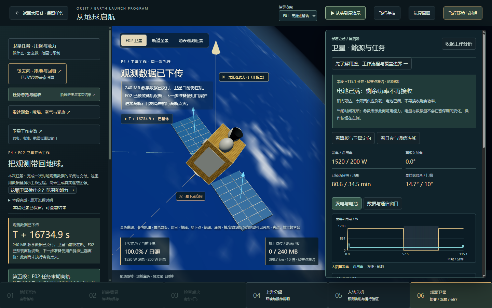
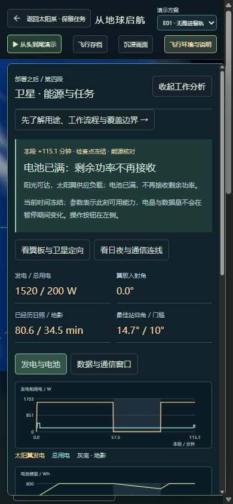

# 产品体验审查与优化清单

日期：2026-09-28。检查基线：`9c9d565`，本地页面 `http://127.0.0.1:4180/`。

本次只审查和整理，不修改产品功能，不发布新版本。截图均来自本次审查，桌面尺寸为 1440×900，小屏尺寸为 390×844。

## 结论与范围

当前已经有太阳系全景、发射过程、卫星工作、处置分支、辅助线、参数曲线、存档和自动演示。主要改进机会集中在这些能力如何组织、如何让用户理解，以及不同观察距离下的呈现质量。不能把这些已有能力重新列为“尚未实现”。

本次检查没有证据支持“整个演示会卡住”或“物理计算已经算错”的结论。截图能确认信息和布局问题；性能、完整任务稳定性、科学精度需要专门验证。

“阶段性归档”表示约定范围经过验收，不表示所有产品方向都已实现。下面的清单应当作为有边界的待办，不能全部变成当前版本的强制归档条件。

## 本次检查的六个页面状态

### 1. 太阳系综合全景

总体状态：可用；已等待表面贴图就绪，再接受截图。

- 已有优点：区域、天体、近景入口和来源说明同时存在，图层及空间示意有标注。
- 已确认的体验问题：左侧区域、顶部模式、右侧内容目录、主题路线及学习路线并存，用户需要先理解几套分类。远景中内太阳系挤在中央，内容已经加载仍可能给人“元素很少”的感觉。
- 优化：明确一个主入口和当前位置；让选择区域、靠近、返回整体形成连续路径。尺度变化时说明哪些成员因距离太远而无法逐个辨认。区分图层数量、视野内图形类别和具名成员数量。
- 可读性风险：部分小字、半透明背景和大量细线需要在不同显示器下测量；本次未做对比度或读屏合规测试。
- 边界：这里展示的是距离压缩的教学全景，不应通过任意增加纵向行星或点云密度来制造“真实感”。

### 2. 从地球启航：基地初始页

总体状态：可操作；场景占据主区域，任务入口主次仍可改进。

- 已有优点：有基地、火箭、流程导航和自动演示入口。
- 已确认的体验问题：左侧多个说明入口排在当前操作之前；顶部“04 上升与分级”与初始基地状态同屏，容易把教学跳转理解为应当立即执行的下一步。
- 优化：突出“当前该做什么”，区分亲自按步骤完成与观看预设演示；把补充说明收进次级入口。基地地面、材质和近景细节可以继续打磨。
- 可读性风险：浅色天空上的文字存在背景变化带来的对比风险，需实测。

### 3. 自动演示：准备与点火

总体状态：可以启动并暂停；停留倒计时和继续操作可见。

- 已有优点：自动演示有当前章节、暂停、退出和停留提示，不是没有反馈的静止画面。
- 已确认的体验问题：自动演示显示第 1/7 章，下方手动流程同时显示第 3/6 步；后续还有 P1—P5 卫星子流程。它们代表不同层级，但对应关系不直观。
- 优化：用一条主任务路径表示全过程，将演示章节和卫星子任务附着到对应阶段；明确当前是在讲解、播放还是等待操作。
- 边界：本次只启动并暂停了这一章，没有把它当作完整自动演示耐久性验证。

### 4. 恢复 E02 存档：卫星任务完成

总体状态：有效存档可恢复，任务结果和 E02 后续动作可见；状态范围容易误解。

- 取样方式：用当前模型生成的有效 E02 样例，经正常“恢复浏览器存档”入口打开。没有在本次审查中从发射飞完整条航线。检查后恢复了原浏览器存储。
- 已有优点：可以看到发电、观测、通信结果、辅助线和 E02 处置说明；已有 240 MB 接收结果。
- 已确认的体验问题：当前任务为 E02，但顶部“演示方案”显示 E01。顶部选择实际用于下一次演示，并不证明本次任务走错分支，然而作用范围没有足够明确。下一步操作排在较长说明下方，在该视口需继续滚动才能看到。
- 优化：明确“当前任务方案”和“新演示方案”；固定当前主要动作。用简短任务回执说明此次观测范围、时段、是否完成下传和最终去向。
- 画面改进：近距离地球云层纹理出现明显像素感，卫星材质及接近镜头可以继续优化；按观察距离配置纹理和细节，不必把所有资源一开始加载。
- 边界：任务回执应明确是教学计算结果，不应假装生成了真实遥感影像。

### 5. 卫星能源与任务参数

总体状态：数值、单位、曲线和关系线已有；观察与阅读争用空间。

- 已有优点：发电和用电、太阳翼夹角、日照与地影、通信窗口、数据结果均有展示，电池已满时不继续接收剩余功率的状态有解释。
- 已确认的体验问题：左侧任务区与右侧参数区同时展开后，中间场景明显缩窄；用户需要来回对照画面、参数和说明。已有来源与计算边界，但分散在说明或折叠项里。
- 优化：每阶段优先展示最有解释力的几项指标；在事件发生时联动标注“进入地影→发电下降→电池供电”等关系。允许一键专注场景或参数，并保留关键任务操作。
- 科学说明改进：统一标识“历表数据”“近似计算”“教学示意”，在详情中关联来源、适用范围和误差边界。
- 边界：本次未重新复核全部物理公式与输入数据，不把展示问题等同于数值错误。

### 6. 小屏中的工作参数面板

总体状态：未见页面横向溢出，但工作面板几乎覆盖场景；属于适配改进。

- 已确认：390×844 视口内，参数面板约 366×724，3D 场景几乎不可观察。
- 优化：小屏采用“场景／任务／参数”切换或可收起面板；保留返回和当前主要动作，避免多层滚动。
- 优先级说明：首版目标为电脑浏览器，小屏支持应单列范围，不能自动变成当前归档阻塞项。
- 边界：未做全键盘、读屏、触控设备和减弱动画偏好专项测试，不能据此宣称无障碍合规。

## 跨方向待办

优先级说明：P1＝优先减少误解或操作阻碍；P2＝体验提升；专项＝先测量再决定。不是将每一项都认定为程序缺陷。

| 方向 | 当前依据或限制 | 建议动作 | 优先级 |
| --- | --- | --- | --- |
| 当前任务与演示模式 | 步骤 4：E02 当前任务与 E01 新演示选项并列 | 明示作用范围，切换前告知将启动什么，不改变现有任务含义 | P1 |
| 导航与流程结构 | 步骤 1—4：多套目录、6 步与 7 章以及 P 子段 | 建立共同任务路径、当前位置和主次入口 | P1 |
| 主要操作和场景空间 | 步骤 2、4、5：说明在前、下一动作在下、双侧面板 | 固定主要操作，说明逐层展开，支持专注场景 | P1 |
| 空间尺度与内容发现 | 步骤 1：就绪后内太阳系仍很小 | 加强尺度提示、区域定位、逐层靠近与返回 | P2 |
| 画面与镜头质量 | 步骤 2、4：基地细节简单，近景地球纹理像素感明显 | 分距离优化纹理、材质、光照和镜头 | P2 |
| 因果讲解与任务成果 | 步骤 4、5：参数丰富，但需自己建立联系 | 图、线、状态同步高亮；展示可理解的任务回执 | P2 |
| 科学边界和来源 | 步骤 1、5 及源码：历表、近似太阳方向、教学功率与数据配置并存 | 统一类型标识及来源详情，清楚说明真实数据和演示设定 | P2 |
| 存档与任务延续 | 源码：浏览器单槽覆盖，已有导出／导入；临时自动演示不跨刷新保存 | 明确保存范围；之后考虑命名存档、多个槽位和最近任务 | P2／后续能力 |
| 性能与资源加载 | 本地构建主脚本约 1.6 MiB 未压缩，现有像素比已限制 | 先测首开、弱网、帧耗时和内存，再决定按模块加载和细节降级 | 专项 |
| 可读性、键盘与小屏 | 步骤 1、2、6：小字、背景对比风险、小屏遮挡 | 定义桌面最低尺寸，测键盘焦点和对比度，另列小屏适配 | 专项／后续能力 |

性能风险不是已经卡顿的证据。单一存档也不是已经丢失用户数据的证据。归档前只处理约定范围内可复现的问题，新增能力应另排版本。

## 建议分四批推进，避免无限优化

1. **统一使用逻辑。** 处理当前任务／新演示作用范围、6 步与 7 章对应关系、主入口和当前主要动作。验收：用户能在任一页面说清“我在哪里、哪个对象正在运行、下一步做什么”，不用滚动寻找唯一主要动作。
2. **改善观察体验。** 处理面板占位、全景到近景的尺度路径、地球近景纹理及基地关键视角。验收：目标桌面尺寸下主要对象可见，能够顺畅进入细节并回到整体，示意比例持续明确。
3. **完成解释闭环。** 统一数据类型／来源标识、事件和参数联动、任务成果及最终去向回执。验收：用户能从画面和简短说明解释本阶段变化与结果，不把教学结果当成真实观测。
4. **专项测量与收尾。** 测首开、典型运行帧耗时、长时间切换、恢复存档和键盘路径；按实测决定性能修复。验收标准先确定目标设备和网络条件，小屏及多存档若纳入版本需单独约定。

这四批是后续优化的整体顺序，不是要求当前待验收版本全部做完才能归档。当前归档需以现有验收约定、实测结果和用户确认决定；本次审查不能替代验收。

## 独立产品扩展，不混入本轮修复

- 航天器操控：姿态、推力、轨道机动、任务目标及失败条件。
- 真实任务对照：真实卫星目录、轨道数据、明确更新周期和失效提示。
- 通信或遥感专题：星座交接、地面网络或成像过程，而不仅是单星轨道动画。
- 工程与环境专题：更完整的大气、热、材料和碎片处理，需另设精度目标与验证范围。

这些扩展需要前提、目标用户和完成标准，不能因为“还可以做”就一直向当前归档版本追加。

## 证据限制与本次操作

- 检查使用独立本地审查页面，未操作用户正在浏览的页面；取样结束后恢复原浏览器存储并关闭审查页。
- 本次没有推送或发布，没有改动产品源码。新增内容只有本报告及六张证据截图。
- 未重新跑完整任务的稳定性回归、所有处置分支、远端冷加载、多个浏览器或目标低配机器；不能承诺所有环境都不会异常或卡顿。
- 未做完整科学精度审计和无障碍合规审计；相关条目是待专项验证的范围。
