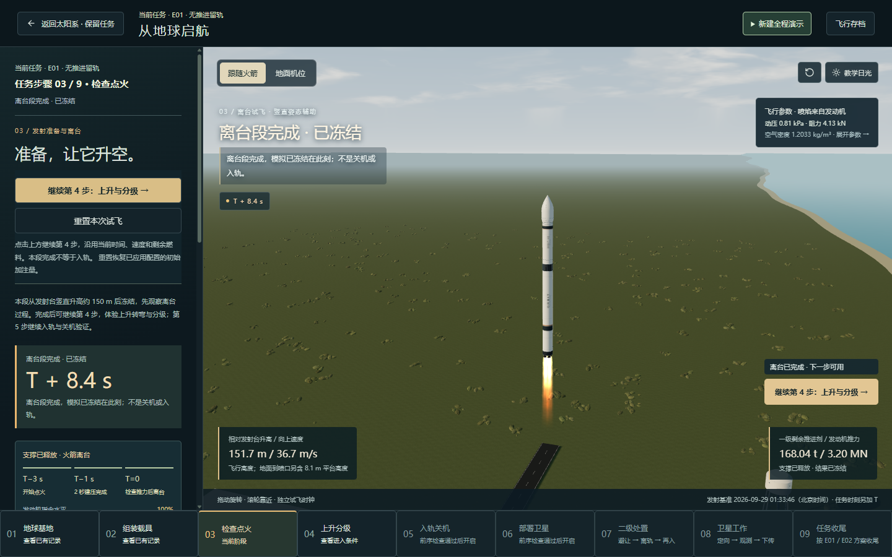
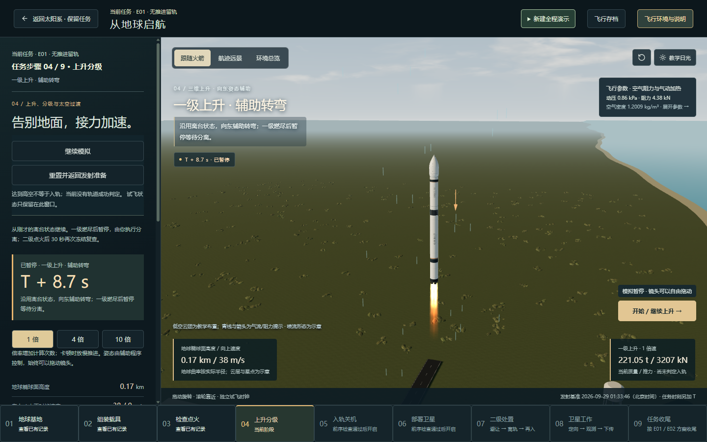

# 验收反馈：步骤切换的画面交接

日期：2026-09-29。用户指出第 1→2、3→4 步存在硬切。本项是四批体验改进后的验收修正，不是追加任务或提升物理精度。

## 原因和修正

- **基地 → 组装。** 两个场景原来立即切换，同时设置不同预设镜头。现在从切换前的画面短暂叠化到新场景。它表示观察场景的转换，不暗示火箭真的被瞬移或运入厂房。
- **离台 → 上升。** 原来进入随火箭移动的绘制坐标系时，重新套用默认镜头。现在相邻时刻的连续离台交接会将原镜头和观察中心转换到新坐标，保留用户旋转的角度和缩放。异时刻跳转或远景仍采用相应场景预设。
- **低空环境。** 原来离台检查点后立即移除基地天空、雾和反射环境，使低空亮度和背景突变。现在在既有的基地近景范围内延续这些效果，由基地地面提供低空表面，避免底层粗网格地球在地平线露出深色条带；离开近景范围时也使用画面过渡。它仍是教学环境，不是实时天气或大气散射精密模拟。
- **布局与阴影。** 侧栏宽度变化不再重置镜头或打断过渡。暂停交接即使模拟时刻不变，也刷新与绘制坐标有关的阴影。

## 操作边界

叠化目标时长约 0.65 秒，只使用显示时间。首次新场景绘制完成后开始；慢帧不会一次耗尽整段过渡。它不修改任务时间、暂停状态、燃料、轨道、步长或后续按钮条件。

连续切换从当前合成画面交接，始终只有一个过渡层；结束后释放全尺寸截图。画面可照常拖动、缩放和使用键盘；开始手动操作时立即取消过渡层。遵循系统「减少动态效果」设置。这里只做短暂场景叠化和镜头交接，没有实现基地到组装厂房的完整运载过程或连续空间漫游。

## 验证与验收

- 新增镜头坐标转换回归：不同用户观察角度下，同一箭体参考点在转换前后的屏幕投影一致；原始坐标和目标不被修改。
- 针对性回归 3 文件／19 项通过；最终完整回归 **123 文件／602 项通过**，耗时 100.97 秒。最终生产构建、TypeScript 和文档同步检查通过。
- 本地生产页面按「地球基地 → 组装 → 检查点火 → 倒计时 → 离台检查点 → 上升分级」操作；在交接前手动旋转镜头，再检查交接后的方向、位置和低空环境。
- 另查快速连续切换、拖动中止叠化、减少动态效果、叠化结束释放图像，以及继续到基地近景范围之外的上升；检查未出现页面异常或请求失败。
- 这是针对反馈路径的桌面抽样，不能代替所有章节组合、所有设备和浏览器的视觉验收。现有大脚本体积提示仍保留。

验收路径：刷新本地页面，进入「地球出发」，先点「开始组装载具」，再进入第 3 步完成离台；先拖动一次视角，再点「继续第 4 步」。重点观察场景是否有渐变交接，火箭是否仍在相近画面位置、视角是否保留，天空和光照是否延续。

本次为本地修改，未提交或推送。功能实现与回归检查完成不等于已经获得用户最终视觉验收。

## 页面证据

1440×900 的独立 Chrome 测试页；结束后恢复测试存储并关闭测试浏览器。未操作用户页面。

- [切换采样](scene-handoffs/transition-samples.json)：最终页面的第 1→2 步和第 3→4 步均记录到中间透明度，随后过渡层隐藏且图像缓冲缩回 1×1；没有页面异常或请求失败。样本帧数受测试机器和截图影响，不是显示 FPS 指标。
- [交互检查](scene-handoffs/interaction-checks.json)：连续点击后只保留一个过渡层；减少动态效果或手动拖动时，过渡层隐藏。
- [组装场景](scene-handoffs/02-assembly.png)。

交接前（已经手动旋转视角）：

交接后（沿用视角、低空天空与环境光；已暂停）：

