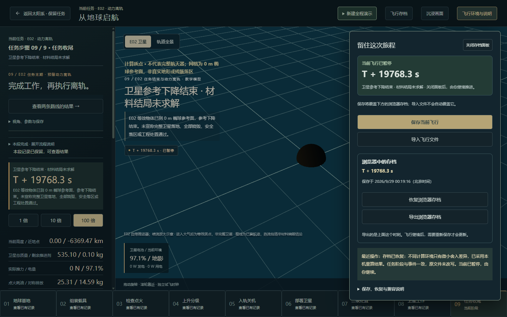
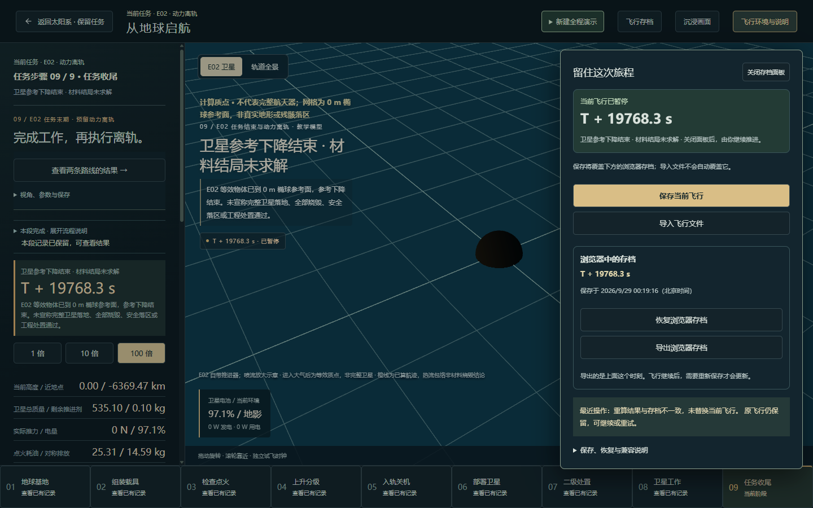
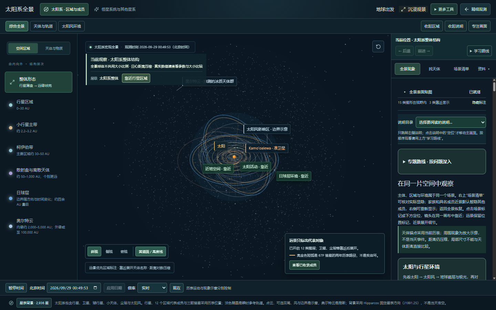

# 第四批：专项测量与本地收尾

日期：2026-09-29。范围：电脑浏览器中的首开、受限网络、典型场景、重复切换、存档恢复与键盘路径。沿用现有物理精度，不增加任务或玩法。

本批完成一项可复现问题修复和约定范围的抽样验证。四批体验改进的本地实施与检查已完成，等待用户验收、提交和发布；本报告不代表远端已经更新，也不代表所有设备或所有科学模型均已验收。

后续用户验收发现步骤切换硬切，处理记录见 [步骤切换的画面交接](SCENE-HANDOFF-FIX.md)。这也说明上述抽样验证不能替代用户视觉验收。

## 修复：同一任务在不同计算环境恢复时被误拒绝

第三批发现：Node 生成的有效任务存档，在 Chrome 重算后会因末位小数不同而触发「重算结果与存档不一致」。六个样例的任务阶段、事件和控制决定一致，数值差异出现在浮点运算积累的末位。例如位置分量相差约 0.00000664 m，近零守恒残差约 0.0000000224；并不是切换了轨道模型或提高了积分精度。

现在仍先验证文件版本、输入、日志和原始快照校验值，再完整重放日志。精确校验值不一致时，才逐项检查数值舍入差异：

`|保存值 − 重算值| ≤ 1e−5 + 1e−10 × max(|保存值|, |重算值|)`

容差按各字段原有单位计算，不是将所有字段都解释为米。对象字段、数组长度、文字、布尔状态以及两边均为整数的值仍需一致；非有限数不接受。最终保留**本机重新计算的状态**，不将保存的近似快照注入求解器。超出容差或阶段、事件不符，继续拒绝恢复并保留当前任务。

存档格式、物理步长、引力、阻力、供电与热模型均未改变。恢复成功后暂停，由用户继续；未主动保存时不覆盖原文件或浏览器存档。页面会解释何时采用了本机重算结果。这项兼容边界只对同一版本下的微小数值差异生效，不保证任意浏览器或模型版本都能互相恢复。

## 测量条件与结果

生产构建通过本地 `http://127.0.0.1:4180/` 预览。使用独立 Headless Chrome 153 测试配置，1440×900、像素比 1；浏览器报告 32 逻辑线程、16 GB 内存档位，GPU 为 Intel UHD / ANGLE D3D11。未操作用户页面或用户浏览器存档；测试结束恢复测试配置中的原存储，关闭独立测试页与测试浏览器，保留本地预览服务。

### 首开和受限网络

「可操作」以全景中的地球出发入口启用为检查点，不等于所有纹理加载完成。每种条件各取一次样本；不是平均值或性能服务承诺。

| 条件 | 可操作 | 全景贴图就绪 | 已观察问题 |
| --- | ---: | ---: | --- |
| 本地冷加载，关闭缓存 | 约 1.01 秒 | 未单独记录完成时刻 | 初始采样 5 个超过 50 ms 的主线程长任务，最长约 425 ms；无请求失败或页面异常 |
| 模拟 5 Mbps 下载、80 ms 延迟，关闭缓存 | 约 3.56 秒 | 约 16.69 秒 | 无请求失败或页面异常 |

两次记录的资源传输量均约 9.25 MiB。受限网络期间需等待完整贴图，不能承诺立即达到最终画质。该结果是本地服务加网络限速模拟，不能替代 GitHub Pages 远端冷加载测量。

### 场景运行抽样

下表是每个场景约 10 秒的页面 `requestAnimationFrame` 回调间隔。Headless 的前后台调度与图形呈现不同，**回调频率不等于屏幕实际 FPS**；三次样本也不构成优化前后对比。

| 场景 | 回调间隔第 95 百分位 | 超过 100 ms 的间隔 |
| --- | ---: | ---: |
| 太阳系全景 | 66.7 ms | 0 |
| 发射基地 | 37.6 ms | 1 |
| 卫星下传，1 倍运行 | 12.6 ms | 0 |

样本没有页面异常；基地样本出现一次超过 100 ms 的间隔，全景也未达到持续 60 Hz 的回调节奏。因此不宣称所有场景始终流畅或没有卡顿。本批没有据此贸然更改渲染质量或物理精度；低配设备和真实显示帧耗时应在有目标设备时另测。

### 重复切换与键盘

- 连续 20 轮「进入基地 → 返回全景」，未出现页面异常或请求失败。
- 主页面强制回收后的 JS 堆：19,281,184 → 22,892,232 字节，增加约 3.44 MiB；文档数 2 → 2，节点数 4,842 → 4,886。未对 Worker 堆、GPU 显存或数小时运行做完整分析；一次前后差值不能证明不存在内存泄漏。
- 基地中连续 35 次 Tab，焦点均留在活动区域，未落到禁用交互的背景。
- 存档面板内连续 12 次 Tab，焦点保持在面板；Escape 关闭面板后回到「飞行存档」。再退出基地后，焦点回到全景的地球出发入口。
- 这覆盖桌面关键键盘路径，不是读屏、触控、对比度和所有弹窗的无障碍合规认证。

### 存档恢复与继续运行

| 样例 | 任务阶段 | Node 存档 → Chrome 页面 | Chrome 存档 → Node |
| --- | --- | --- | --- |
| 上升 | ascent | 通过 | 通过 |
| 地影 | ops-cycle | 通过 | 通过 |
| 下传 | ops-downlink | 通过 | 通过 |
| 工作完成 | ops-complete | 通过 | 通过 |
| E01 退役仍在轨 | life-observed | 通过 | 通过 |
| E02 参考下降完成 | disposal-complete | 通过 | 通过 |

Chrome 验证通过产品原有「恢复浏览器存档」入口和正式 Worker 完成，没有绕过重放或直接填入求解器状态。每次核对任务时刻、暂停状态、兼容提示及原存档未改写。Node 恢复后再次保存、重开，六个样例均走精确匹配路径。

在页面中用质量增加 1 kg 且重新计算文件校验值的样例验证，重放仍拒绝替换当前飞行。恢复下传样例后以 1 倍继续运行，机上／地面数据由 236／4 MB 变为 232／8 MB；再次暂停后读数冻结。

## 回归检查与证据

- 新增 3 项存档兼容回归：微小差异、保留重算结果并继续运行、损坏或实质改动仍拒绝。针对性 2 文件／8 项通过。
- 最终完整回归：**123 文件／601 项通过**，耗时 84.50 秒。此前并发执行浏览器与回放检查时，一项既有轨道预测测试超过 5 秒；关闭测试浏览器、单独执行完整回归后通过，未放宽该测试超时或断言。
- 生产构建、TypeScript 与文档同步检查通过。仍有既有主脚本体积提示：约 1,685 kB，gzip 约 518 kB；未把它标记为已解决。
- [测量记录与恢复结果](specialist-checks/measurements.json)包含加载、回调、切换、键盘和六组恢复结果；本页截图已检查。

## 本轮结束条件和后续边界

四批工作对应：统一任务与导航、改善观察空间与视角、连接事件参数与成果、完成本次专项检查。当前本地版本可交给用户验收，不再因为「还可以增加」而追加新能力。

用户验收可集中检查：进入地球出发、查看工作参数中的解释图、保存后恢复并继续、返回全景。通过后再整理提交描述、推送并核对线上发布。**本次尚未提交或推送。**

小屏完整适配、多槽命名存档、航天器操控、真实任务目录属于后续产品范围。其他浏览器、实际低配机器、远端网络和数小时连续运行的覆盖仍有限；浏览器抽样不能替代从头连续观看两条全程，也不将现有教学模型称为真实工程预测。
