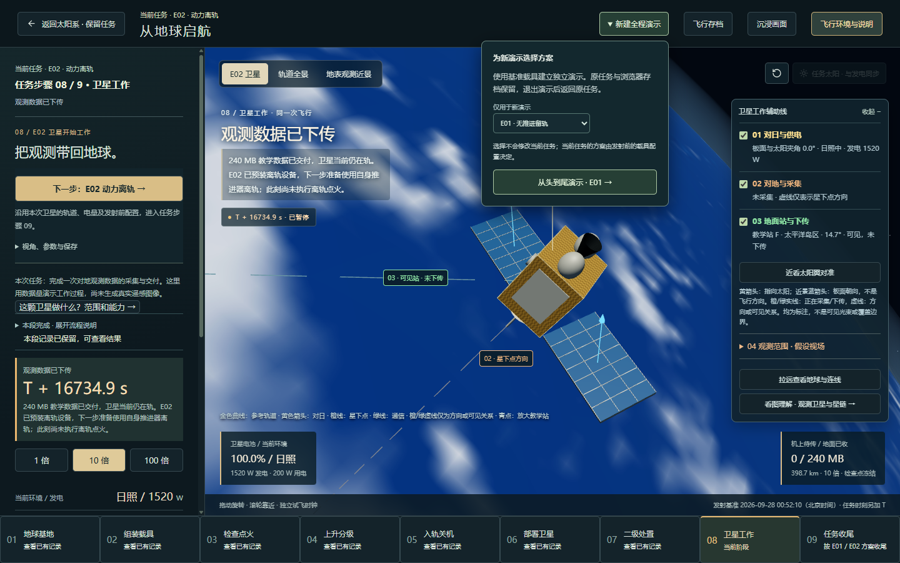
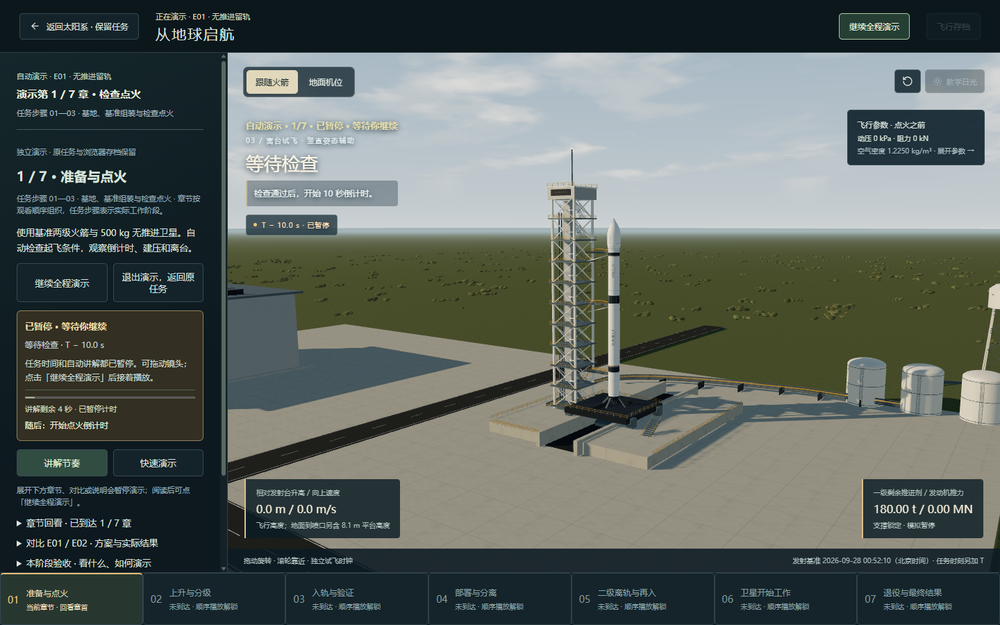
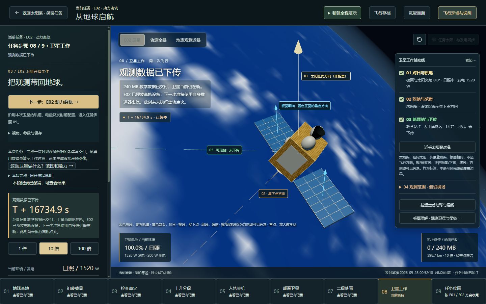
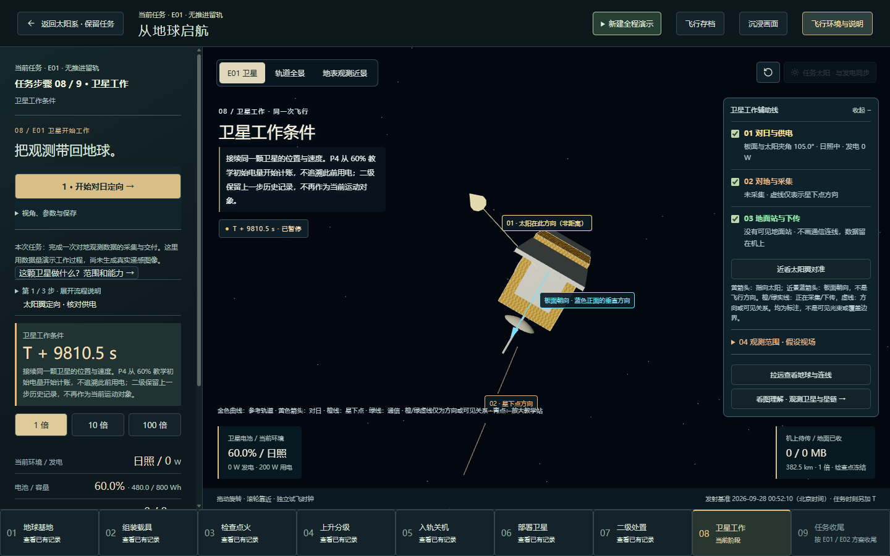
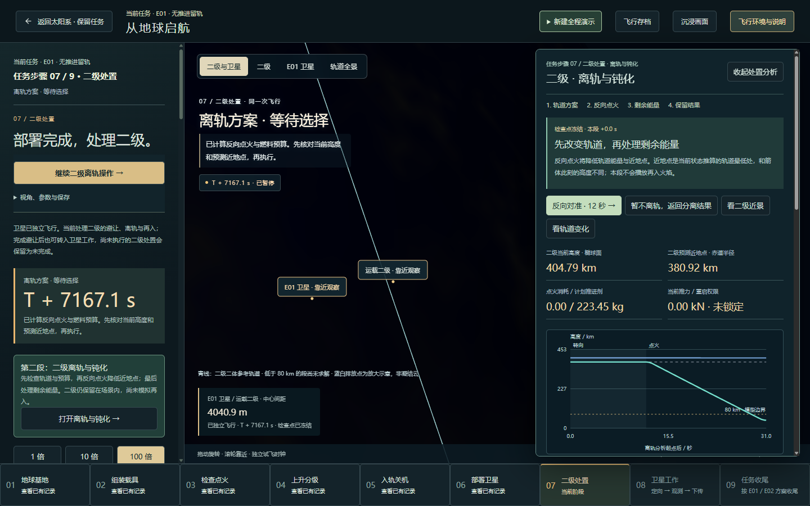

# 第一批：任务流程与操作入口

2026-09-28，本地待验收。前置审查报告已在提交 `91b910b` 推送；本文件记录之后的功能改动。

## 这次完成什么

- 顶部始终显示正在查看的任务方案；“新建全程演示”独立展开，方案选择只作用于新演示，并说明退出后返回原任务。
- 手动路径从原出发到部署的六步，延伸为九个任务位置：基地、组装、检查点火、上升分级、入轨关机、部署卫星、二级处置、卫星工作、任务收尾。
- 第 7 步包含原资料中的 P1 避让、P2 离轨钝化和 P3 再入；第 8 步对应 P4 卫星工作；第 9 步对应 P5 / E02 收尾。旧存档和模型记录不改写。
- 自动演示单独显示七章，不再在底部同时突出手动第 3/6 步。第一章覆盖基地与基准组装准备到点火，其余章节明确对应实际任务步骤。只允许回看本次演示已到达的章节。
- 基地的组装、使用现配置发射入口前置；任务说明、参数和回看入口收进“任务资料、参数与回看”。快速上升的教学入口保留在资料中。
- 飞行与卫星控制的原有操作提前，并在桌面侧栏滚动时保持可见；视角、参数、保存收进次级操作。E02 数据交付后直接显示动力离轨入口，E01 则显示维护与退役入口。
- 已经过的任务位置打开已有记录，不会把正在运行的卫星误切回早期火箭操作。后续入口仍受原检查点和计算就绪条件约束。

## 已检查的实际页面操作

1. 进入基地：无需先滚过说明，就能组装或准备发射；未解锁步骤不会启动任务。
2. 打开发射准备：检查和点火动作在说明前方；检查未通过时倒计时按钮仍禁用。
3. 打开独立演示：选择方案的含义明确；七章导航只解锁已到达章节，暂停、章首回看和退出正常。
4. 经正常存档入口恢复 E02 的观测交付检查点：标题、任务位置和下一步均显示 E02；第 8 步高亮。向下滚动后，动力离轨按钮仍在侧栏顶部。
5. 在 E02 原任务中启动 E01 演示，再退出：恢复 E02 和原 `T+16734.9 s`，没有把演示方案应用到原任务。
6. 从 E02 交付检查点进入动力离轨条件检查：第 9 步高亮，当前动作变成发送结束与离轨指令。
7. 恢复 E01 卫星工作起点：显示 E01、第 8 步及“开始对日定向”；没有将 E02 离轨操作混入。
8. 恢复二级避让完成检查点：第 7 步高亮，主要动作是分析二级离轨，另保留转入卫星工作的已有分支。点击后等待实际方案结果，确认进入“离轨方案 · 等待选择”，反向定向操作可用；没有把加载提示当作完成结果。

恢复用样例由当前模型生成，并通过正常“恢复浏览器存档”入口加载；不是本次在界面中手动飞完整条航线。检查使用独立页面，原浏览器存储在结束后恢复。

## 验收入口

本地首页 → 地球出发。

- 看顶部“当前任务”和“新建全程演示”是否容易区分。
- 看底部手动九步与自动七章是否各自对应左侧当前内容。
- 进入卫星工作后，检查下一步是否无需翻到说明底部才能找到。

## 验证记录

- 构建及规划文档同步检查通过。
- 全量回归：117 个测试文件、571 项通过，包括新增的任务位置、后续入口条件、当前方案与新演示配置、章节解锁测试。
- 首次默认并行运行有 6 项超过已有 5 秒测试时限，未出现数值断言不符。经 npm 脚本传递并发参数的尝试未实际生效；最终直接执行 `node node_modules/vitest/vitest.mjs run --maxWorkers=2`，全量通过，耗时约 116 秒。没有放宽测试时限或修改物理断言。
- 浏览器验证为本地独立页面；不是远端发布验证，也不是本次手动完成全部物理分支。全量测试通过后，仅继续同步了二级处置页的标题与说明，并重新构建检查。

## 页面证据

当前方案与新演示配置的作用范围：

自动演示使用七章导航，并标明对应的任务步骤：

E02 数据交付后，主要动作在说明前方：

E01 工作起点使用同一任务路径：

二级处置的导航、场景标题与分析结果相对应：

## 范围边界

本记录覆盖发射到卫星任务的流程清晰度；太阳系全景多套目录的整理随后完成，见[全景导航实现与验收记录](PANORAMA-NAVIGATION-IMPLEMENTATION.md)。没有新增天体、修改引力或能源公式、改写存档格式，也没有把 E01 改成具备推进能力。

相机、材质、小屏参数面板、更多存档槽和性能优化仍按审查报告的后续批次推进。本次界面改动不等于整个产品已经重新完成科学精度或阶段归档验收。
