# 卫星观测演示检查报告

2026-09-28，发布前本地验证记录，纳入 `2026.09.28-satellite-rc1`。下文各次“未发布”保留检查当时状态；当前发布与用户验收以阶段收尾说明为准。目标：检查完整教学流程能否作为本阶段归档候选，不新增任务类型。截图均为本轮独立浏览器实际运行，逐张检查后保存；E01 与 E02 各从正常入口运行到结尾。

## 步骤与结论

| 步骤 | 检查对象 | 结果 |
| --- | --- | --- |
| 1 | 入口、方案选择、启动 | 通过，两方案都能从头自动运行 |
| 2 | 太阳翼定向与供电 | 通过，近景、箭头、夹角和功率可读；背向时不再误写充电 |
| 3 | 地表观测与保存 | 修复后通过，40° 重新取景仍保留，近景和全景互斥选中 |
| 4 | 窗口下传 | 通过，等待原因明确，数据在窗口中交付，不把几何可见等同于下传 |
| 5 | 核对交付与后续入口 | 修复后通过，240 MB 已收、0 MB 待传；E02 入口指向动力离轨 |
| 6 | E01 / E02 结尾 | 通过，分别为退役仍在轨与等效物体 0 m 参考终点，材料结局未求解 |
| 7 | 退出、保留与说明 | 通过，退出返回原任务且浏览器存档未改写；说明面板 Escape 关闭后焦点返回入口 |

其他检查：暂停时旋转和切换镜头不推进时间；390 px 下新增视角按钮与能力卡片无横向溢出；工程检查 114 文件 / 555 项通过，生产构建与文档同步通过。没有修改积分模型或存档格式。

## 截图与对应发现

### 1. 入口

方案选择与开始演示在顶部。E02 选择只影响独立演示，不把原任务草稿变成 E02。

### 2. 定向供电

太阳翼在近景中可辨认，蓝箭头表示发电正面的法线，黄箭头表示太阳方向。此例在地影中，0 W 不意味着未完成定向。

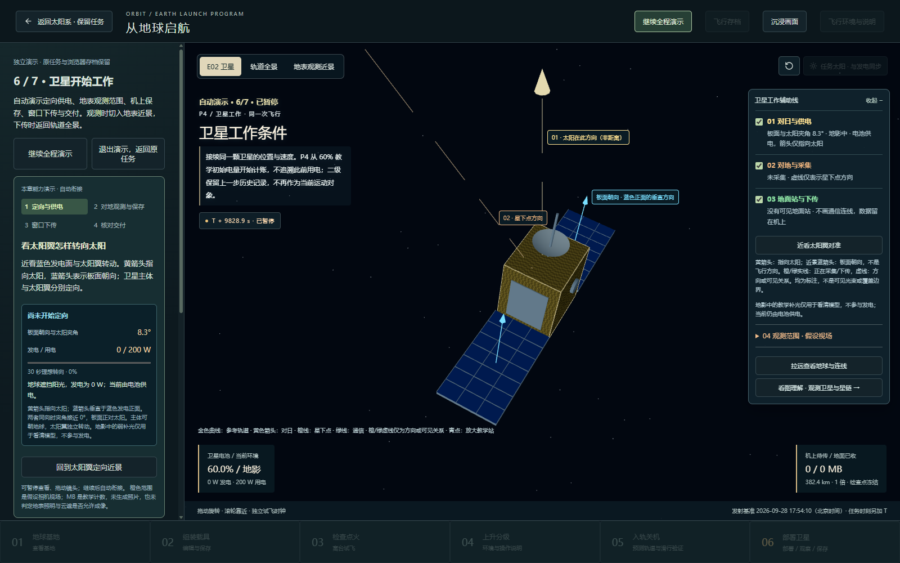

补充日照、背向状态：真实浏览器计算得到 105.0°，功率 0 / 200 W；参数页明确由电池供电，没有错误写成正在充电。

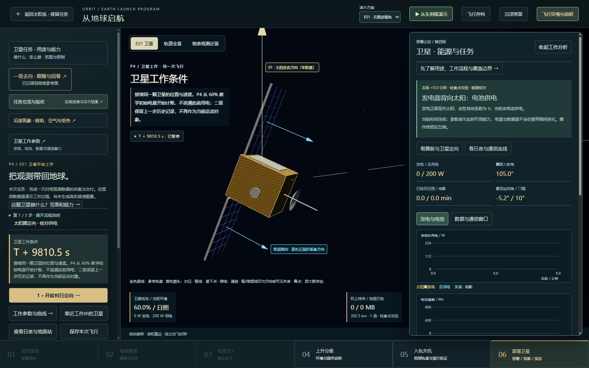

### 3. 地表观测

修复前：近景误亮「轨道全景」，重新取景把 40° 重置成 20°。修复后截图保留 40°，且只有「地表观测近景」选中。橙色区域明确为假设视场，不能当作已拍摄面积。

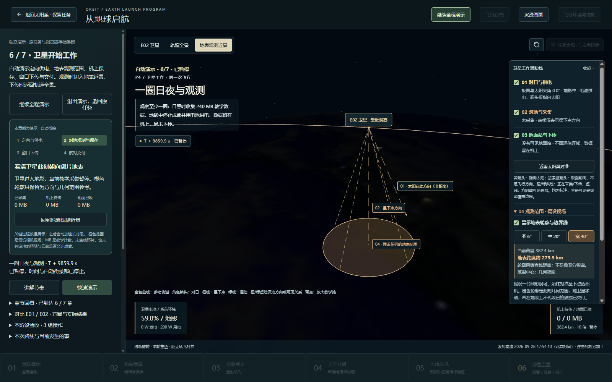

### 4. 等待下传

240 MB 留在机上，当前无有效窗口，不绘制不存在的实际下传线。等待解释直接出现在能力卡中；进入窗口后实际计算完成交付。

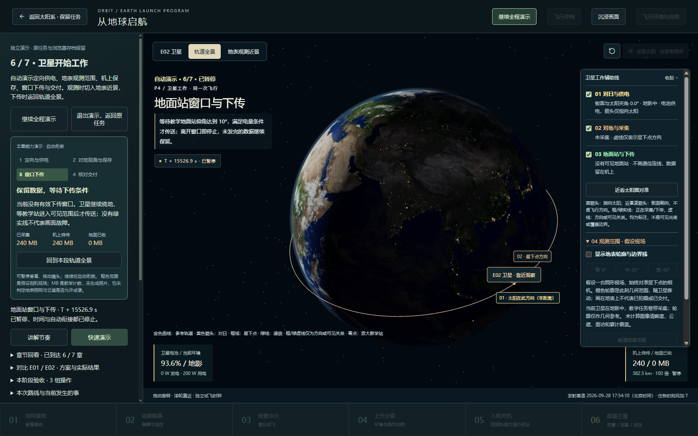

### 5. 核对交付

已采集 240 MB、机上 0 MB、地面 240 MB。轨道远景保留实体遮挡，卫星处于地球背面时不强制显示；用户可以拖动或切换近景。

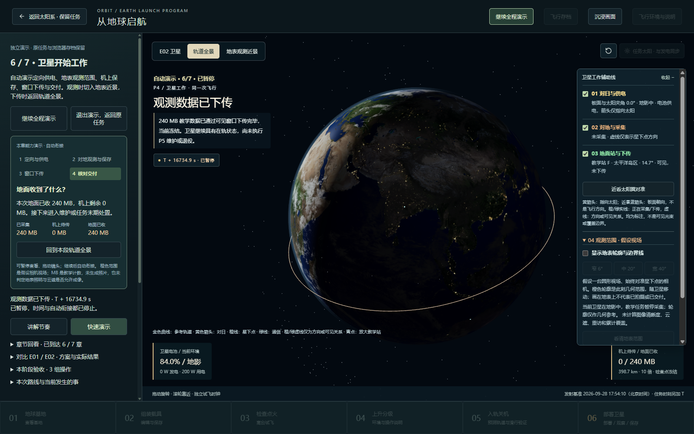

E02 手动工作段的后续入口明确为动力离轨，已修复结果说明中残留的 E01 无推进分支。

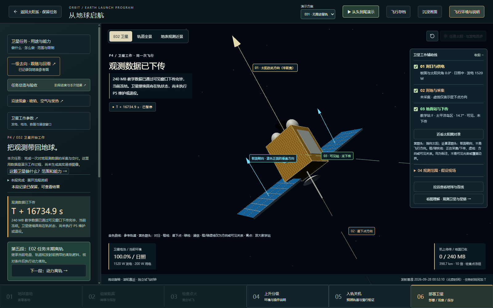

### 6. 分开的结尾

E01 明确写明已退役仍在轨；E02 显示 0 m 椭球参考面及等效质点，不宣称完整卫星存活、全部烧毁或安全落区。两次运行的时间不同，不作同时刻比较。

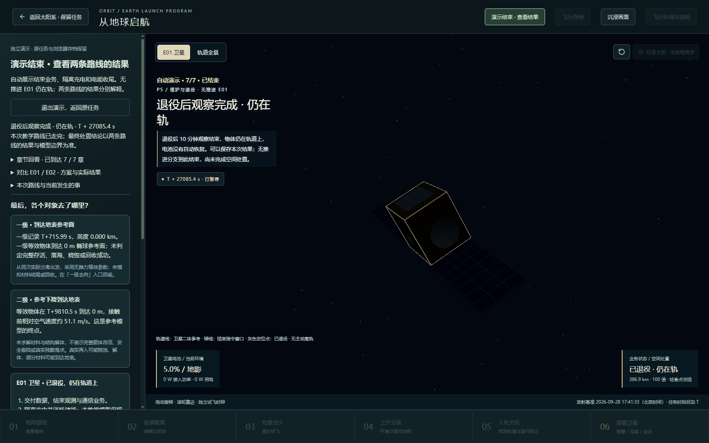

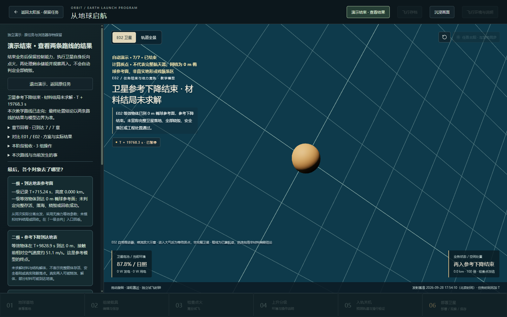

### 7. 退出与保留

退出独立演示后回到原来的未发射基地任务。浏览器存档逐字比对保持不变；工作存档在相同浏览器正常计算并重算恢复通过。

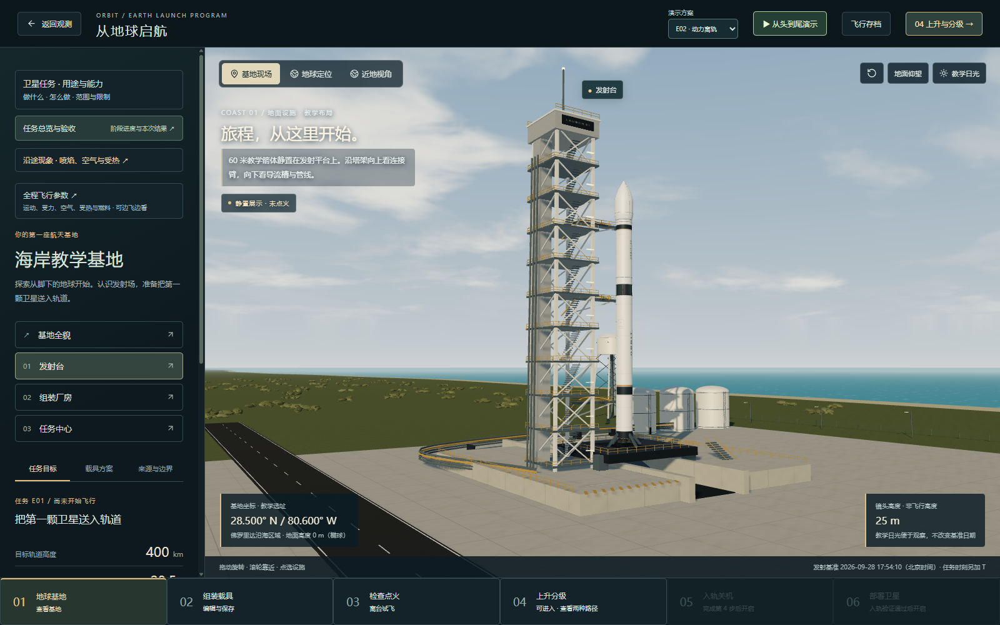

## 可访问性与验收限制

- 已验证说明对话框获取焦点、Escape 关闭并返回入口，视角按钮带互斥选中语义。没有进行读屏软件实测、全站键盘遍历或 WCAG 合规认证。
- 390 px 新按钮和能力卡片没有横向溢出，但展开的辅助线面板仍会覆盖部分画布，需要收起或滚动。这是保留的手机布局限制；本阶段目标为电脑浏览器，不称为手机沉浸体验已完成。
- 一次额外兼容性探测使用开发运行时生成存档再交给浏览器，严格重算校验拒绝了结果差异，并保留原任务。换为同浏览器正常生成的存档后恢复通过。本轮没有放宽校验；跨 JavaScript 引擎或版本的存档迁移仍未保证。
- 截图说明视觉与操作结果；555 项自动检查提供状态与几何证据，两者均不等于用户验收或真实航天工程认证。

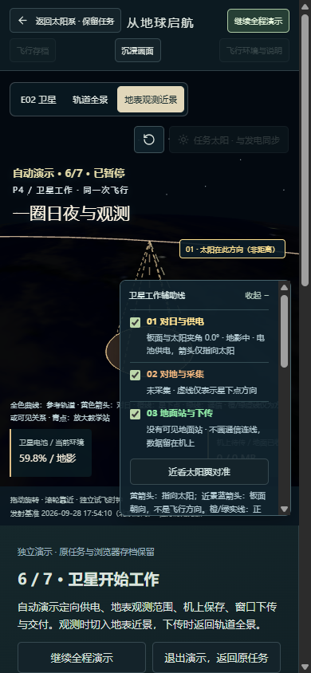

## 中文阅读与演示入口补查

用户反馈说明文件乱码后复核：原文件包含正确的 UTF-8 中文，但开发服务器直接返回 Markdown 时只有 `text/markdown`，没有字符集声明。此前文档链接的检查只确认请求成功，不足以证明直接打开时正确解码。

已改为网页内读取同一份文档并显示标题、列表和表格，内部文档及本批检查截图保持在当前页面打开；下载原文和源文件带 UTF-8 编码标记。开发页面与使用 `/0922_codexgpt6_project/` 路径的本地生产预览均检查通过：建设记录、卫星任务说明和演示验收三个入口中文可读，关联报告图片成功加载，下载含编码标记，390 px 阅读面板与桌面演示侧栏不被表格撑宽。生产构建通过；仍有既有主脚本体积提示。本轮未发布到远端。

验收清单原先确实只有文字。现在清单明确对应第 6 章，提供当前卫星画面定位、已到达章节回看与结束后的结果入口。独立浏览器从正常入口运行至第 6 章，再实际点击回看：恢复真实章节起点并暂停，可继续查看太阳翼定向；未到达时按钮禁用并解释原因。退出后原任务存档保留，浏览器无异常。本轮只改说明呈现和入口，没有修改飞行或能源计算，因此未重复运行上一轮的 555 项物理与状态检查。

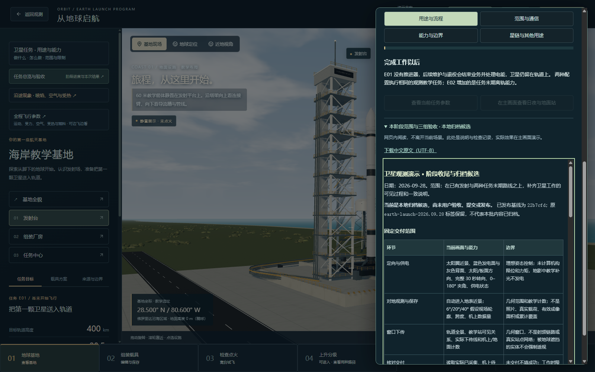

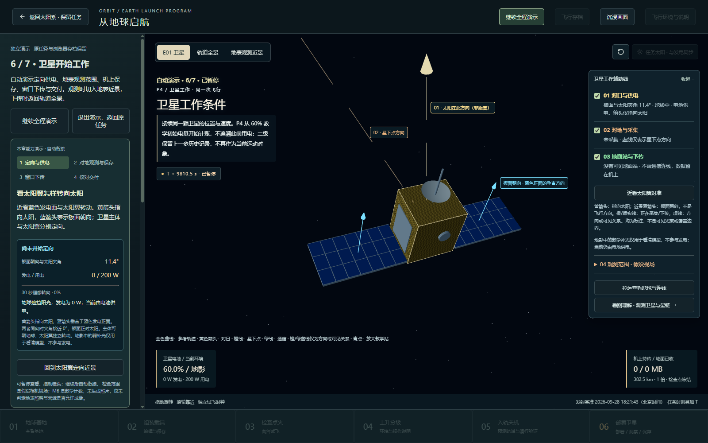

## 阅读与返回操作收尾

复现了展开验收清单后任务仍运行的问题：阅读期间倒计时从 T−6.9 s 推进到 T−4.4 s。现在展开章节、方案对比、验收清单或其中的资料都会暂停；使用固定的暂停指令，连续展开不会反向恢复播放。收起仍保持暂停，用户可明确选择「返回画面并继续演示」。

回看、方案切换及从清单定位卫星画面后，阅读区会收起，焦点和滚动位置回到当前章节标题；继续按钮保持可见。资料上下提供收起入口，Esc 先退出资料阅读，再次 Esc 才关闭外层任务说明。慢加载中收起会取消该次呈现，迟到内容不重开资料或抢走焦点。

验证：独立浏览器从正常发射流程运行 E02 至第 6 章，实际检查定位不推进任务时间、章节回看回到已计算起点、退出保留原任务存档。另在与 GitHub Pages 相同的子路径生产预览中重新验证自动暂停、任务时间冻结、明确继续、人工延迟资料请求后收起、上下收起按钮、分层 Escape、方案切换、390 px 操作区宽度与键盘焦点；浏览器无异常，类型检查和生产构建通过。本轮只修改呈现与交互，没有改变已有积分和能源计算，也未将预览视为已上线。

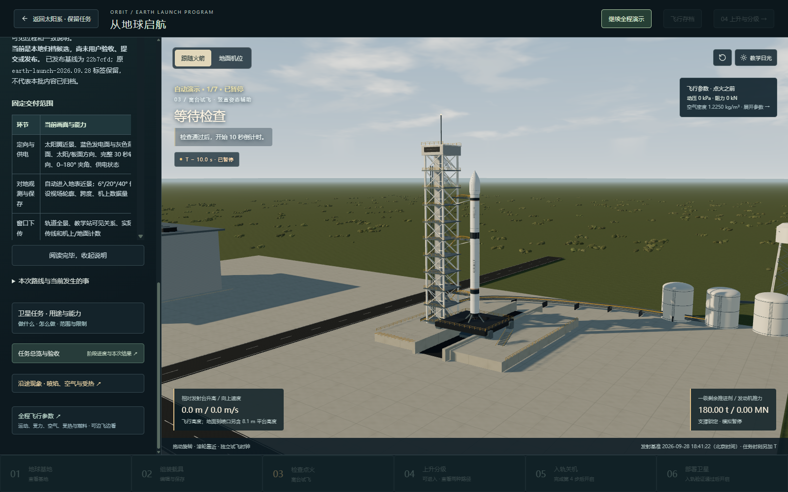

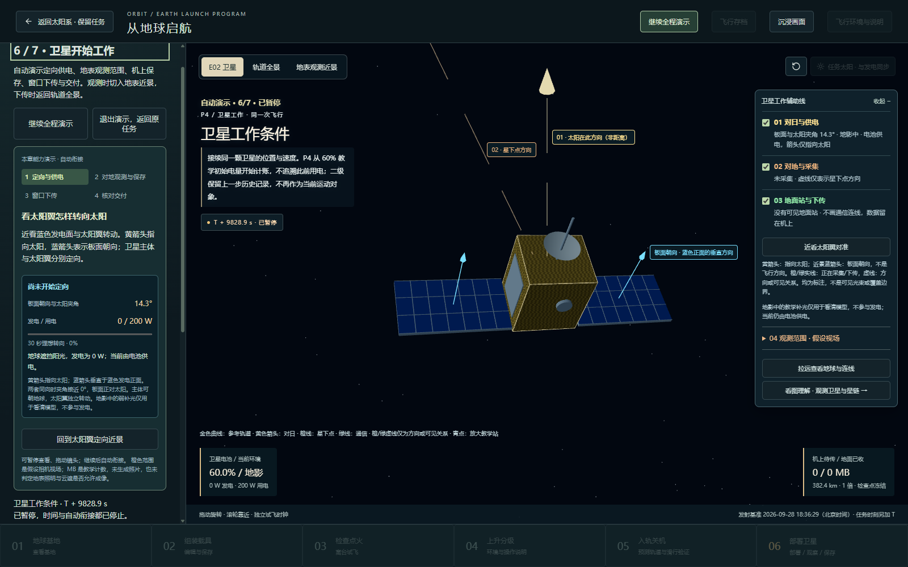

## 自动停留、下一步与主画面状态

原提示只有「即将自动继续」，没有讲解余量或下一步动作。新增的状态区位于播放按钮下方，主画面也采用同一状态文字；区分恢复、模型失败、完成、暂停、自动讲解及实际运行。自动动作与提示共用检查点安排，教学计时读取实际演示进度；暂停同时冻结它和任务时间，进入运行段立即清除上一检查点的余量。讲解秒数是播放时间，未用它冒充航行时长、日照等待或通信窗口预测。

完整回归 115 文件 / 560 项通过。首次开发页实跑被文档热更新刷新中断，没有计为通过；改用固定的生产预览，在 `/0922_codexgpt6_project/` 下从正常入口完整运行 E02 到 T+19768.3 s 的 0 m 参考终点。实际验证初始与卫星检查点提示、暂停冻结两种计时、章节回看重置余量、真实转向开始后清除讲解条、交付后指向 E02 自身动力离轨、结束不再承诺自动继续，以及退出保留原存档。390 px 状态区无横向溢出，浏览器无异常。

最终截图复核又发现 E02 交付后主画面和侧栏任务时钟沿用了旧的「P5 维护退役」文字。两处现在共用后续说明，修正仅发生在显示层，根据实际配置和已交付量解释后续，保持存档中的原消息和校验值不变。修正后 3 个相关测试文件 / 23 项通过；独立浏览器使用正常计算的 E02 工作完成存档重算恢复，确认主画面与侧栏明确说明尚未离轨，且不再混入 E01 路线，两处正文一致；保存文本逐字保持一致。最终主画面与侧栏的暂停、讲解文字也已核对一致。

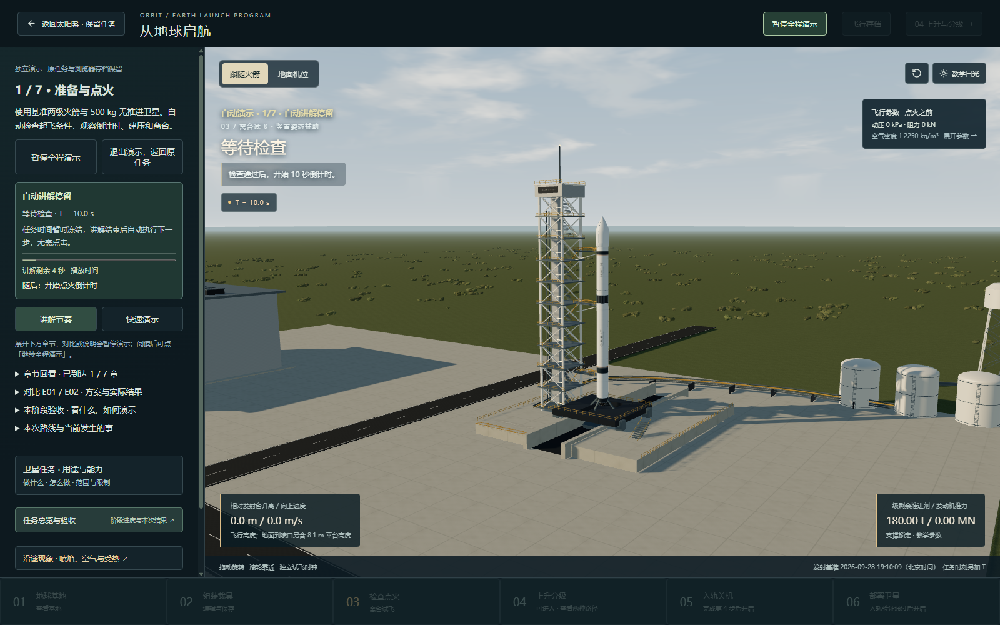

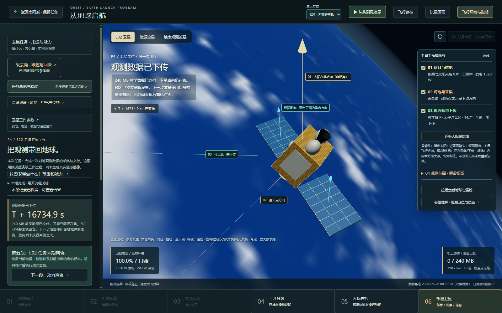

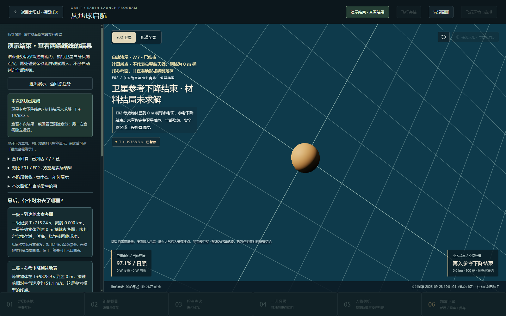

## 计算异常后的停止与恢复

收尾代码复核发现，计算器异常终止后旧演示仍可能显示运行，恢复命令也仍发送给已停止的计算器。现统一冻结任务和讲解，主画面显示最后一帧，侧栏提供「选择存档恢复」「重新开始地面任务」。旧连接被关闭，排队中的旧消息不能覆盖新任务。冻结帧不能保存成完整任务；异常终止后的未保存进度无法继续，正常退出演示保留原任务的承诺不再用于此情形。

完整回归 116 文件 / 566 项通过，涵盖连接中断、发送失败、启动失败、迟到消息和重复关闭。第一轮浏览器检查中，属性形式的结果读取异常监听未收到注入事件，末尾用例超时；改为显式事件监听后，6 项连接检查与整组浏览器验收重新通过，没有把首次超时计为成功。

浏览器验证使用独立生产预览 `/0922_codexgpt6_project/`，未操作用户标签。测试包装器只在测试页向真正的计算线程注入未捕获异常，确认浏览器发出了错误事件；另触发发送异常、启动异常及结果读取异常事件。核对：

- 中断后删除旧演示操作与讲解倒计时，阶段按钮停用，最后时刻不推进；镜头仍能拖动。
- 冻结帧保存按钮禁用，已有存档恢复和文件导入仍可用。
- 无效文件被拒绝，不替换最后画面；随后有效 E02 浏览器存档正常重算恢复并暂停，可执行「下一段：动力离轨」，出现可用的结束与离轨指令。
- 恢复成功后再次导入无效文件，保留真正的当前会话，不误报计算崩溃。
- 发送失败后可通过有效文件导入恢复；再次启动失败后仍能重试。正常演示启动和退出均可用。
- 每次恢复、导入及新任务启动后，原浏览器存档逐字保持一致；无存档时明确解释文件导入或重新开始。
- 390 px 恢复面板不横向溢出；预期注入异常之外没有浏览器错误，测试结束恢复原存储并关闭测试标签。

这些结果验证的是异常恢复交互，不代表进程完全无响应时也能自动检测，亦不提供未保存任务的自动备份。没有更改物理模型、存档格式或重算校验。

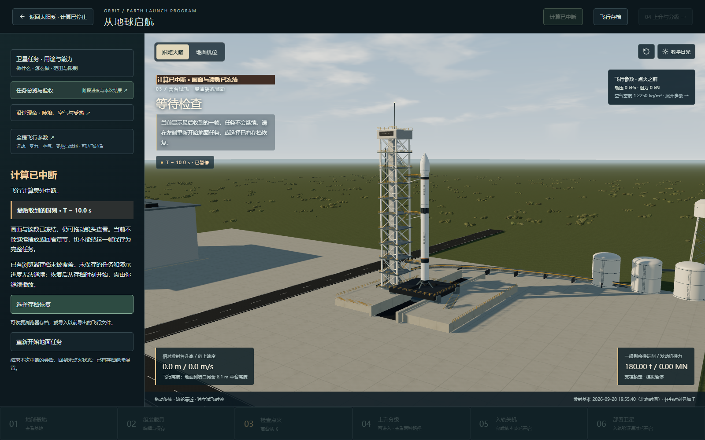

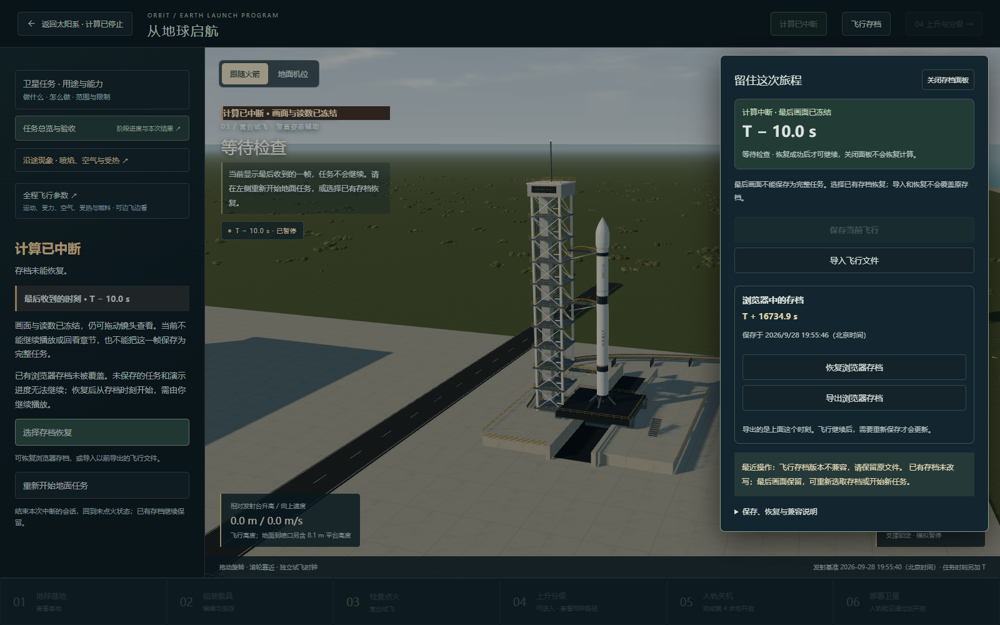

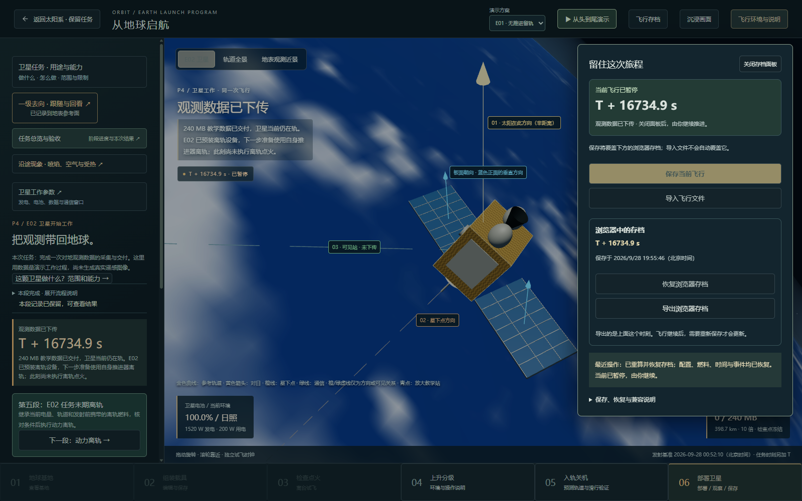

结论：当前桌面教学流程可进入固定三组体验验收；本批整理为待验收版交付，最终用户验收与版本标签归档待确认。见[本阶段收尾与归档条件](../../SATELLITE-DEMO-CLOSEOUT.md)。
